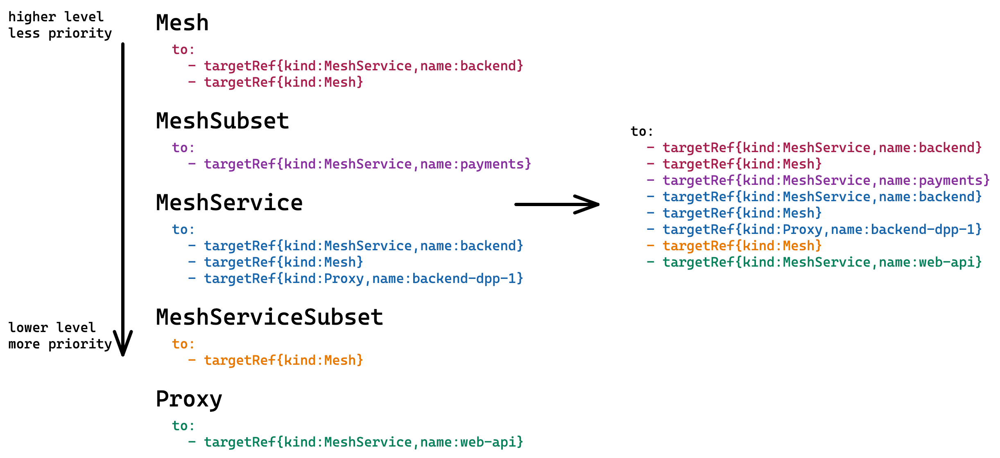

# New Policy Matching

* Status: accepted

Technical Story: https://github.com/kumahq/kuma/issues/3330 

## Context and Problem Statement

Source and destination selectors (S&D) are trying to solve the problem of mapping between policies and connections. 
But in the real world of Envoy proxies, 
there is no such thing as "connection". 
There are "inbounds" and "outbounds". 
Depending on policy type, S&D could select either outbounds or inbounds; 
this is hidden from the user and generates ambiguity and complexity:
* If S&D selects outbounds under the hood, 
then the "destination" selector is limited by only the "kuma.io/service" tag.
* If S&D selects inbounds under the hood, 
then "source" selectors might have some unexpected behavior (TrafficPermissions shadow each other).
* Kuma selects "the most specific" policy based on S&D ranks, 
but sometimes it's hard to say which policy is more specific.
* "source" selectors could be tricky to implement, especially regarding TCP traffic.

The idea of the current proposal is to make the model more transparent. 
If we want to map Policies to inbounds/outbounds, 
it should be clear to users 
what inbound/outbounds Kuma is choosing for the current policy. 
To make it work, 
we have to get rid of the existing "source" and "destination" selectors 
and replace them with "inbound" and "outbound" selectors.

## Considered Options

* targetRef selector 
* S&D with constraints [1] 

## Decision Outcome

Chosen option: targetRef selector

### Overview

"TargetRef" selector is inspired by [Gateway API Policy Attachment](https://gateway-api.sigs.k8s.io/v1alpha2/references/policy-attachment/) specification. 
Even though, Kuma policy matching cannot be compatible with Gateway API Policy Attachment spec at that moment,
we don't rule out the possibility in the future. The reasons Kuma targetRef is not compatible with Gateway API:
* Kuma "targetRef" uses own proto message, instead of reusing [PolicyTargetReference](https://github.com/kubernetes-sigs/gateway-api/blob/master/apis/v1alpha2/policy_types.go).
* Kuma "targetRef" doesn't have `namespace` and `group` fields.
* Kuma "targetRef" can reference objects that are not present in the store (MeshSubset, MeshService, MeshServiceSubset).
* Kuma "targetRef" has extra field `tags`.

Each Kuma policy has a single "TargetRef": 

```protobuf
message TargetRef {
  // Kind of the referenced resource
  // +kubebuilder:validation:Enum=Mesh;MeshSubset;MeshService;MeshServiceSubset;Proxy;MeshGatewayRoute;MeshHTTPRoute
  string kind = 1;

  // Name of the referenced resource
  string name = 2;

  // Tags are used with MeshSubset and MeshServiceSubset to define a subset of proxies 
  map<string, string> tags = 3;
}
```

for example:

```yaml
type: UpstreamTimeout
mesh: mesh-1
name: timeouts
spec:
  targetRef:
    kind: MeshService
    name: backend
  to:
    # timeouts configuration
```

"TargetRef" can attach policy to different objects:
* Mesh
* MeshSubset
* MeshService
* MeshServiceSubset
* Proxy
* MeshGatewayRoute 
* MeshHTTPRoute

"TargetRef" identifies a set of DPPs that will be affected by the policy.

Traffic direction is expressed using "to" and "from" arrays. 

If policy configures outbounds, then configuration is specified in "to" array: 
```yaml
type: UpstreamTimeout
mesh: mesh-1
name: timeouts
spec:
  targetRef:
    kind: MeshService
    name: backend
  to:
    - targetRef:
        kind: MeshService
        name: payments
      conf:
        connectTimeout: 10s
    - targetRef:
        kind: MeshService
        name: web-api
      conf:
        connectTimeout: 20s
```

If policy configures inbounds, then configuration is specified in "from" array: 
```yaml
type: MeshTrafficPermission
mesh: mesh-1
name: permissions
spec:
  targetRef:
    kind: MeshService
    name: backend
  from:
    - targetRef:
        kind: Mesh
      conf:
        action: DENY
    - targetRef:
        kind: MeshServiceSubset
        name: backend
        tags:
          version: v2
      conf:
        action: ALLOW
    - targetRef:
        kind: MeshSubset
        tags:
          kuma.io/zone: us-east
      conf:
        action: ALLOW
```

### Applying

#### Outbound policy

All outbound policies contains a "to" array.
Each element of the array has a "targetRef" that selects outbound
and has an outbound configuration:

```yaml
to:
  - targetRef: Mesh | MeshService | MeshHTTPRoute
    conf: ...
```

If a data plane proxy has 3 outbounds:
```yaml
outbound:
  - port: 8081
    tags:
      kuma.io/service: backend
  - port: 8082
    tags:
      kuma.io/service: web-api
  - port: 8083
    tags:
      kuma.io/service: payments
```

then policy can select a single "web-api" outbound:

```yaml
to:
  - targetRef:
      kind: MeshService
      name: web-api
    conf: ... # conf for "web-api" outbound
```

policy can select all outbounds ("backend", "web-api" and "payments"):

```yaml
to:
  - targetRef:
      kind: Mesh
    conf: ... # conf for all outbounds
```

policy can select an MeshHTTPRoute:

```yaml
to:
  - targetRef:
      kind: MeshHTTPRoute
      name: payments-get-info-v1-httproute
    conf: ... # conf for "/v1/getinfo/" route of "payments" outbound 
```

When several targetRefs select the same outbound,
corresponding confs are merged in the order they're presented in the "to" array 
(bottom ones have more priority over the top ones):

"backend" outbound is selected by 3 targetRefs

```yaml
to:
  - targetRef: 
      kind: Mesh
    conf:
      param1: value1
  - targetRef: 
      kind: MeshService
      name: backend
    conf:
      param1: value2
      param2: value3
  - targetRef: 
      kind: Mesh
    conf:
      param2: value4
```

resulting configuration for "backend" outbound is:

```yaml
conf:
  param1: value2 # overrides 'value1' from 'targetRef{kind:Mesh}' 
  param2: value4 # overrides 'value3' from 'targetRef{kind:MeshService,name:backend}'
```

#### Inbound policy

All inbound policies contains a "from" array.
Each element of the array has a "targetRef" that selects source of the traffic
and has a configuration for selected source:

```yaml
from:
  - targetRef: Mesh | MeshSubset | MeshService | MeshServiceSubset
    conf: ...
```

Policy can select traffic from "backend" service:

```yaml
from:
  - targetRef:
      kind: MeshService
      name: backend
    conf: ... # conf for traffic coming from "backend" service
```

Policy can select traffic from proxies with "kuma.io/zone: us-east" tag:

```yaml
from:
  - targetRef:
      kind: MeshSubset
      tags:
        kuma.io/zone: us-east
    conf: ... # conf for traffic coming from "us-east" zone
```

Policy can select traffic from all sources:

```yaml
from:
  - targetRef:
      kind: Mesh
    conf: ... # conf for all incoming traffic
```

When several targetRefs select the same source,
corresponding confs are merged in the order they're presented in the "from" array:

Traffic from "backend" of v2 is selected by 3 targetRefs

```yaml
to:
  - targetRef: 
      kind: MeshServiceSubset
      name: backend
      tags:
        version: v2
    conf:
      param1: value1
  - targetRef:
      kind: MeshService
      name: backend
    conf:
      param1: value2
      param2: value3
  - targetRef:
      kind: Mesh
    conf:
      param2: value4
```

resulting configuration for "backend" outbound is:

```yaml
conf:
  param1: value2 # overrides 'value1' from 'targetRef{kind:Mesh}'
  param2: value4 # overrides 'value3' from 'targetRef{kind:MeshService,name:backend}'
```

### Overlapping

As already mentioned "targetRef" attaches policy to objects:
Mesh, MeshSubset, MeshService, MeshServiceSubset, Proxy, MeshGatewayRoute, MeshHTTPRoute. 
These objects are overlapping, i.e Mesh includes many MeshSubsets, MeshSubset includes many MeshServices,
MeshService includes many MeshServiceSubsets, etc.
That's why policies attached to different objects are overlapping as well.

#### Sorting

Overlapping policies are sorted based on the order of objects
they're attached to:


Policies on lower levels have more priority
and able to override behavior specified on higher levels.

If multiple policies target the same object, 
they'll be sorted in a lexicographic order (using policy name). 

#### Merging

Most policies consist of either "to" or "from" arrays.
For overlapping policies these arrays are concatenated according to sorting order.



After being merged resulting policy is applied according to rules defined in the [applying](#applying).

### Examples

#### UpstreamTimeout

The lowest level is created for mesh operators,
so they could provide default policies
that are reasonable for that particular mesh:

```yaml
type: UpstreamTimeout
mesh: mesh-1
name: 00-base-timeouts
targetRef:
  kind: Mesh
to:
  - targetRef:
      kind: Mesh
    conf:
      connectTimeout: 10s
      http:
        requestTimeout: 5s
        streamIdleTimeout: 1h
```

Service owners would like to propagate recommendations
how other services should interact with their service:

```yaml
type: UpstreamTimeout
mesh: mesh-1
name: 01-consume-backend-timeouts
targetRef:
  kind: Mesh
to: 
  - targetRef:
      kind: MeshService
      name: backend
    conf:
      connectTimeout: 20s
      http:
        idleTimeout: 0s
```

Service owners would like to set timeouts
for the outgoing traffic of their service:

```yaml
type: UpstreamTimeout
mesh: mesh-1
name: web-timeouts
targetRef:
  kind: MeshService
  name: web
to:
  - targetRef:
      kind: Mesh
    conf:
      connectTimeout: 5s
  - targetRef:
      kind: MeshService
      name: backend
    conf:
      http:
        requestTimeout: 15s
```

Now we want to figure
what configuration we'll get on "web" data plane proxy.

Merge all "to" sections from all policies
matched for "web" proxy:

```yaml
to:
  - targetRef: # from 'web-timeouts'
      kind: Mesh
    conf:
      connectTimeout: 5s
  - targetRef: # from 'web-timeouts'
      kind: MeshService
      name: backend
    conf:
      http:
        requestTimeout: 15s
  - targetRef: # from '01-consume-backend-timeouts'
      kind: MeshService
      name: backend
    conf:
      connectTimeout: 20s
      http:
        idleTimeout: 0s
  - targetRef: # from '00-base-timeouts'
      kind: Mesh
    conf:
      connectTimeout: 10s
      http:
        requestTimeout: 5s
        idleTimeout: 1h
```

Now we'll look at each outbound individually.

For "backend" outbound we select elements of the "to" array
that target "backend" outbound:

```yaml
to:
  - targetRef: # from 'web-timeouts'
      kind: Mesh
    conf:
      connectTimeout: 5s
  - targetRef: # from 'web-timeouts'
      kind: MeshService
      name: backend
    conf:
      http:
        requestTimeout: 15s
  - targetRef: # from '01-consume-backend-timeouts'
      kind: MeshService
      name: backend
    conf:
      connectTimeout: 20s
      http:
        idleTimeout: 0s
  - targetRef: # from '00-base-timeouts'
      kind: Mesh
    conf:
      connectTimeout: 10s
      http:
        requestTimeout: 5s
        idleTimeout: 1h
```

and merge these into a single outbound conf for "backend" outbound:

```yaml
conf:
  connectTimeout: 5s # from 'web-timeouts'
  http:
    requestTimeout: 15s # from 'web-timeouts'
    idleTimeout: 0s # from '01-consume-backend-timeouts'
```

For another outbounds "payments" we have to do the same.
Select "to" sections
that target "payments" outbound:

```yaml
to:
  - targetRef: # from 'web-timeouts'
      kind: Mesh
    conf:
      connectTimeout: 5s
  - targetRef: # from '00-base-timeouts'
      kind: Mesh
    conf:
      connectTimeout: 10s
      http:
        requestTimeout: 5s
        idleTimeout: 1h
```

and merge these into a single conf for "payment" outbound:

```yaml
conf:
  connectTimeout: 5s # from 'web-timeouts'
  http:
    requestTimeout: 5s # from '00-base-timeouts'
    idleTimeout: 1h # from '00-base-timeouts'
```

#### MeshTrafficPermission

Mesh operator creates a policy
that denies everything except infra services.
Services "infra-monitoring" and "infra-logger" require access
to all workloads in the mesh to scrape data:

```yaml
type: MeshTrafficPermission
mesh: mesh-1
name: allow-only-infra
targetRef:
  kind: Mesh
from:
  - targetRef:
      kind: MeshService
      name: infra-monitoring
    conf:
      action: ALLOW
  - targetRef:
      kind: MeshService
      name: infra-logger
    conf:
      action: ALLOW
  - targetRef:
      kind: Mesh
    conf:
      action: DENY
```

Service owner of "backend" changes behaviour to allow-by-default
and denies requests from old versions of "web".

```yaml
type: MeshTrafficPermission
mesh: mesh-1
name: backend-permissions
targetRef:
  kind: MeshService
  name: backend
from:
  - targetRef:
      kind: MeshServiceSubset
      name: web
      tags:
        version: v1
    conf:
      action: DENY
  - targetRef:
      kind: Mesh
    conf:
      action: ALLOW
```

Now we want to figure
what configuration we'll get on "backend" data plane proxy.

Merge all "from" sections from all policies
matched for "backend" proxy:

```yaml
from:
  - targetRef: # from backend-permissions
      kind: MeshServiceSubset
      name: web
      tags:
        version: v1
    conf:
      action: DENY
  - targetRef: # from backend-permissions
      kind: Mesh
    conf:
      action: ALLOW
  - targetRef: # from allow-only-infra
      kind: MeshService
      name: infra-monitoring
    conf:
      action: ALLOW
  - targetRef: # from allow-only-infra
      kind: MeshService
      name: infra-logger
    conf:
      action: ALLOW
  - targetRef: # from allow-only-infra
      kind: Mesh
    conf:
      action: DENY
```

Now we'll look at each possible traffic source individually.

Select "from" sections that target "web" with "v1":

```yaml
from:
  - targetRef: # from backend-permissions
      kind: MeshServiceSubset
      name: web
      tags:
        version: v1
    conf:
      action: DENY
  - targetRef: # from backend-permissions
      kind: Mesh
    conf:
      action: ALLOW
  - targetRef: # from allow-only-infra
      kind: Mesh
    conf:
      action: DENY
```

and merge into single configuration:

```yaml
conf:
  action: DENY # from backend-permissions
```

Select "from" sections that target "infra-monitoring":

```yaml
from:
  - targetRef: # from backend-permissions
      kind: Mesh
    conf:
      action: ALLOW
  - targetRef: # from allow-only-infra
      kind: MeshService
      name: infra-monitoring
    conf:
      action: ALLOW
  - targetRef: # from allow-only-infra
      kind: Mesh
    conf:
      action: DENY
```

and merge into single configuration:

```yaml
conf:
  action: ALLOW # from backend-permissions
```

Select "from" sections that target "infra-logger":

```yaml
from:
  - targetRef: # from backend-permissions
      kind: Mesh
    conf:
      action: ALLOW
  - targetRef: # from allow-only-infra
      kind: MeshService
      name: infra-logger
    conf:
      action: ALLOW
  - targetRef: # from allow-only-infra
      kind: Mesh
    conf:
      action: DENY
```

and merge into single configuration:

```yaml
conf:
  action: ALLOW # from backend-permissions
```

#### ProxyTemplate

ProxyTemplate is neither inbound nor outbound policy, 
so it doesn't have "from" or "to" arrays. 
There are only "imports" and "modifications" arrays
which override arrays from other levels.
That's why no merging is available for this policy
(and this is a good thing taking into account complexity):

```yaml
type: ProxyTemplate
mesh: default
name: pt-1
spec:
  targetRef:
    kind: MeshService
    name: backend
  conf:
    imports:
      - default-proxy
    modifications:
      - cluster:
          operation: add
          value: |
            name: test-cluster
            connectTimeout: 5s
            type: STATIC
```

Now if you create a ProxyTemplate for DPP with an empty `modifications` array,
`test-cluster` won't be added:

```yaml
type: ProxyTemplate
mesh: default
name: pt-2
spec:
  targetRef:
    kind: Proxy
    name: my-special-backend-dpp
  conf:
    imports:
      - default-proxy
    modifications: [] # overrides "modifications" array from "pt-1"
```

#### TrafficLog

Keep backends in the Mesh for now,
move them into TrafficLogBackend policy in the future.

Traffic log is a policy that contains both "to" and "from" arrays:
```yaml
type: TrafficLog
mesh: mesh-1
name: tl-1
targetRef:
  kind: Mesh
to:
  - targetRef:
      kind: MeshService
      name: web
    conf:
      backends:
        - name: logstash
from:
  - targetRef:
      kind: Mesh
    conf:
      backends:
        - name: file
```

This policy specifies the following behaviour:
* all outgoing requests to "web" are logged to "logstash"
* all incoming requests from all services in the mesh are logged to "file".

When overlapping, "to" and "from" arrays are merged independently.

### Rolling out

The change affects not only policy selectors, but also policy's configurations.
That's why instead of changing existing policies, we're going to introduce a new set of policies.
For each existing policy we'll provide a new policy with "targetRef" and "to/from" arrays:

* TrafficPermission -> MeshTrafficPermission
* TrafficRoute -> MeshTrafficRoute
* CircuitBreaker -> MeshCircuitBreaker
* HealthCheck -> MeshHealthCheck
* FaultInjection -> MeshHTTPFault
* Retry -> MeshRequestRetry
* Timeout -> MeshUpstreamTimeout
* RateLimit -> MeshRateLimit
* TrafficTrace -> MeshTracing
* TrafficLog -> MeshLogging
* _ -> MeshMetrics
* ProxyTemplate -> MeshEnvoyTemplate
* VirtualOutbound -> MeshVirtualOutbound

For each new policy a separate MADR is required.

### Positive Consequences <!-- optional -->

* Kuma model is closer to real world
* Role-oriented approach (cluster admins, mesh operators, service owners, developers)
* Similarity with Gateway API Policy Attachment.
For people who are new to Kuma but already familiar with Gateway API Policy Attachment 
should be easier to get up to speed with Kuma. 

### Negative Consequences <!-- optional -->

* Additional complexity 
* Implementation efforts

## Links <!-- optional -->

1. [S&D with constraints](https://docs.google.com/document/d/1FM72PCThcTD6kg920g8LTw7oeBgSZ-0HaRi6D6TrcrU/edit) 
