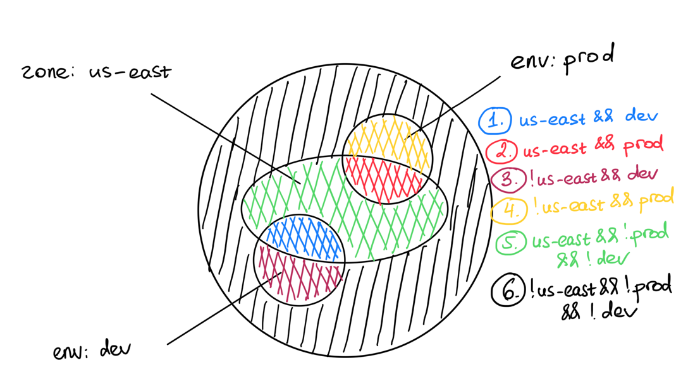

# MeshTrafficPermission

* Status: accepted

Technical Story: https://github.com/kumahq/kuma/issues/4222

## Context and Problem Statement

[New policy matching MADR](./005-policy-matching.md) introduces a new approach how Kuma applies configuration to proxies.
Rolling out strategy implies creating a new set of policies that satisfy a new policy matching.
Current MADR aims to define a MeshTrafficPermission.

## Considered Options

* Create a MeshTrafficPermission policy

## Decision Outcome

Chosen option: create a MeshTrafficPermission policy

### Overview

MeshTrafficPermission allows blocking unwanted incoming traffic for the service.
There might be several reasons why it could be useful to block unwanted traffic:
* following the [principle of least privilege](https://en.wikipedia.org/wiki/Principle_of_least_privilege)
* cut off access for clients that shouldn't use your service (legacy clients, clients from another zone, etc.)
* temporary blocking services that mistakenly (e.g. caused by a bug) seemed to DOS a service. 
Before a fix was put in place the team impacted could cut off unwanted traffic swiftly

### Specification

Top-level targetRef can have all available kinds:

```yaml
targetRef:
  kind: Mesh|MeshSubset|MeshService|MeshServiceSubset|MeshGatewayRoute|MeshHTTPRoute
  name: ...
```

MeshTrafficPermission is an inbound policy that's why it has a "from" array:

```yaml
from:
  - targetRef:
      kind: Mesh|MeshSubset|MeshService|MeshServiceSubset
      name: ...
```

Configuration for MeshTrafficPermission has a single field "action" with values "ALLOW", "DENY", 
"ALLOW_WITH_SHADOW_DENY" and "DENY_WITH_SHADOW_ALLOW".
So the overall specification looks like this:

```yaml
type: MeshTrafficPermission
mesh: default
spec:
  targetRef:
    kind: Mesh|MeshSubset|MeshService|MeshServiceSubset|MeshGatewayRoute|MeshHTTPRoute
    name: ...
  from:
    - targetRef:
        kind: Mesh|MeshSubset|MeshService|MeshServiceSubset
        name: ...
      default:
        action: ALLOW|DENY|ALLOW_WITH_SHADOW_DENY|DENY_WITH_SHADOW_ALLOW
```

We don't want to mix mTLS configs (like permissive mTLS or TLS version) with MeshTrafficPermission. 
The main reason is that mTLS settings are applied for the entire inbound, while permissions could be set for a group of clients. 

### Shadow actions

Shadow actions are not enforced but emit stats and can be used for rule testing.
For example, before creating "action: DENY" rule, user creates "action: ALLOW_WITH_SHADOW_DENY" rule and checks the stats.
If there are no unexpected denied requests from the clients then it's safe to change "action" to "DENY".

#### Other considered options

Option 1: `action: ALLOW|DENY, shadow: true|false`

Cons: policy matching makes it less obvious with merging. It's easy to create a rule like:
```yaml
targetRef:
   kind: Mesh
default:
  action: DENY
  shadow: true
```
and unintentionally shadow all less specific rules.

Option 2: `action: ALLOW|DENY, shadowAction: ALLOW|DENY`

Cons:
* there are unused states like `action: ALLOW, shadowAction: ALLOW` and `action: DENY, shadowAction: DENY`
* when the user creates a config:
    ```
    default:
      shadowAction: DENY
    ```
    they may assume `action` is implicit `ALLOW`, but it's not true. The `action` is whatever you have in less specific "from" items.
* better UX, managing 1 field is easier than managing 2 fields


### Envoy configuration

Envoy has [RBAC Network Filter](https://www.envoyproxy.io/docs/envoy/latest/configuration/listeners/network_filters/rbac_filter) 
that allows configuring permissions for the list of principals.

**Principal** is an entity that can be authenticated.<br>
**Permission** is access granted to the principal.  

Each Kuma service has a generated certificate with URIs that identify service name and tags.
For example "backend" service in "us-east" zone of version v1 can have the following list of URIs:
* spiffe://mesh-1/backend
* kuma://kuma.io/zone/us-east
* kuma://version/v1

If we want to grant any permissions to these instances we can create the following Network RBAC:

```yaml
action: ALLOW
policies:
  "MeshTrafficPermission":
    permissions:
      - any: true
    principals:
      - and_ids:
          ids:
            - authenticated:
                principal_name:
                  exact: "spiffe://mesh-1/backend"
            - authenticated:
                principal_name:
                  exact: "kuma://kuma.io/zone/us-east"
            - authenticated:
                principal_name:
                  exact: "kuma://version/v1"
```

In order request to be allowed, at least 1 principal should be matched. 

#### Converting MeshTrafficPermission to Envoy NetworkRBAC

1. Concatenate "from" arrays from all matched MeshTrafficPermissions 

Input
```yaml
type: MeshTrafficPermission
name: global
spec:
  targetRef:
    kind: Mesh
  from:
    - targetRef:
        kind: Mesh
      default:
        action: DENY
---
type: MeshTrafficPermission
name: global-2
spec:
  targetRef:
    kind: Mesh
  from:
    - targetRef:
        kind: MeshSubset
        tags:
          kuma.io/zone: us-east
      default:
        action: DENY_WITH_SHADOW_ALLOW
---
type: MeshTrafficPermission
name: backend
spec:
  targetRef:
    kind: MeshService
    name: backend
  from:
    - targetRef:
        kind: MeshSubset
        tags:
          env: dev
      default:
        action: ALLOW
    - targetRef:
        kind: MeshService
        name: web
      default:
        action: ALLOW_WITH_SHADOW_DENY
```

Concatenated "from" array
```yaml
from:
  - targetRef: # from 'global'
      kind: Mesh
    default:
      action: DENY
  - targetRef: # from 'global-2'
      kind: MeshSubset
      tags:
        kuma.io/zone: us-east
    default:
      action: DENY_WITH_SHADOW_ALLOW
  - targetRef: # from 'backend'
      kind: MeshSubset
      tags:
        env: dev
    default:
      action: ALLOW
  - targetRef: # from 'backend'
      kind: MeshService
      name: web
    default:
      action: ALLOW_WITH_SHADOW_DENY
```

2. Create a full rule-based view (with negations) 

Regular [rule-based view](005-policy-matching.md#rule-based-view) doesn't work well for NetworkRBAC generation,
because rule-based view relies on the order, but NetworkRBAC doesn't. 

In this example, if a request matches "rule 2" this means it doesn't match "rule 1":
```yaml
rules:
  - targetRef: # rule 1
      kind: MeshSubset
      tags:
        kuma.io/zone: us-east
        env: dev
    default:
      action: ALLOW
  - targetRef: # rule 2
      kind: MeshSubset
      tags:
        kuma.io/zone: us-east
    default:
      action: DENY
```

So "rule 2" implicitly matches requests from zone "us-east" that are **not** from env "dev".
That's why it's important to have a full rule-based view with negations ("!" means "not"):

```yaml
rules:
  - targetRef:
      kind: MeshSubset
      tags:
        kuma.io/zone: us-east
        env: dev
        kuma.io/service: !web
    default:
      action: ALLOW
  - targetRef:
      kind: MeshSubset
      tags:
        kuma.io/zone: us-east
        env: !dev
        kuma.io/service: !web
    default:
      action: DENY_WITH_SHADOW_ALLOW
  - targetRef:
      kind: MeshSubset
      tags:
        kuma.io/zone: !us-east
        env: dev
        kuma.io/service: !web
    default:
      action: ALLOW
  - targetRef:
      kind: MeshSubset
      tags:
        kuma.io/zone: !us-east
        env: !dev
        kuma.io/service: !web
    default:
      action: DENY
  - targetRef:
      kind: MeshSubset
      tags:
        kuma.io/zone: us-east
        env: dev
        kuma.io/service: web
    default:
      action: ALLOW_WITH_SHADOW_DENY
  - targetRef:
      kind: MeshSubset
      tags:
        kuma.io/zone: us-east
        env: !dev
        kuma.io/service: web
    default:
      action: ALLOW_WITH_SHADOW_DENY
  - targetRef:
      kind: MeshSubset
      tags:
        kuma.io/zone: !us-east
        env: dev
        kuma.io/service: web
    default:
      action: ALLOW_WITH_SHADOW_DENY
  - targetRef:
      kind: MeshSubset
      tags:
        kuma.io/zone: !us-east
        env: !dev
        kuma.io/service: web
    default:
      action: ALLOW_WITH_SHADOW_DENY 
```

See [how to generate a full rule-based view with negations](#how-to-generate-a-full-rule-based-view-with-negations)

3. Actual rules. Take only rules that have action "ALLOW" or "ALLOW_WITH_SHADOW_DENY":

```yaml
rules:
  - targetRef:
      kind: MeshSubset
      tags:
        kuma.io/zone: us-east
        env: dev
        kuma.io/service: !web
    default:
      action: ALLOW
  - targetRef:
      kind: MeshSubset
      tags:
        kuma.io/zone: !us-east
        env: dev
        kuma.io/service: !web
    default:
      action: ALLOW
  - targetRef:
      kind: MeshSubset
      tags:
        kuma.io/zone: us-east
        env: dev
        kuma.io/service: web
    default:
      action: ALLOW_WITH_SHADOW_DENY
  - targetRef:
      kind: MeshSubset
      tags:
        kuma.io/zone: us-east
        env: !dev
        kuma.io/service: web
    default:
      action: ALLOW_WITH_SHADOW_DENY
  - targetRef:
      kind: MeshSubset
      tags:
        kuma.io/zone: !us-east
        env: dev
        kuma.io/service: web
    default:
      action: ALLOW_WITH_SHADOW_DENY
  - targetRef:
      kind: MeshSubset
      tags:
        kuma.io/zone: !us-east
        env: !dev
        kuma.io/service: web
    default:
      action: ALLOW_WITH_SHADOW_DENY 
```

Generate [config.rbac.v3.RBAC](https://www.envoyproxy.io/docs/envoy/latest/api-v3/config/rbac/v3/rbac.proto#envoy-v3-api-msg-config-rbac-v3-rbac)
with "ALLOW" action and with a single "MeshTrafficPermission" policy. The policy has permission "any: true" and the list of "principals".
List of principals generated based on the list from step 3. Each principal is matched with OR semantic: 

```yaml
action: ALLOW
policies:
  "MeshTrafficPermission":
    permissions:
      - any: true
    principals: 
      - and_ids:
          ids:
            - authenticated:
                principal_name:
                  exact: "kuma://kuma.io/zone/us-east"
            - authenticated:
                  principal_name:
                    exact: "kuma://env/dev"
            - not_id:
                authenticated:
                  principal_name:
                    exact: "kuma://kuma.io/service/web"
      - and_ids:
          ids:
            - not_id:
                authenticated:
                  principal_name:
                    exact: "kuma://kuma.io/zone/us-east"
            - authenticated:
                principal_name:
                  exact: "kuma://env/dev"
            - not_id:
                authenticated:
                  principal_name:
                    exact: "kuma://kuma.io/service/web"
      - and_ids:
          ids:
            - authenticated:
                principal_name:
                  exact: "kuma://kuma.io/zone/us-east"
            - authenticated:
                principal_name:
                  exact: "kuma://env/dev"
            - authenticated:
                  principal_name:
                    exact: "kuma://kuma.io/service/web"
      - and_ids:
          ids:
            - authenticated:
                principal_name:
                  exact: "kuma://kuma.io/zone/us-east"
            - not_id:
                authenticated:
                  principal_name:
                    exact: "kuma://env/dev"
            - authenticated:
                  principal_name:
                    exact: "kuma://kuma.io/service/web"
      - and_ids:
          ids:
            - not_id:
                authenticated:
                  principal_name:
                    exact: "kuma://kuma.io/zone/us-east"
            - authenticated:
                  principal_name:
                    exact: "kuma://env/dev"
            - authenticated:
                principal_name:
                  exact: "kuma://kuma.io/service/web"
      - and_ids:
          ids:
            - not_id:
                authenticated:
                  principal_name:
                    exact: "kuma://kuma.io/zone/us-east"
            - not_id:
                authenticated:
                  principal_name:
                    exact: "kuma://env/dev"
            - authenticated:
                principal_name:
                  exact: "kuma://kuma.io/service/web"
```
Set this policy as "rules" into NetworkFilter.

4. Shadow rules. Take only rules that have "DENY_WITH_SHADOW_ALLOW":

```yaml
rules:
  - targetRef:
      kind: MeshSubset
      tags:
        kuma.io/zone: us-east
        env: !dev
        kuma.io/service: !web
    default:
      action: DENY_WITH_SHADOW_ALLOW
```

Generate [config.rbac.v3.RBAC](https://www.envoyproxy.io/docs/envoy/latest/api-v3/config/rbac/v3/rbac.proto#envoy-v3-api-msg-config-rbac-v3-rbac)
with "ALLOW" action and with a single "MeshTrafficPermission" policy. The policy has permission "any: true" and the list of "principals".
List of principals generated based on the list from step 3. Each principal is matched with OR semantic:

```yaml
action: ALLOW
policies:
  "ShadowMeshTrafficPermission":
    permissions:
      - any: true
    principals:
      - and_ids:
          ids:
            - authenticated:
                principal_name:
                  exact: "kuma://kuma.io/zone/us-east"
            - not_id:
                authenticated:
                  principal_name:
                    exact: "kuma://env/dev"
            - not_id:
                authenticated:
                  principal_name:
                    exact: "kuma://kuma.io/service/web"
```
Set this policy as "shadow_rules" into NetworkFilter.

5. If MeshTrafficPermission is targeting proxy then NetworkRBAC is placed as a NetworkFilter on the inbound listener.
If MeshTrafficPermission is targeting MeshHTTPRoute then NetworkRBAC is placed as a NetworkFilter on the route. 
Even in the case of MeshHTTPRoute, global per-proxy NetworkRBAC will be set to provide secure access for other routes. 

### MeshTrafficPermission and Kubernetes

MeshTrafficPermission is going to be the first policy with a new policy matching. 
There are a few things worth mentioning regarding this fact. 

#### Mesh as label

Instead of creating a CRD with a "mesh" field, we can use a label to store mesh:

```yaml
apiVersion: kuma.io/v1alpha1
kind: MeshTrafficPermission
metadata:
  labels:
    kuma.io/mesh: mesh-1
```

This allows filtering policies by mesh using kubectl. 
If the label is unset it will be added automatically by the webhook to be "kuma.io/mesh: default".

#### Scope is namespaced

Today all policies are cluster-scoped, but new policies should be namespace scoped.
MeshTrafficPermission can only be created in the namespace where the control-plane runs (`kuma-system` by default), 
and affects DPPs across all namespaces.
In the future we'll add support for other namespaces, so the policy could affect DPPs only in the specified namespace but this is out of scope for this MADR. 

### Cross-mesh

MeshTrafficPermission is used to specify a list of clients from other meshes that have an access to MeshGatewayRoute.
In that case we use targetRef with "mesh" field:

```yaml
type: MeshTrafficPermission
mesh: expose
name: cross-mesh-permission
spec:
  targetRef:
    kind: MeshGatewayRoute
    name: cross-mesh-route
  from:
    - targetRef:
        kind: MeshService
        name: backend
        mesh: consume
      default:
        action: ALLOW
    - targetRef:
        kind: MeshServiceSubset
        name: backend
        mesh: consume
        tags:
          version: v1
      default:
        action: DENY
```

### Positive Consequences <!-- optional -->

* MeshTrafficPermission is more flexible and straight-forward than TrafficPermission
* MeshTrafficPermission supports l7 routes

### Negative Consequences <!-- optional -->

Not found

## Links <!-- optional -->

### How to generate a full rule-based view (with negations)

1. Each targetRef could be represented as a list of tags (tag has "key" and "value")
    * targetRef{kind:Mesh} -> []Tag{} (empty list of tags)
    * targetRef{kind:MeshSubset,tags:tags} -> []Tag{tags...}
    * targetRef{kind:MeshService,name:name} -> []Tag{{key:"kuma.io/service","value":name}}
    * targetRef{kind:MeshServiceSubset,name:name,tags:tags} -> []Tag{append(tags, {key:"kuma.io/service","value":name})}
    
Represent each targetRef in "from" array as tags:

```go
allTags := []Tag{}
for _, item := range from {
	allTags = append(allTags, representAsTags(item.TargetRef)...)
}
dedup(allTags) // tag1 == tag2 <=> (tag1.key == tag2.key && tag1.value == tag2.value)
```

2. We have to iterate over all possible combinations with negations. If we have 3 keys:
```go
allTags = []Tag{
    {key: "key1", value: "value1"},
    {key: "key2", value: "value2"},
    {key: "key3", value: "value3"},
}
```

then there are 2^3=8 combinations:

```go
comb1 = []Tag{
    {key: "key1", value: "value1"},
    {key: "key2", value: "value2"},
    {key: "key3", value: "value3"},
}
comb2 = []Tag{
    {key: "key1", value: "!value1"},
    {key: "key2", value: "value2"},
    {key: "key3", value: "value3"},
}
comb3 = []Tag{
    {key: "key1", value: "value1"},
    {key: "key2", value: "!value2"},
    {key: "key3", value: "value3"},
}
comb4 = []Tag{
    {key: "key1", value: "!value1"},
    {key: "key2", value: "!value2"},
    {key: "key3", value: "value3"},
}
comb5 = []Tag{
    {key: "key1", value: "value1"},
    {key: "key2", value: "value2"},
    {key: "key3", value: "!value3"},
}
comb6 = []Tag{
    {key: "key1", value: "!value1"},
    {key: "key2", value: "value2"},
    {key: "key3", value: "!value3"},
}
comb7 = []Tag{
    {key: "key1", value: "value1"},
    {key: "key2", value: "!value2"},
    {key: "key3", value: "!value3"},
}
comb8 = []Tag{
    {key: "key1", value: "!value1"},
    {key: "key2", value: "!value2"},
    {key: "key3", value: "!value3"},
}
```

Each combination uniquely defines a group of client and each client belongs to exactly one group.
It's possible to have combinations with 0 clients like:
```go
zeroClientsComb = []Tag{
    {key: "key1", value: "value1"},
    {key: "key1", value: "value2"},
}
```

3. Determine configuration value (ALLOW or DENY in the context of permissions) for each combination.
It could be done using initial "from" array by checking every combination against "from" items.

Example

We have a "from" array:

```yaml
from:
  - targetRef:
      kind: Mesh
    default:
      action: ALLOW
  - targetRef: 
      kind: MeshSubset
      tags:
        zone: us-east
    default:
      action: DENY
  - targetRef:
      kind: MeshSubset
      tags:
        env: dev
    default:
      action: ALLOW
  - targetRef:
       kind: MeshSubset
       tags:
          env: prod
    default:
       action: ALLOW
```

1. Create "allTags" array:
```go
allTags = []Tag{
	{key: "zone", value: "us-east"},
	{key: "env", value: "dev"},
	{key: "env", value: "prod"},
	
}
```

2. Create all possible combination with negations:

```go
comb1 = []Tag{
    {key: "zone", value: "us-east"},
    {key: "env", value: "dev"},
    {key: "env", value: "!prod"},
}
comb2 = []Tag{
    {key: "zone", value: "us-east"},
    {key: "env", value: "!dev"},
    {key: "env", value: "prod"},
}
comb3 = []Tag{
    {key: "zone", value: "!us-east"},
    {key: "env", value: "dev"},
    {key: "env", value: "!prod"},
}
comb4 = []Tag{
    {key: "zone", value: "!us-east"},
    {key: "env", value: "!dev"},
    {key: "env", value: "prod"},
}
comb5 = []Tag{
    {key: "zone", value: "us-east"},
    {key: "env", value: "!dev"},
    {key: "env", value: "!prod"},
}
comb6 = []Tag{
    {key: "zone", value: "!us-east"},
    {key: "env", value: "!dev"},
    {key: "env", value: "!prod"},
}
comb7 = []Tag{ // no clients can have env=dev and env=prod at the same time 
    {key: "zone", value: "us-east"},
    {key: "env", value: "dev"},
    {key: "env", value: "prod"},
}
comb8 = []Tag{ // no clients can have env=dev and env=prod at the same time
    {key: "zone", value: "!us-east"},
    {key: "env", value: "dev"},
    {key: "env", value: "prod"},
}
```



3. Determine configuration for each combination (only number 5-green is DENY):

```yaml
rules:
  - targetRef:
      kind: MeshSubset
      tags:
         zone: us-east
         env: dev
    default:
      action: ALLOW
  - targetRef:
       kind: MeshSubset
       tags:
          zone: us-east
          env: prod
    default:
       action: ALLOW
  - targetRef:
       kind: MeshSubset
       tags:
          zone: !us-east
          env: dev
    default:
       action: ALLOW
  - targetRef:
       kind: MeshSubset
       tags:
          zone: !us-east
          env: prod
    default:
       action: ALLOW
  - targetRef:
       kind: MeshSubset
       tags:
          zone: us-east
          env: !prod
          env: !dev
    default:
       action: DENY
  - targetRef:
       kind: MeshSubset
       tags:
          zone: !us-east
          env: !prod
          env: !dev
    default:
       action: ALLOW
```