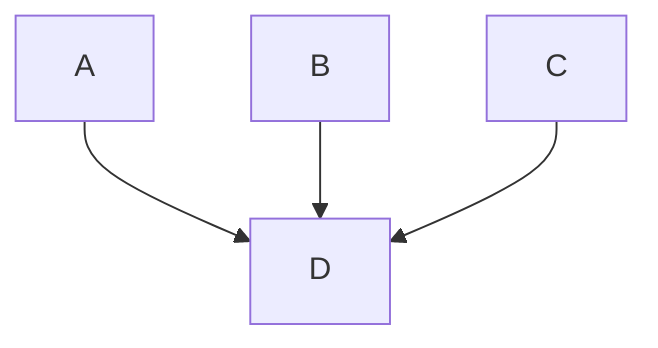
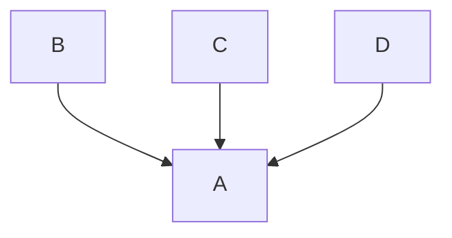
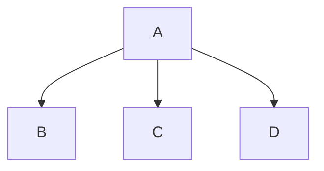
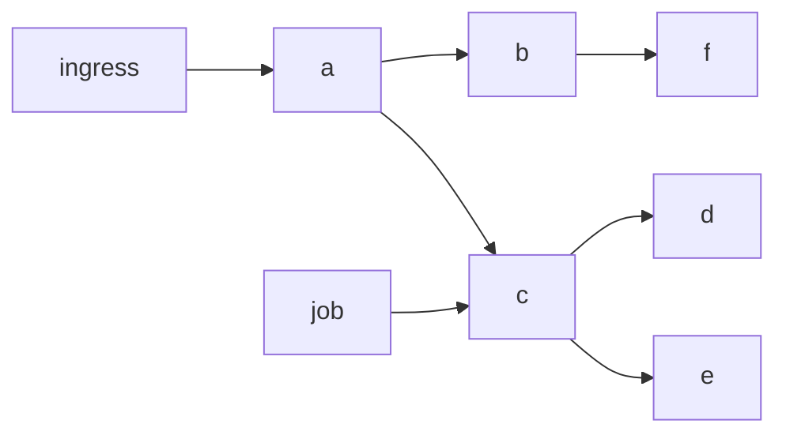

# Automatic reachable services

* Status: accepted

Technical Story: https://github.com/kumahq/kuma/issues/6551

## Context and Problem Statement

With large enough Mesh (more than 1000 services) processing the whole cluster state for each proxy is not possible due to performance reasons. 
The complexity of this computation is O(n^2) (n is the number of services), it also affects Envoy configs size (reaching multiple MB).
This is why a feature called [reachable services](https://github.com/kumahq/kuma-website/blob/045ff9868acdb4b322759dde3f8053f41948100f/app/_src/production/upgrades-tuning/fine-tuning.md#L8-L7) was introduced.
Reachable services is a step in the right direction but defining the whole service graph manually by the service owners or the platform team is a big ask (it can be another reason to resist adopting the mesh).

How can we make Kuma easy to use and not have people needing to do systematic performance tuning?

## Glossary

- MTP - [MeshTrafficPermission](https://kuma.io/docs/2.4.x/policies/meshtrafficpermission/#meshtrafficpermission-(beta))
- ODCDS - [On-demand CDS Updates](https://www.envoyproxy.io/docs/envoy/latest/configuration/http/http_filters/on_demand_updates_filter#config-http-filters-on-demand)

## Decision Drivers 

* feasibility of implementation for 2.5 release
* minimize the manual labour needed
* smooth migration to Mesh for large systems without downtime or service communication issues

## Considered Options

* Using MeshTrafficPermission to generate reverse graph that would feed into reachable services
* Dynamically load clusters using [ODCDS](https://www.envoyproxy.io/docs/envoy/latest/api-v3/extensions/filters/http/on_demand/v3/on_demand.proto)
* Using MeshHTTPRoute / MeshTCPRoute to populate the clusters

## Decision Outcome

Chosen option: "Using MeshTrafficPermission to generate reverse graph that would feed into reachable services"

### Positive Consequences

* not invasive, plug and play, can be removed if proven not efficient enough
  * reachable services should take precedence because:
    * we can change it back if we need to
    * we have escape path if there is an edge case that would incorrectly generate the graph
* possible to implement in the given time frame
* it still works with reachable services and people can mix and match both options
* is a performance benefit for users that already have MTPs defined
* adds an extra layer of security as you can't look at your envoy config to figure out the IP of services you don't have access to
* if passthrough is disabled then a compromised internal service can't be exploited to DOS services it does not have access to

### Negative Consequences

* requires some manual work to define MTPs
* everything in the option section
  * to have performance consequences it requires knowledge of all services that consume API of the service being migrated (you can always do `from: Mesh`)
  * breaking "top-level targetRef selects proxy to configure" rule
  * no RBAC stats on the server side
  * different errors on the client side, instead of 403 client will get connection close / connection reset (more info in mTLS section)
    * this might be desirable in some cases (e.g. github will 404 on repositories you don't have access to if you **are not** part of the organisation)
    * but it also can be undesirable (e.g. github will 403 on repositories you don't have access to if you **are** part of the organisation)

## Pros and Cons of the Options

### Using MeshTrafficPermission to generate reverse graph that would feed into reachable services

#### Mapping

MeshTrafficPermission is defined by the service owner and states which services can communicate with that service.
Based on that information we could build a reverse graph containing information who can talk to whom and based on that we could trim the configs created (which would be equivalent to populating reachable services field).

So MTPs like this:

```yaml
apiVersion: kuma.io/v1alpha1
kind: MeshTrafficPermission
metadata:
  namespace: kuma-system
  name: mtp-b
spec:
  targetRef:
    kind: MeshService
    name: d
  from:
    - targetRef:
        kind: MeshService
        name: a
      default:
        action: Allow
    - targetRef:
        kind: MeshService
        name: b
      default:
        action: Allow
    - targetRef:
        kind: MeshService
        name: c
      default:
        action: Allow
```

Would translate into:



Let's consider other `targetRef` with allow types in combination with `top`/`from` level:
1. `Mesh/Mesh` - this won't help us because that's the default, anyone can talk to anyone and we can't

2. `MeshService/Mesh`  

```yaml
apiVersion: kuma.io/v1alpha1
kind: MeshTrafficPermission
metadata:
  namespace: kuma-system
  name: mtp-ms-to-mesh
spec:
  targetRef:
    kind: MeshService
    name: a
  from:
    - targetRef:
        kind: Mesh
      default:
        action: Allow
```



We could either define an edge between every service to that service or have a special list that contains allIncomingAllowed.
Services from that list would always be added as an outgoing edge.

- `Mesh/MeshService`

```yaml
apiVersion: kuma.io/v1alpha1
kind: MeshTrafficPermission
metadata:
  namespace: kuma-system
  name: mtp-mesh-to-ms
spec:
  targetRef:
    kind: Mesh
  from:
    - targetRef:
        kind: MeshService
        name: a
      default:
        action: Allow
```



This is simply `A` can talk to anyone, this could be either adding and outgoing edge from this service to every other service or having it on a list called allOutgoing and not bothering to trim the configuration.

3. `MeshService/MeshService` - already talked about, this is the easy case

4. Subsets 

There is a strong case that makes sense using `k8s.kuma.io/namespace: xyz` to allow only traffic from a specific namespace.

We will support `MeshSubset` and `MeshServiceSubset` on the `from` level and support `k8s.kuma.io/namespace`, `k8s.kuma.io/service`, `k8s.kuma.io/port` labels on the `top` level.

#### Migration

A typical migration to Mesh involves bringing services gradually into the Mesh.
If the system is small enough, after several iterations, it will be enabled for the whole system (every service).

If the system is too big to do this we need to do extra work in the iterations (defining MeshTrafficPermissions along the way).

The example below is small (deals with individual services), so it's easier to illustrate and understand.
Having an MTP for the mesh should be a recommended way to go about a migration.
Even if you use a very wide MTP (from: Mesh or from: Namespace).

1. 0 services are in the Mesh
2. Bring X services into the Mesh (where X is small enough, so the Mesh can handle it)
3. Enable MeshTrafficPermission for services brought into the mesh (the performance improves because we trimmed the configs)
4. Repeat point 2-3 until all services are in the Mesh

The good thing about how this migration is set up is that we can gradually do it without any interruption to the system.

It's good to keep in mind that the solution does not have to be perfect from the get-go.
People can start with:

```yaml
apiVersion: kuma.io/v1alpha1
kind: MeshTrafficPermission
metadata:
  namespace: kuma-system
  name: namespace-controlled
spec:
  targetRef:
    kind: MeshSubset
    tags:
      namespace: my-ns
  from:
    - targetRef:
        kind: MeshService
        name: a
      default:
        action: Allow
```

And then for each of namespaces and then selectively allow services with:

```yaml
apiVersion: kuma.io/v1alpha1
kind: MeshTrafficPermission
metadata:
  namespace: kuma-system
  name: ns-allow
spec:
  targetRef:
    kind: MeshService
    name: my-public
  from:
    - targetRef:
        kind: Mesh
      action: Allow
```

Scale this to 10 namespaces with 10 services per namespace with 2 services per ns accessible outside their own service.
Then you have per instance 10 + (9 * 2) = 28 services to know about vs 100 services in our current naive case this is a massive improvement and without much sacrifice.

Let's take the following service graph as an example:



We want to bring services into the mesh one by one and trim their config, let's start with service `c` (it's a good example because it has both inbound and outbound traffic):

1. We enable sidecar injection on `c`
2. The traffic flows through like normal
3. We define MTP with `allow` from service `a`, for now this has no consequences because there is no service `a` in the Mesh.
4. We bring service `a` into the mesh
5. We bring service `job` into the mesh
6. We switch MTP for `c` to have `allow` from `a` and `job`, then `deny` for any other service (`Mesh`)
7. This has no consequences on the config size because `a`, `job` and `c` are the only services in the mesh
8. Now let's bring service `d` into the mesh
9. When we do that we will observe the first consequence of config trimming,
   service `d` will have only `a` cluster but won't have `c` cluster because we defined that `c` can only be contacted by `a` and `job`
10. We repeat this until we have all services in the mesh, all new services that join already have a smaller config because we trimmed it along the way

It's critical to remember to only switch to `deny` when **ALL** consumers are **defined in MTP** and are in the Mesh.

There are other concerns that also need addressing:
- breaking "top-level targetRef selects proxy to configure" rule
  - I don't think we can do anything about this, it's at the core of this feature working, what we can (and should) do
    is to have this feature behind a flag and if there is too much negative feedback about this point we can revert it
- wrong errors on the client side, instead of 403 client will get 404/"no upstream"
  - in public facing APIs this is quote common to get a 404 to a resource that you don't have permissions to
  - I imagine we could have a flag to distinguish between a regular 404 and this 404 caused by no upstream resulting from config trimming and return a 403, but
    I think this is out of scope for this, probably a future improvement
- wrong RBAC stats on the server side
  - we would have correct stats on the client side - if we can translate that and surface it to the user I don't think anyone would mind, but
    I think its is for future improvement
- assuming that every service owner knows which services consume their API
  - as a future improvement we will come up with tooling to assist the users with this problem
    - have metrics / logs and a dashboard when `allow_with_shadow_deny` is used (this is not a silver bullet - it assumes that during "discovery" period all possible communication will happen, if you gather data for a week and there is a job that runs every quarter it probably won't be recorded)

##### mTLS

When mTLS is disabled, the traffic will go through the `passthrough` cluster and reach the destination.
When either permissive or strict mTLS is enabled the requests will fail with a closed connection like this:

```bash
root@second-test-server:/# curl -v first-test-server:80
*   Trying [IP]:80...
* Connected to first-test-server ([IP]) port 80 (#0)
> GET / HTTP/1.1
> Host: first-test-server
> User-Agent: curl/7.81.0
> Accept: */*
>
* Empty reply from server
* Closing connection 0
curl: (52) Empty reply from server
```

When `passthrough` is disabled and mTLS enabled we get a connection reset:

```bash
root@second-test-server:/# curl -v first-test-server:80
*   Trying [IP]:80...
* Connected to first-test-server ([IP]) port 80 (#0)
> GET / HTTP/1.1
> Host: first-test-server
> User-Agent: curl/7.81.0
> Accept: */*
>
* Recv failure: Connection reset by peer
* Closing connection 0
curl: (56) Recv failure: Connection reset by peer
```

### Dynamically load clusters using ODCDS

ODCDS only works with `host` header, so it would only work for HTTP traffic.

Based on that limitation we could have in our DNS component a special IP for services with `kuma.io/protocol: http`

```yaml
inlineDnsTable:
  virtualDomains:
  - answerTtl: 30s
    endpoint:
      addressList:
        address:
        - 241.0.0.0 # normally it's 240.0.0.0
    name: some-service.svc
```

And that I would have a special listener in Envoy that would have an HTTP filter that would use `odcds`.

You can see a demo of this in https://github.com/slonka/test-odcds.

Pros/cons:
* This is a very clean solution that would require minimal effort from the users, just marking services with `kuma.io/protocol: http`
* It requires implementing `odcds` in `go-control-plane` and changes in Kuma
* No solution for TCP traffic
* Not possible in the required timeframe
* Delay on the first request 
* Unable to make a request to new service when CP is down 

### Using MeshHTTPRoute / MeshTCPRoute to populate the clusters

This solution does not seem any different to me than just using reachable services, and it has the following downsides:
* Requires work but does not give additional security benefits
* Requires defining empty routes that do not do anything

## Links

* https://www.envoyproxy.io/docs/envoy/latest/api-v3/extensions/filters/http/on_demand/v3/on_demand.proto
* https://github.com/slonka/test-odcds
