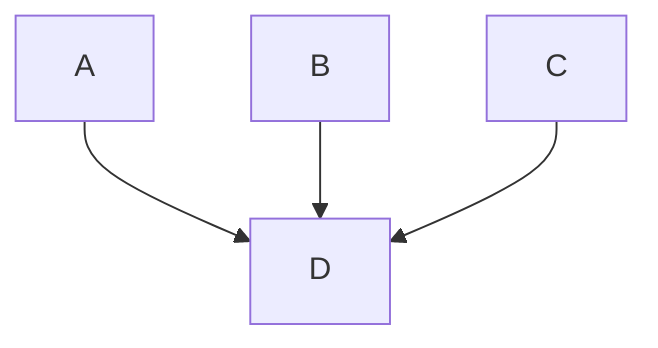
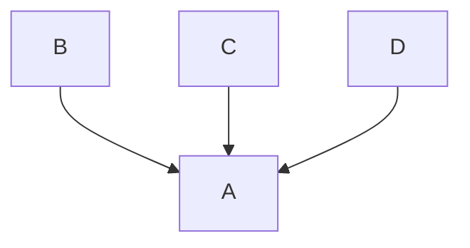
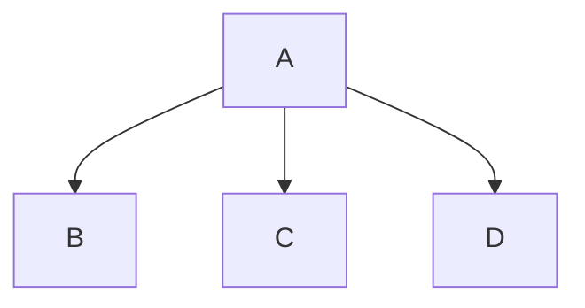
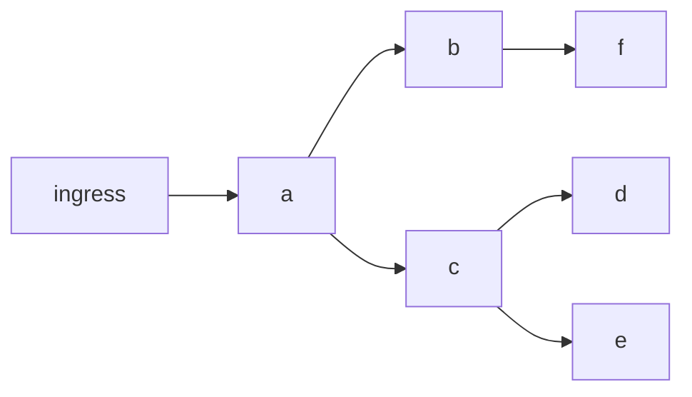

# Automatic reachable services

* Status: accepted

Technical Story: https://github.com/kumahq/kuma/issues/6551

## Context and Problem Statement

With large enough Mesh (more than 1000 services) processing the whole cluster state for each proxy is not possible due to performance reasons (what is the boundary that we're hitting, is it the CPU of the CP / DP, can we have flame graphs showing hot spots?).
This is why a feature called [reachable services](https://github.com/kumahq/kuma-website/blob/045ff9868acdb4b322759dde3f8053f41948100f/app/_src/production/upgrades-tuning/fine-tuning.md#L8-L7) was introduced.
Reachable services is a step in the right direction but defining the whole service graph manually by the service owners or the platform team is a big ask.

How do we ensure a smooth Mesh migration (keeping in mind the performance and minimising manual labour) for large systems?

## Decision Drivers <!-- optional -->

* feasibility of implementation for 2.5 release
* minimize the manual labour needed
* smooth migration to Mesh for large systems without downtime or service communication issues

## Considered Options

* Using MeshTrafficPermission to generate reverse graph that would feed into reachable services
* {option 2}
* {option 3}
* … <!-- numbers of options can vary -->

## Decision Outcome

Chosen option: "{option 1}", because {justification. e.g., only option, which meets k.o. criterion decision driver | which resolves force {force} | … | comes out best (see below)}.

### Positive Consequences <!-- optional -->

* {e.g., improvement of quality attribute satisfaction, follow-up decisions required, …}
* …

### Negative Consequences <!-- optional -->

* {e.g., compromising quality attribute, follow-up decisions required, …}
* …

## Pros and Cons of the Options

### Using MeshTrafficPermission to generate reverse graph that would feed into reachable services

#### Mapping

MeshTrafficPermission is defined by the service owner and states which services can communicate with that service.
Based on that information we could build a reverse graph containing information who can talk to whom and based on that we could trim the configs created (which would be equivalent to populating reachable services field).

So MTPs like this:

```yaml
apiVersion: kuma.io/v1alpha1
kind: MeshTrafficPermission
metadata:
  namespace: kuma-system
  name: mtp-b
spec:
  targetRef:
    kind: MeshService
    name: d
  from:
    - targetRef:
        kind: MeshService
        name: a
      default:
        action: Allow
    - targetRef:
        kind: MeshService
        name: b
      default:
        action: Allow
    - targetRef:
        kind: MeshService
        name: c
      default:
        action: Allow
```

Would translate into:



Warning: this is only the case when you enable mTLS and remove default TrafficPermission and MeshTrafficPermission.
For visibility, you could have a default "deny all" policy.

Let's consider other `targetRef` with allow types in combination with `top`/`from` level:
1. `Mesh/Mesh` - this won't help us because that's the default, anyone can talk to anyone and we can't

2. `MeshService/Mesh`  

```yaml
apiVersion: kuma.io/v1alpha1
kind: MeshTrafficPermission
metadata:
  namespace: kuma-system
  name: mtp-ms-to-mesh
spec:
  targetRef:
    kind: MeshService
    name: a
  from:
    - targetRef:
        kind: Mesh
      default:
        action: Allow
```



We could either define an edge between every service to that service or have a special list that contains allIncomingAllowed.
Services from that list would always be added as an outgoing edge.

- `Mesh/MeshService`

```yaml
apiVersion: kuma.io/v1alpha1
kind: MeshTrafficPermission
metadata:
  namespace: kuma-system
  name: mtp-mesh-to-ms
spec:
  targetRef:
    kind: Mesh
  from:
    - targetRef:
        kind: MeshService
        name: a
      default:
        action: Allow
```



This is simply A can talk to anyone, this could be either adding and outgoing edge from this service to every other service or having it on a list called allOutgoing and
not bothering to trim the configuration.

3. `MeshService/MeshService` - already talked about, this is the easy case

4. `MeshServiceSubset` 

There are two options here:
1. We could treat it as just `MeshService` and include everything, it will probably be just a small overhead in Endpoints
2. We could trim the endpoints based on the tags

For 2. we would probably need to reuse the policy matching mechanism while doing the graph computation.

5. `MeshSubset`

This one is a bit more tricky because the potential radious is a bit bigger. The approaches are the same as in `MeshServiceSubset`.
Do people really use `MeshSubset` for MeshTrafficPermission?

#### Migration

A typical migration to Mesh involves bringing services gradually into the Mesh.
If the system is small enough, after several iterations, it will be enabled for the whole system (every service).

If the system is too big to do this we need to do extra work in the iterations (defining MeshTrafficPermissions along the way).

1. 0 services are in the Mesh
2. We bring in X services into the Mesh (where X is small enough, so the Mesh can handle it)
3. We enable MeshTrafficPermission for services brought into the mesh (the performance improves because we trimmed the configs)
4. We repeat point 2-3 until all services are in the Mesh

Let's take the following service graph as an example:



If we enable MTP on `d` that allows `c` to contact it,
and we only use this information
then suddenly traffic between `c -> e` does not work <sup>1</sup>.

We can't enable MTP on `b` until we bring `a` into the mesh.

How this only could work is that we start at the `ingress` and we bring the services level by level and
at each level we define MTP. We have to bring services at each level at the same time to not disturb the flow of traffic (<sup>1</sup>).

It seems to me that this approach requires a lot of up front knowledge (the entire service graph) and
leaves not too much room for error.

There are other small concerns that also need addressing:
- wrong errors on the client side, instead of 403 client will get 404/"no upstream"
  - in public facing APIs this is quote common to get a 404 to a resource that you don't have permissions to
  - we could have a flag to distinguish between a regular 404 and this 404 caused by no upstream resulting from config trimming and return a 403
- wrong RBAC stats on the server side
  - we would have correct stats on the client side - if we can translate that and surface it to the user I don't think anyone would mind
  - 


### {option 2}

{example | description | pointer to more information | …} <!-- optional -->

* Good, because {argument a}
* Good, because {argument b}
* Bad, because {argument c}
* … <!-- numbers of pros and cons can vary -->

### {option 3}

{example | description | pointer to more information | …} <!-- optional -->

* Good, because {argument a}
* Good, because {argument b}
* Bad, because {argument c}
* … <!-- numbers of pros and cons can vary -->

## Links <!-- optional -->

* {Link type} {Link to ADR} <!-- example: Refined by [ADR-0005](0005-example.md) -->
* … <!-- numbers of links can vary -->
