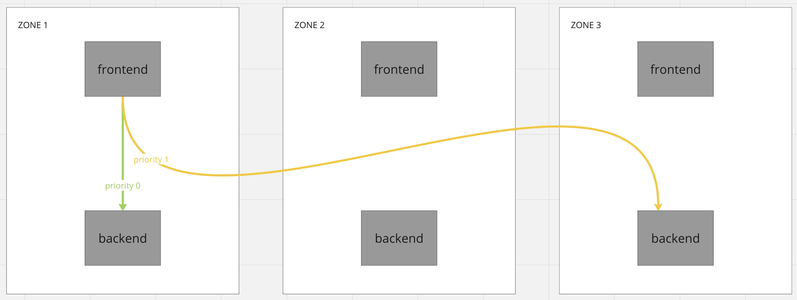
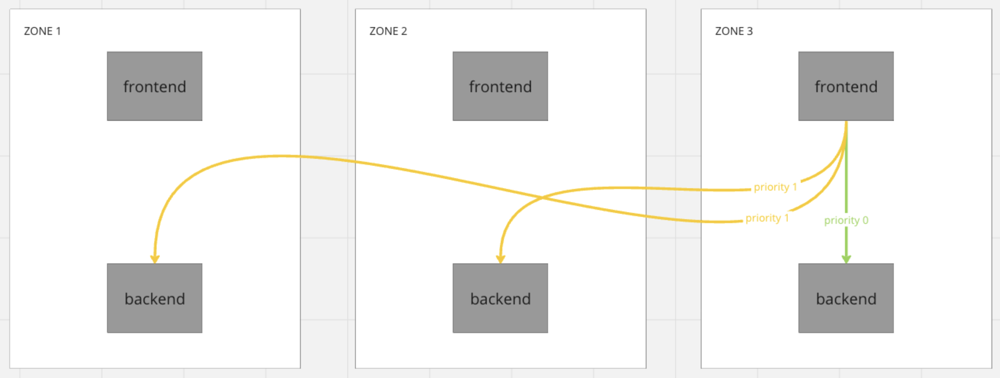
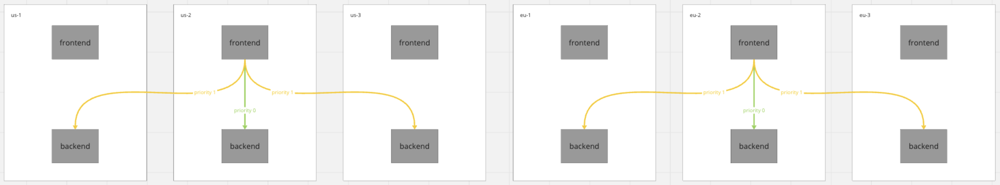

# MeshLoadBalancingStrategy - locality aware
* Status: accepted

Technical Story: https://github.com/kumahq/kuma/issues/2689

## Context and Problem Statement
Right now we have really simple locality aware load balancing, we only care about zones. Dataplane will prefer sending traffic to local zone with fallback to other zones. We would like to add more sophisticated mechanism of locality aware load balancing. We would like to allow user to specify load balancing rules based on tags. For example, big cluster is deployed in multiple AZ’s, and we would like to prefer staying in a single AZ to reduce traffic cost.

## Decision Outcome

We will implement locality aware load balancing by extending MeshLoadBalancingStrategy policy. API that we picked as well
as internals are described in details in next sections of this MADR.

## Solution
As stated earlier, we would like to improve our current locality aware load balancing, and make it more flexible for users.

### Use cases
After gathering client's expectations and a couple of brainstorming sessions, we ended up with multiple use cases for locality aware load balancing:

1. Keeping traffic in single zone (disable all cross-zone traffic)
2. Load balancing based on priorities within a zone. Example: node → AZ → region
3. Prefer traffic in single zone with fallback to other zones
4. Load balance equally to list of zones
5. When leaving zone, target specific zones first. Example zones physically close to each other
6. Load balance equally to local dpp and other zone
7. Exclude zone from load balancing
8. Load balance equally within a group of zones

### API design
Looking at use cases, it is clear that we have two types of load balancing strategies, inside zone and cross zone. We can easily route to services with proper tags inside the zone, but immediately after we cross zone border and hit Zone Ingress we lose the ability to control locality.
Because of this we have decided that we will split our API in two sections: `localZone ` and `crossZone`.

Here is the full example of policy:

```yaml
targetRef:
  kind: Mesh
to:
  targetRef:
    kind: MeshService
    name: backend
  defaults:
    localityAwareness:
      disabled: false
      localZone:
        affinityTags:                                       # (1)
        - key: "k8s.io/node"                                # (2)
          weight: 90                                        # (3)
        - key: k8s.io/az"
          weight: 9
      crossZone:                                            # (4)
        failover:                                           # (5)
          - from:                                           # (6)
              zones: ["zone-1", "zone-2"]
            to:                                             # (7)
              type: Only                                    # (8)
              zones: ["zone-1", "zone-2"]
          - from:
              zones: ["zone-3"]
            to:
              type: AnyExcept
              zones: ["zone-1"]
          - to:
              type: Any
        failoverThreshold: 
          percentage: 70                                    # (9)
```


(1) In `localZone` section, you configure the affinity of tags used for load balancing. If list is empty or localZone is not specified, load balancing works normally, without taking any priorities into account. 

(2) In `key` field, you define the name of the tag.

(3) In `weight` field, you define proportional load that the group should take. Default values are calculated based on the order of the list.
Example:
```yaml
affinityTags:
  - key: "k8s.io/node"
  - key: k8s.io/az"
  - key: k8s.io/region"
```

Would create weights:

```yaml
affinityTags:
  - key: "k8s.io/node"
    weight: 900
  - key: "k8s.io/az"
    weight: 90
  - key: "k8s.io/region"
    weight: 9
```

and all other endpoints are going to have the weight of 1. To compute the percentage of traffic that will stay inside a tag
you need to sum all the weight within localZone and then divide weights by it. These weights don't apply for cross zone traffic, and the traffic is routed cross zone only when number of healthy instances within the local zone is lower than `failoverThreshold`. In this example sum of weights is 999. If you divide weights by it, you
get 90% of traffic for `k8s.io/node` 9% for `k8s.io/az` and 1% for `k8s.io/region`. 
When configuring weight you need to either specify weights for all tags or don't specify weights at all. When you specify weights the order of the list becomes irrelevant.

(4) In `crossZone` section, you configure zones priority.

(5) In `failover` section, you configure list of zone priorities, first rules will have the highest load balancing priority and last in order will have the lowest priority.

(6) In `from` section, you configure to which zones this rule applies. This rule will apply to all DPPs in `zone-1` and `zone-2`. If not defined is for all zones.

(7) In `to` section, you configure to which zones traffic should be redirected. This field is required.

(8) `type` field lets you control how fallback zones are picked. Allowed values:
- `Only` - will load balance traffic only to zones listed in `zones` field 
- `None` - will not load balance traffic any further
- `Any` - will load balance traffic to all zones
- `AnyExcept` - will load balance traffic to all zones except ones specified in `zones` field

(9) In `failoverThreshold` you configure the percentage of live endpoints below which we will start load balancing to the 
next priority. This is the inverse of [Envoy overprovisioning factor](https://www.envoyproxy.io/docs/envoy/latest/intro/arch_overview/upstream/load_balancing/overprovisioning#arch-overview-load-balancing-overprovisioning-factor). 
Default: 50% 
Example: If you have 2 instances in your local zone and suddenly one of instances is unhealthy, traffic is still in the local zone.


### API examples based on use cases

#### Keeping traffic in same zone (disable cross zone traffic)

This:
```yaml
targetRef:
  kind: Mesh
to:
  targetRef:
    kind: MeshService
    name: backend
  defaults: 
    localityAwareness: {}
```
and this:
```yaml
targetRef:
  kind: Mesh
to:
  targetRef:
    kind: MeshService
    name: backend
  defaults:
    localityAwareness:
      localZone: 
        affinityTags: []
```

are the same configuration.


#### Load balancing based on priorities within a zone and no cross-zone traffic. Example: node → AZ → region

```yaml
targetRef:
  kind: Mesh
to:
  targetRef:
    kind: MeshService
    name: backend
  defaults:
    localityAwareness:
      localZone:
        affinityTags:
        - key: "k8s.io/node"
        - key: "k8s.io/az"
```


#### Prefer traffic in same zone with fallback to any other zone

```yaml
targetRef:
  kind: Mesh
to:
  targetRef:
    kind: MeshService
    name: backend
  defaults:
    localityAwareness:
      localZone:
        affinityTags: []
      crossZone:
        failover:
          - to: 
              type: Any
```


#### Load balance equally to list of zones when local is not available
In this case, traffic from outside to the `backend` service in `zone-2` is completely excluded.

```yaml
targetRef:
  kind: Mesh
to:
  targetRef:
    kind: MeshService
    name: backend
  defaults:
    localityAwareness:
      localZone:
        affinityTags: []
      crossZone:
        failover:
          - to:
              type: Only
              zones: ["zone-1", "zone-3"]
```





#### When leaving zone, target specific zones first

```yaml
targetRef:
  kind: Mesh
to:
  targetRef:
    kind: MeshService
    name: backend
  defaults:
    localityAwareness:
      localZone:
        affinityTags: []
      crossZone:
        failover:
          - to:
              type: Only
              zones: ["zone-1"]
          - to:
              type: Only
              zones: ["zone-3"]
```


#### Route within local zone and then fallback to any zone except 1 (zone-3)

Worth noting that zone-3 would not have any zone failover in this case

```yaml
targetRef:
  kind: Mesh
to:
  targetRef:
    kind: MeshService
    name: backend
  defaults:
    localityAwareness:
      localZone:
        affinityTags: []
      crossZone:
        failover:
          - to:
              type: AnyExcept
              zones: ["zone-3"]
```




#### Load balance equally within a group of zones

When we want to keep traffic in specific groups and don't route fallback from EU to US.



```yaml
targetRef:
  kind: Mesh
to:
  targetRef:
    kind: MeshService
    name: backend
  defaults:
    localityAwareness:
      localZone:
        affinityTags: []
      crossZone:
        failover:
          - from: 
              zones: ["us-1", "us-2", "us-3"]
            to:
              type: Only
              zones: ["us-1", "us-2", "us-3"]
          - from:
              zones: ["eu-1", "eu-2", "eu-2"]
            to:
              type: Only
              zones: ["eu-1", "eu-2", "eu-2"]
```

#### Load balance equally to local and zone


We have the couple of use cases for this, but no config yet:
- You are migrating from universal to k8s, both zones are in the same AZ and I would like to move traffic gradually from one to another
- You have some zone with testing or preview environment, and you would like to handle live traffic on it for testing.

**This is not the locality aware load balancing responsibility, and should be configured using `MeshHttpRoute`**

### Implementation

We want to enhance current `MeshLoadBalancingStrategy` so code related to the changes should be placed in the plugin.

#### Matching endpoints
Each instance of the service might be in a different locality: zone, node. Users need to properly tag these dataplanes so we are able to match them. We need to retrieve all tags from all inbounds and, later, based on these tags, match outbounds that are in the same location.

Example:

On Kubernetes, all tags from the node could be populated automatically (see details later), while on Universal, users need to populate tags themselves:

```yaml
type: Dataplane
mesh: default
name: demo
networking:
  address: 127.0.0.1
  inbound:
    - port: 9999
      servicePort: 10000
      serviceAddress: 127.0.0.1
      tags:
        kuma.io/service: demo
        kuma.io/protocol: tcp
        k8s.io/az: us-east-1
```


Later, based on these tags, the control-plane creates `ClusterLoadAssignment` and puts all tags, for each endpoint, into cluster metadata::

```json
"metadata":{
  "filter_metadata": {
    "envoy.lb": {
      "az/test": "b",
      "kuma.io/protocol": "tcp",
      "k8s.io/az": "us-east-1"
    }
  }
}
```


We can retrieve them from `ClusterLoadAssignment` and match them with the policy. First, we need to retrieve all tags from inbounds so we can determine our location and match it with endpoints.

Pseudo algorithm:

1. Get all inbound tags.
2. Take the matched policy and take the config from it.
3. Check if inbound has the tag defined in the policy config. 
4. If yes, iterate over all endpoints of the service and group them in to priority groups, by matching with the specific rule(first localZone, then crossZone). If no, get all the endpoints in the zone. 
   1. Move matching endpoints by first tag to priority 0
   2. Move matching endpoints by n tag to priority 0 but lower wieght
   3. All not matching endpoint in the local zone move to priority 0 with weight 1
   4. Iterate over zone endpoints and based on matching put them in priority N+ iteration
5. Create `LocalityLbEndpoints` with selected endpoints. 
6. Override `ClusterLoadAssignment` for the dataplane in the `ResourceSet`.

Dataplanes in the specific location are going to receive only endpoints in the specific locality. For cross zone traffic without egress the control-plane delivers only ingresses of specific zones.

How to configure Clusters traffic?

Envoy allows different forms of load balancing:
* [Priority load balancing](https://www.envoyproxy.io/docs/envoy/latest/intro/arch_overview/upstream/load_balancing/priority.html#priority-levels)
* [Locality weighted load balancing](https://www.envoyproxy.io/docs/envoy/latest/intro/arch_overview/upstream/load_balancing/locality_weight#arch-overview-load-balancing-locality-weighted-lb)
* [Load Balancer Subsets](https://www.envoyproxy.io/docs/envoy/latest/intro/arch_overview/upstream/load_balancing/subsets.html)

1. Priority: Ideal for managing cross-zone traffic and prioritizing the acceptance of specific zones. You can also use it to prioritize local zone endpoints based on these settings.

2. Load Balancer Subsets: Initially considered a good choice for managing localZone traffic. It organizes endpoints into subsets based on provided keys, albeit with a slight increase in Envoy's memory usage. However, I encountered some issues during testing that led me to reconsider this option:

Problems:
* When an endpoint with a matching tag becomes unhealthy, Envoy still attempts to send requests to it and doesn't fall back. This behavior is unacceptable.
* Priorities do not work seamlessly with subsets, even when using aggregated clusters.

3. Locality Weighted Load Balancing: This strategy can help distribute traffic and may be suitable for local zone traffic, but it's not a perfect solution due to the following concerns:
* We need to deliver weights to the sidecar, which can cause traffic to not stay within the node. Traffic is routed based on these weights, so even if we specify that a node has a higher weight than an availability zone, some traffic might still be routed elsewhere.

I think we should implement the following:

* Priority: for cross-zone traffic.
* Locality-Weighted Load Balancing: This will help ensure that local zone traffic does not overload instances within the highest priority group when there are more instances available in other groups.
  * Ideally, if there are a sufficient number of healthy hosts, the traffic should primarily remain within the local zone and only route outside when there aren't enough healthy hosts. This behavior is largely determined by the overprovisioning factor, which can be set as a default value while allowing users to define it as needed. By default, it's 50% which means if there is less than 50% healthy traffic is routed cross zone.
  * We will be using default high weights that prioritize specific tags within the local zone. This configuration ensures that a significant portion of the traffic is directed mostly to endpoints in specific locations.

##### Adding node labels to the Pod
Valuable routing information can be accessed through the 'node' object in Kubernetes. We have the ability to extract node-related details from Kubernetes and use them as tags for pods. One possible method involves extending a Pod Kubernetes controller to retrieve node labels and incorporate them into the Pod object. However, it's important to note that this step may not be within the scope of the initial implementation.

##### Egress
Egress is not as simple as ingress. Currently, we support Locality Aware when atleast one client requires it, so we cannot distinguish between clients. Control-plane needs to send all dataplanes to the egress because there might be services sending requests to all zones. There are 2 options:
- LoadBalacing based on metadata
- Separate clusters
- Support only Mesh scope for Egress
- **Client defines which zone wants to communicate to**

Load balancing based on the metadata seems to be able to solve an issue but it has limitations. Because, egress knows all endpoints and does routing based on matching metadata the request might not obey the priority of zones. In this case we cannot configure different priorities for different clients.

Separate cluster seems to be the only option that could solve this problem. When there is a different configuration of Load Balancing for the one of dataplane, control-plane sends to egress new a cluster `mesh-name:service-name:hash(tag + value)` with the routing based on the SNI: `service-name{mesh=mesh-name,hash=hash}`
This cluster has a different configuration of priorities and only subset of zones. Dataplanes interested in this Load Balancing are going to have the same configuration of the cluster which sets SNI: `service-name{mesh=mesh-name,hash=hash}` and based in this SNI egress can make a routing decision to route to the specific cluster. That also requries each ingress to create a filter chain match for SNIs, to match an incoming request with the cluster.

Another option doesn't create separate configuration for each client, but uses just Mesh scoped `MeshLoadBalancingStrategy` to configure egress. That reduces possibilites of configuring Egress but can be changed in the future.

The most favorable approach appears to be defining routing on the client side. Instead of creating separate cluster sets for each client on the Egress, we create an 'aggregate_cluster' for the client:

Aggregate_cluster:

- backend_in_zone
- backend_zone1
- backend_zone2

Each entry represents the Envoy cluster name that the client is interested in communicating with, in order of priority. This arrangement enables each cluster to set a separate 'SNI' for each zone, facilitating matching and routing on the Egress side.

For example:

```yaml
backend_zone1 = SNI backend{mesh=default,kuma.io/zone=zone1}
backend_zone2 = SNI backend{mesh=default,kuma.io/zone=zone2}
```

In addition, it is important to configure the Egress correctly. For each `SNI`, we need to create a filter chain match that sets the required metadata for selecting endpoints:

```yaml
- filterChainMatch:
    serverNames:
    - backend{mesh=default,kuma.io/zone=zone1}
    transportProtocol: tls
  filters:
  - name: envoy.filters.network.tcp_proxy
    typedConfig:
      '@type': type.googleapis.com/envoy.extensions.filters.network.tcp_proxy.v3.TcpProxy
      cluster: default:backend
      metadataMatch:
        filterMetadata:
          envoy.lb:
            kuma.io/zone: zone1
      statPrefix: default:backend_zone1
```
Each dataplane has metadata, and it's important to ensure that `kuma.io/zone` is available. If it's not present, add it to the endpoints.

On the ingress side, you only need to adjust the `SNI` to include its corresponding `kuma.io/zone`.

However, it's important to note that this step may not be within the scope of the initial implementation. We are going to support initially: **Support only Mesh scope for Egress**.

##### Ingress
We don't configure ingresses.

#### ClusterLoadBalancing cache
Currently, while retrieving endpoints in the plugin, we are getting a pointer to the object in the cache that is shared between dataplanes. This won't work with localityAwareness load balancing because each dataplane might have a different subset of endpoints with different priorities.

We are going to implement this without the cache and verify performance.

Steps:
* Run `mesh-perf` test to measure impact of not using CLA cache
* If results are good we'll remove the CLA cache
* Otherwise, rewrite CLA cache to keep the different clusters depending on the dataplane tags

##### Test result
We have run a test of 1000 services with 2 instances each in standalone mode. Each service had reachable services to 3 services defined.

With CLA cache:


Without CLA cache:


We can observe that p90 and p99 are much higher without using the cache. We should keep records in the cache but we have to ensure that generated key is reusable so we don't create to many same CLA entries. Also, we could move CLA cache into MeshContext to keep related things together.

#### MeshHTTPRoute and MeshTCPRoute
`MeshHTTPRoute` and `MeshTCPRoute` enable the creation of splits for the cluster, and load balancing should be applied to them. It appears that the easiest approach would be to retrieve CLAs for the splits from the `ResourceSet` and then make necessary modifications within the `MeshLoadBalancingStrategy` after their creation. It's important to note that these splits are currently being aggregated during the `GatherEndpoints` function call, but they should not be aggregated in this specific case. Additionally, when working with objects in the `EndpointMap` it's important to avoid manipulating pointers directly and instead make use of copies, or create CLAs cache logic that would support Priorites.

Example:

Let's say we have a MeshHTTPRoute policy:

```yaml
apiVersion: kuma.io/v1alpha1
kind: MeshHTTPRoute
metadata:
  name: route-all-zones
  namespace: kuma-system
  labels:
    kuma.io/mesh: default
spec:
  targetRef:
    kind: MeshService
    name: frontend
  to:
  - targetRef:
      kind: MeshService
      name: backend
    rules:
      default:
        backendRef:
        - kind: MeshServiceSubset
          name: backend
          tags:
            kuma.io/zone: zone-1
        - kind: MeshServiceSubset
          name: backend
          tags:
            kuma.io/zone: zone-3
```

and `MeshLoadBalancingStrategy`:

```yaml
apiVersion: kuma.io/v1alpha1
kind: MeshLoadBalancingStrategy
metadata:
  name: mlbs-only-zone-1
  namespace: kuma-system
  labels:
    kuma.io/mesh: default
spec:
  targetRef:
    kind: Mesh
  to:
    targetRef:
      kind: MeshService
      name: backend
    defaults:
      localityAwareness:
        disabled: false
        crossZone:
          failover:
            - to:
                type: Only
                zones: ["zone-1"]
```

In this case, `MeshLoadBalancingStrategy` modifies the endpoints of clusters created by `MeshHTTPRoute` because the strategy allows routing only to `zone-1`. As a result, your split is limited to communicating exclusively with `zone-1`. Policies are managed at a different level, and `MeshLoadBalancingStrategy` is the component with the authority to override the cluster's behavior.

### Other
#### Cross mesh
We cannot configure this policy cross mesh. We are bound to mesh, when you leave mesh you lose all information needed for locality aware load balancing, and you need to specify new policy for each mesh.

Cross mesh gateway should be handled as simply yet another destination with tags. We can add standard k8s node tags, zone tags, etc to it. This won't be done in the first version of policy, 
