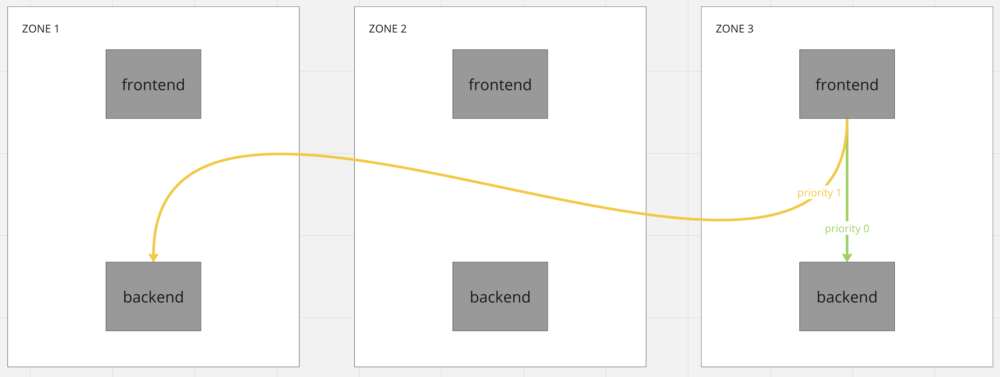

# MeshLoadBalancingStrategy - locality aware
* Status: accepted

Technical Story: https://github.com/kumahq/kuma/issues/2689

## Context and Problem Statement
Right now we have really simple locality aware load balancing, we only care about zones. Dataplane will prefer sending traffic to local zone with fallback to other zones. We would like to add more sophisticated mechanism of locality aware load balancing. We would like to allow user to specify load balancing rules based on tags. For example, big cluster is deployed in multiple AZ’s, and we would like to prefer staying in a single AZ to reduce traffic cost.

## Considered Options

## Decision Outcome

## Solution
As stated earlier, we would like to improve our current locality aware load balancing, and make it more flexible for users.
### Use cases
After gathering client's expectations and a couple of brainstorming sessions, we ended up with multiple use cases for locality aware load balancing:

1. Keeping traffic in single zone (disable all cross-zone traffic)
2. Load balancing based on priorities within a zone. Example: node → AZ → region
3. Prefer traffic in single zone with fallback to other zones
4. Load balance equally to list of zones
5. When leaving zone, target specific zones first. Example zones physically close to each other
6. Load balance equally to local dpp and other zone
7. Exclude zone from load balancing
8. Load balance equally within a group of zones

### API design
Looking at use cases, it is clear that we have two types of load balancing strategies, inside zone and cross zone. We can easily route to services with proper tags inside the zone, but immediately after we cross zone border and hit Zone Ingress we lose the ability to control locality.
Because of this we have decided that we will split our API in two sections: `inZone` and `crossZone`.

Here is the full example of policy:

```yaml
targetRef:
  kind: Mesh
to:
  targetRef:
    kind: MeshService
    name: backend
  defaults:
    localityAwareness:
      inZone: ["k8s.io/node", "k8s.io/az"] # (1)
      crossZone: # (2)
        rules: # (3)
          - groups: # (4)
            - name: "group1" # (5)
              zones: ["zone-1", "zone-2"]
            - name: "group2"
              zones: ["zone-3", "zone-4"]
          - groups:
            - zones: ["zone-5"]
        fallback: # (6)
          type: Any # (7)
          exclude: # (8)
            zones: ["zone-6"]
      overprovisioningFactor: 120% # (9)
```


(1) In `inZone` section, you configure the priorities of tags used for load balancing. If list is empty or inZone is not specified, load balancing works normally, without taking any priorities into account. 

(2) In `crossZone` section, you configure zones priority.

(3) In `rules` section, you configure list of zone groups priorities, first groups will have the highest load balancing priority and last in order will have the lowest priority.

(4) In `groups` section, you configure logical zone groups. Let's assume `zone-1` and `zone-2` are located in the same datacenter, so you want to load balance equally between them. `Zone-5` is located in another datacenter so it should have lower priority, that is why it is in the second groups entry.

(5) In the `name` section, you can assign a name to the group, which is later used for matching when there are multiple groups. If no group name is provided, the values from the group will apply to all entries in previous groups.

(6) In `fallback` section, you can configure the default behaviour in case of other zones fail, or exclude specific zones.

(7) At last we should apply some fallback if no dataplanes from previous configuration are available, at this moment we allow `Fail` and `Any` fallback. Default value `Fail`'

(8) In `exclude` section, you can configure which zones shouldn't take part in the routing

(9) In [`overprovisioningFactor`](https://www.envoyproxy.io/docs/envoy/latest/intro/arch_overview/upstream/load_balancing/overprovisioning#arch-overview-load-balancing-overprovisioning-factor) section, you configure how early [Envoy] should consider other priorities.


### API examples based on use cases

#### Keeping traffic in same zone (disable cross zone traffic)

```yaml
targetRef:
  kind: Mesh
to:
  targetRef:
    kind: MeshService
    name: backend
  defaults:
    localityAwareness:
      inZone: []
```


#### Load balancing based on priorities within a zone. Example: node → AZ → region

```yaml
targetRef:
  kind: Mesh
to:
  targetRef:
    kind: MeshService
    name: backend
  defaults:
    localityAwareness:
      inZone: ["k8s.io/node", "k8s.io/az"]
```


#### Prefer traffic in same zone with fallback to any other zone

```yaml
targetRef:
  kind: Mesh
to:
  targetRef:
    kind: MeshService
    name: backend
  defaults:
    localityAwareness:
      inZone: []
      crossZone:
        fallback:
          type: Any
```


#### Load balance equally to list of zones
In this case, traffic from outside to the `backend` service in `zone-2` is completely excluded.

```yaml
targetRef:
  kind: Mesh
to:
  targetRef:
    kind: MeshService
    name: backend
  defaults:
    localityAwareness:
      inZone: []
      crossZone:
        - groups:
          - name: "group1"
            zones: ["zone-1", "zone-3"]
        fallback:
          type: Fail
```




#### When leaving zone, target specific zones first

```yaml
targetRef:
  kind: Mesh
to:
  targetRef:
    kind: MeshService
    name: backend
  defaults:
    localityAwareness:
      inZone: []
      crossZone:
        - groups:
          - zones: ["zone-1"]
            name: "group1"
        - groups:
          - zones: ["zone-3"]
            name: "group1"
```


#### Exclude single zone from load balancing

```yaml
targetRef:
  kind: Mesh
to:
  targetRef:
    kind: MeshService
    name: backend
  defaults:
    localityAwareness:
      inZone: []
      crossZone:
        fallback:
          type: Any
          exclude:
            zones: ["zone-3"]
```


#### Load balance equally within a group of zones

When we want to keep traffic in specific groups and don't route fallback from EU to US.


```yaml
targetRef:
  kind: Mesh
to:
  targetRef:
    kind: MeshService
    name: backend
  defaults:
    localityAwareness:
      inZone: []
      crossZone:
        - groups:
          - name: "us"
            zones: ["us-east", "us-west"]
          - name: "eu"
            zones: ["eu-east"]
        - groups:
          - name: "eu"
            zones: ["eu-east2"]
        fallback:
          type: Fail
```

#### Load balance equally to local and zone


We have the couple of use cases for this, but no config yet:
- You are migrating from universal to k8s, both zones are in the same AZ and I would like to move traffic gradually from one to another
- You have have some zone with testing or preview environment and you would like to handle live traffic on it for testing. Is it a use case for locality aware lb? Or should this be done with MeshHTTPRoute?
The question is if we really need it, or can this be done currently in some other way?

### Implementation

We want to enhance current `MeshLoadBalancingStrategy` so code related to the changes should be placed in the plugin.

#### Matching endpoints
Each instance of the service might be in a different locality: zone, node. Users need to properly tag these dataplanes so we are able to match them. We need to retrieve all tags from all inbounds and, later, based on these tags, match outbounds that are in the same location.

Example:

On Kubernetes, all tags from the pod are populated automatically, while on Universal, users need to populate tags themselves:

```yaml
type: Dataplane
mesh: default
name: demo
networking:
  address: 127.0.0.1
  inbound:
    - port: 9999
      servicePort: 10000
      serviceAddress: 127.0.0.1
      tags:
        kuma.io/service: demo
        kuma.io/protocol: tcp
        k8s.io/az: us-east-1
```


Later, based on these tags, the control-plane creates `ClusterLoadAssignment` and puts all tags, for each endpoint, into cluster metadata::

```json
"metadata":{
  "filter_metadata": {
    "envoy.lb": {
      "az/test": "b",
      "kuma.io/protocol": "tcp",
      "k8s.io/az": "us-east-1"
    }
  }
}
```


We can retrieve them from `ClusterLoadAssignment` and match them with the policy. First, we need to retrieve all tags from inbounds so we can determine our location and match it with endpoints.

Pseudo algorithm:

1. Get all inbound tags.
2. Take the matched rules.
3. Check if inbound has the tag defined in the rule. 
4. If yes, iterate over all endpoints of the service and group them in to priority groups, by matching with the specific rule(first inZone, then  cross Zone). If no, get all the endpoints in the zone.
5. Create `LocalityLbEndpoints` with selected endpoints. 
6. Override `ClusterLoadAssignment` for the dataplane in the `ResourceSet`.

Dataplanes in the specific location are going to receive only endpoints in the specific locality. For cross zone traffic without egress the control-plane delivers only ingresses of specific zones.

##### Adding node labels to the Pod
Valuable routing information can be accessed through the 'node' object in Kubernetes. We have the ability to extract node-related details from Kubernetes and use them as tags for pods. One possible method involves creating a Kubernetes controller to retrieve node labels and incorporate them into the Pod object. However, it's important to note that this step may not be within the scope of the initial implementation.

##### Egress
Egress is not as simple as ingress. Currently, we support Locality Aware when atleast one client requires it, so we cannot distinguish between clients. Control-plane needs to send all dataplanes to the egress because there might be services sending requests to all zones. There are 2 options:
- LoadBalacing based on metadata
- Separate clusters
- Support only Mesh scope for Egress

Load balancing based on the metadata seems to be able to solve an issue but it has limitations. Because, egress knows all endpoints and does routing based on matching metadata the request might not obey the priority of zones. In this case we cannot configure different priorities for different clients.

Separate cluster seems to be the only option that could solve this problem. When there is a different configuration of Load Balancing for the one of dataplane, control-plane sends to egress new a cluster `mesh-name:service-name:hash(tag + value)` with the routing based on the SNI: `service-name{mesh=mesh-name,hash=hash}`
This cluster has a different configuration of priorities and only subset of zones. Dataplanes interested in this Load Balancing are going to have the same configuration of the cluster which sets SNI: `service-name{mesh=mesh-name,hash=hash}` and based in this SNI egress can make a routing decision to route to the specific cluster. That also requries each ingress to create a filter chain match for SNIs, to match an incoming request with the cluster.

The last option doesn't create separate configuration for each client, but uses just Mesh scoped `MeshLoadBalancingStrategy` to configure egress. That reduces possibilites of configuring Egress but can be changed in the future.

##### Ingress
We don't configure ingresses.

#### ClusterLoadBalancing cache
Currently, while retrieving endpoints in the plugin, we are getting a pointer to the object in the cache that is shared between dataplanes. This won't work with localityAwareness load balancing because each dataplane might have a different subset of endpoints with different priorities.

We are going to implement this without the cache and verify performance.

Steps:
* Run `mesh-perf` test to measure impact of not using CLA cache
* If results are good we'll remove the CLA cache
* Otherwise rewrite CLA cache to keep the different clusters depending on the dataplane tags

#### MeshHTTPRoute and MeshTCPRoute
`MeshHTTPRoute` and `MeshTCPRoute` enable the creation of splits for the cluster, and Load Balancing should be applied to them. It's essential to apply Load Balancing before creating the splits. To ensure this order, we must specify that the plugin comes before `Mesh*Route`. Additionally, when generating endpoints for splits, we usually utilize CLA Cache. However, in this scenario, we should retrieve endpoints from the `ResourceSet`.

### Other
#### Cross mesh
We cannot configure this policy cross mesh. We are bound to mesh, when you leave mesh you lose all information needed for locality aware load balancing, and you need to specify new policy for each mesh.

Question what if someone is placing each bounded context in a different mesh for isolation and would still like to benefit from locality aware load balancing? Will cross mesh traffic be routed locally? 
