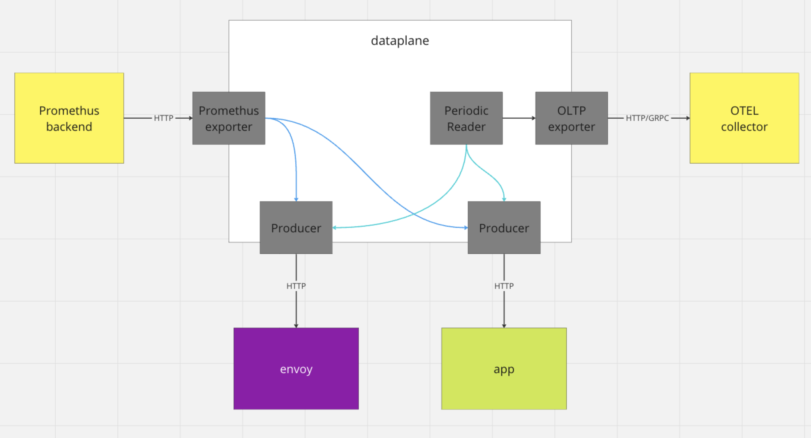

# MeshMetric policy
* status: accepted
  Technical Story: https://github.com/kumahq/kuma/issues/5708

## Context and Problem statement
We want to create a new policy responsible for Metrics collection. This policy will be part of Kuma observability policies 
stack, alongside `MeshAccessLog` and `MeshTrace`. The new policy should expose the same functionality as now is exposed through `Mesh`. 
We want to provide support for Prometheus and native support for OTEL backend.

## Decision Outcome
We will implement new `MeshMetric` policy as described further in this MADR.

## Solution

### API design

#### Current API
The API is going to be similar to what we have under `mesh.spec.metrics`. The current API looks like this:

```yaml
apiVersion: kuma.io/v1alpha1
kind: Mesh
metadata:
  name: default
spec:
  metrics:
  enabledBackend: prometheus-1
  backends:
    - name: prometheus-1
      type: prometheus
      conf:
        tls:
          mode: disabled | providedTLS | activeMTLSBackend
        port: 5670
        path: /metrics
        tags:
          kuma.io/service: dataplane-metrics
        envoy:
          filterRegex: http2_act.*
          usedOnly: true
        aggregate:
          - name: my-service
            path: "/metrics/prometheus"
            port: 8888
          - name: other-sidecar
            port: 8000
```

#### Changes to the API
1. I think the aggregation that [uses the aggregate name and pod annotations](https://kuma.io/docs/2.5.x/policies/traffic-metrics/#expose-metrics-from-applications) no longer makes sense, as we can use targetRef 
policies to point to specific DPs. I imagine there would be a default wide policy (possibly `Mesh` scoped) and per app / framework / language overrides.
2. What I also don’t like about this is that “filters” are under envoy - We could rename it to `sidecar` and introduce 
the concept of “profiles” like we discussed. Maybe something like this:

```yaml
sidecar:
  usedOnly: true # true or false
  profile: minimal # one of minimal, default, full
  regex: http2_act.* # only profile or regex can be defined
```
3. Should we also think about grouping the settings somehow, tls/port/path/tags/envoy are all “mesh/sidecar” metrics and 
“aggregate” are application metrics, or maybe we should just rename `aggregate` to `otherContainers`?

#### What other meshes do
- Istio has [Telemetry](https://istio.io/latest/docs/reference/config/telemetry/#Metrics) policy that allows defining providers (our backends), overrides (that allows disabling / changing tags), reporting interval
- LinkerD has only tutorials on how to [export metrics](https://linkerd.io/2.14/tasks/exporting-metrics/#proxy), and creating a service profile can enable per route metrics

#### New API suggestion:

```yaml
apiVersion: kuma.io/v1alpha1
kind: MeshMetrics
metadata:
  name: default
  namespace: kuma-system
spec:
  targetRef:
    kind: Mesh | MeshSubset | MeshService | MeshServiceSubset
  default:
    sidecar:
      profile: minimal
      regex: http2_act.* # only profile or regex can be defined
      usedOnly: true
    application:
      - path: "/metrics/prometheus" # is name still needed since targetRef can just point to a name?
        port: 8888
        regex: http.*
      - port: 8000 # default path is /metrics
    backends:
      - type: Prometheus
        prometheus:
          port: 5670
          path: /metrics
          tls:
            mode: Disabled | ProvidedTLS | ActiveMTLSBackend
      - type: OpenTelemetry
        openTelemetry:
          endpoint: otel-collector:4317
```

### Configure MADS based on policy data
MADS server is responsible for aggregating information about dataplanes needed for Prometheus monitoring. 
It now extracts information from the `Mesh` resource which proxy should be monitored and creates a `MonitoringAssignment` response.

We need to change the source of our information about monitored proxies from `Mesh` to `MeshMetric` policy. We cannot treat 
new policy as usual in this context, we should not merge policies, but create different `MonitoringAssignment` for each 
defined policy, this is needed for scenarios like migrating to a new backend. For example, when we define two `MeshMetric` 
policies that target the same data plane proxy, we should create two separate `MonitoringAssignment` responses. 
We can achieve this by extending Prometheus integration, so that it sends backend name with requests to MADS API.

### Pushing metrics from DP to OTEL collector
In order to push metrics to the OTEL collector, and preserve current Prometheus metrics, we need to start using [OTEL metrics sdk](https://pkg.go.dev/go.opentelemetry.io/otel/sdk/metric). 
It allows us to export metrics in multiple formats, especially the ones that we are interested in, Prometheus and OTLP. 
Thanks to this, we will be able to preserve our old functionality and add the possibility to push metrics to the OTEL collector.

### Metrics hijacker
To preserve metrics hijacker functionality, we need to implement our own OTEL [Producer](https://pkg.go.dev/go.opentelemetry.io/otel/sdk/metric#Producer). 
It needs to make HTTP requests to Envoy to gather stats, apply our custom transformations and convert them to OTLP format. 
Thanks to usage of [PeriodicReader](https://pkg.go.dev/go.opentelemetry.io/otel/sdk/metric#PeriodicReader) 
from OTEL SDK, we will be able to make these calls periodically. This reader can use both Prometheus and OTLP exporters 
to publish metrics to desired backends.



### Using xDS to configure DPP
In order to pick which backend we will be using for metrics collection, we need to somehow configure our data plane dynamically. 
The easiest way to do this is to use xDS and create an Envoy listener that will serve configuration for DPP, 
then we will need to periodically make requests from DPP to it to check if configuration changed. This will enable us
to not only configure metrics backend, but will make DPP easily configurable from control-plane with policies or any other mechanism.

In case of metrics, this enables us to do basically anything with metrics itself: filter, combine, mutate etc.

Our listener could expose `/dpp-config` endpoint, that can serve configuration. Right now we can start with providing only 
monitoring configuration. Example payload:

```json
{
  "observability": {
    "metrics": {
      "applications": [
        {
          "path": "/metrics/prometheus",
          "port": "8888",
          "regex": "http.*"
        },
        {
          "port": "8000"
        }
      ],
      "backends": [
        {
          "type": "Prometheus",
          "prometheus": {
            "port": "5670",
            "path": "/metrics"
          }
        }
      ]
    }
  }
}
```

The question is if we want to allow configuring multiple backends for a single DPP, I think that this is technically possible,
and can be useful when migrating from `Prometheus` to `OTEL`.

How to implement this: 

We can add another generator like [prometheus_endpoint_generator](https://github.com/kumahq/kuma/blob/f8f5b40a649c4ea5b5dac4ea56ff4fc289da07bc/pkg/xds/generator/prometheus_endpoint_generator.go). 
This generator will create some basic dataplane configuration. Then we can create new plugin type, eg. `DataplaneConfigurationPlugin` 
that will be called in the generator to update the config.
