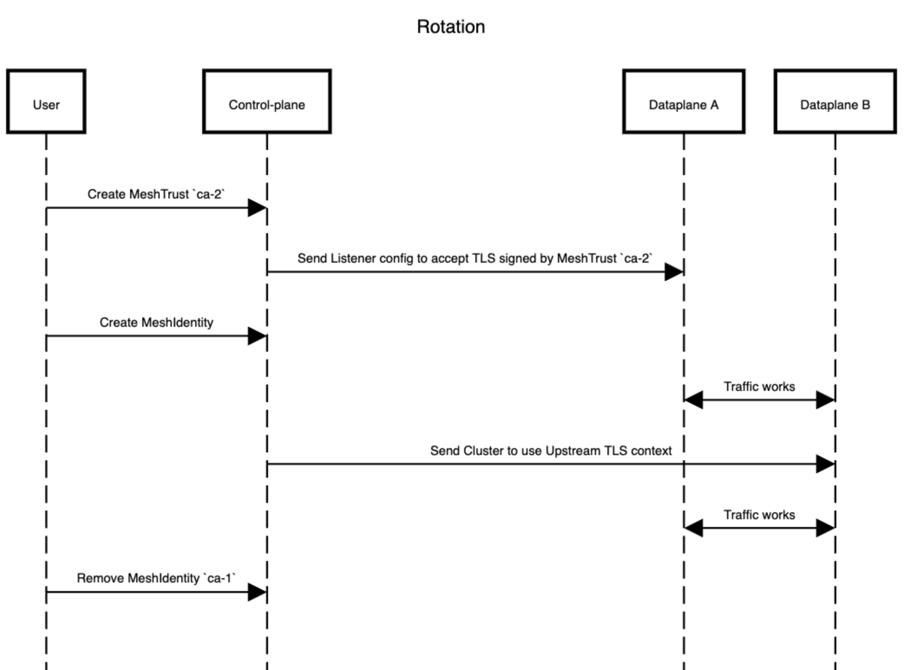

# SPIFFE Compliance

* Status: accepted

Technical Story: https://github.com/kumahq/kuma/issues/13659

## Context and Problem Statement

In today’s service mesh systems, secure communication between services is essential. To make that possible, each service needs a clear and trusted identity: so we know exactly who is talking to whom and who we can trust.

We should define two crucial concepts:
* **Identity** - (Who a workload is) — A workload's identity is the name encoded in its certificate, and this identity is considered valid only if the certificate is signed by a Trust.
* **Trust** - (Who to believe) - Trust defines which identities you accept as valid, and is established through trusted certificate authorities (CAs) that issue those identities. Trust is attached to trust domain, and there can be mutliple Trusts in the cluster.

One of the most trusted standards for defining these service identities is SPIFFE (Secure Production Identity Framework for Everyone). It gives us:

* A standard way to name services: `spiffe://<trust-domain>/<path>`
* A strict format for certificates, especially the Subject Alternative Name (SAN) - which must contain exactly one URI (the SPIFFE ID)
* Tools and rules for issuing, rotating, and checking these identities
* SPIFFE certificates identify workload, not an API endpoint

Right now, Kuma does something similar by generating SPIFFE-like IDs like `spiffe://<mesh-name>/<service-name>`. But it also adds extra SANs (like `kuma://kuma.io/version/v1`) based on tags. These extra SANs make Kuma's certificates non-compliant with SPIFFE, meaning they can’t be used directly with SPIFFE-based systems like SPIRE, or other tools that expect full compliance. Also, Kuma uses certificates to identify endpoints (one Inbound), whereas SPIFFE-based certificates are used to establish identity via SPIFFE IDs of the workload (e.g. Deployment).

In SPIFFE, a Trust Domain is a logical boundary for identity and trust, similar to a DNS domain. Services within the same trust domain can securely identify and trust each other. Communication across different trust domains (such as between organizations or clusters) requires federation, which establishes trust relationships so that identities from one trust domain are recognized and trusted by another.

Kuma currently uses the mesh name as the trust domain. While this works inside Kuma, it doesn’t clearly separate trust boundaries, and it limits how easily Kuma can connect with external services or other applications in the same trust domain.

This setup causes problems when:

* You want to connect Kuma with other SPIFFE-compliant systems outside the mesh
* You run multiple clusters that need to trust each other
* You work in environments that require strict identity standards for security or compliance reasons
* You have identity not coming from Kuma (.e.g SPIRE)

To fully support SPIFFE and modern security practices, Kuma should:

* Issue certificates that include only one SPIFFE-compliant URI SAN (currently we generate `spiffe://<mesh>/<service>` for each inbound and `kuma://kuma.io/<tag_name>/<tag_value>` for each tag)
* Let users set the trust domain explicitly, not tie it to the mesh name
* Allow using other systems (like SPIRE) to manage identities
* Kuma should separate issuing identity from validating trust.

## User Stories

### As a user, I want a Dataplane (e.g., Service A) inside the mesh to accept mTLS connections based on Trusts.

A user should be able to use certificates signed by the same Certificate Authority (CA) across different services. This capability simplifies migration paths and unlocks use cases such as enabling mTLS communication between services inside the mesh and components outside the mesh (e.g., a gateway without a sidecar proxy). It's also worth mentioning that the CA might be managed by another component e.g.: SPIRE, which can issue certificates that are SPIFFE compliant.

### As a user, I want to be able to change the way I issue Identity without interrupting existing connections or causing service downtime.

During the entire process, communication between services must remain secure to ensure uninterrupted, encrypted traffic. This is essential for maintaining zero-trust security guarantees and ensuring operational reliability in production environments.

Example:
I want to move from using certificates issued by Kuma to SPIRE in different trust domain. 

### As a user, it should not become harder to enable or manage mTLS in either single-zone or multi-zone deployments than it is today.

Currently, users can enable mTLS in both single-zone and multi-zone deployments just by configuring it in the Mesh resource. As we introduce features like trust domains, external identities, or federation, we must preserve this simplicity and avoid adding unnecessary complexity to the mTLS setup process.

### As a user, I want to be able to communicate with applications in different trust domains.

In the presence of multiple trust domains. Users should be able to trust each domains.

### As a Mesh operator, I want to be able to define Identity issuers for subset of Dataplanes.

It makes sense to allow users to define a trust domain for specific parts of the infrastructure — whether that's a single zone or an entire mesh. Additionally, it should be possible to select a specific subset of dataplanes to use a particular identity provider.

One important use case is identity rotation or migration. During migration, multiple trust domains can be used simultaneously to support a smooth transition from one identity provider to another without service disruption.

From a security perspective, assigning separate identities or trust domains per zone provides better isolation. If one trust domain is compromised, it does not impact the others — enabling a stronger and more granular trust model.

Suggestions trust domain on global: `spiffe://<mesh>.<KumaClusterId>.kuma.io/` - is generated on Global, to ensure uniquness

### As a Mesh operator, I want to be able to migrate some workloads to another trust domain without interrupting traffic.

I have a workloads in a trust domain `example.com` and I want to move them to `example.org`. I should be able to do it and don't break the traffic.

### As a user, I want certificate to be valid for a short period of time

Based on the [specification](https://spiffe.io/docs/latest/spiffe-about/spiffe-concepts/#spiffe-workload-api) certificates should be short-lived.

## Future User Stories (things that are going to be implemented in future releases)

### As a user, I want to have a SPIFFE-compliant SAN in a non-Kubernetes environment

It would be beneficial to support connectivity between different environments. Unfortunately, our services currently lack proper identity on Universal, which makes this challenging.

### As a user, I want to federate different trust domains using the Federation API exposed by the control plane

It should be possible to federate different trust domains without creating additional resources, only by using the federation endpoint exposed by the control plane. This would be a valuable feature, enabling interoperability between different SPIFFE-compliant systems.

### As a user, I want to use an intermediate CA instead of a root CA on the zone

When a user provides a root CA on the global control plane, we could generate a separate intermediate CA for each connecting zone. This would offer a stronger security model, ensuring that if a certificate is compromised in one zone, it does not impact other zones.

### As a user, I want to Trust from my zone to be synced to other zones automatically.

Trust could be automatically generated by the control plane and propagated to other zones. While this would improve automation and reduce configuration overhead, it is not critical at this stage and can be addressed in a future iteration.

### As a user, I want to use all available CA providers from legacy mTLS in new mTLS setup

Kuma currently supports various CA (Certificate Authority) backends for identity management. The new mTLS system should at least support the same set of CA providers, to ensure a smooth transition and preserve compatibility with existing deployments.

### As a user, I want to migrate from Kuma non-SPIFFE complient certificates to SPIRE

We should allow users to migrate from Kuma issued certificates, which are not SPIFFE-compliant, to using SPIRE. This may require an intermediate step to first migrate to SPIFFE-compliant certificates, but the details will be specified later.

### As a user, I want to automatically rotate the CA

This could be straightforward to implement, but we shouldn't prioritize it at the moment.

### As a user, I want to specify certificates for ZoneEgress proxy and Admin endpoints.

This would provide a beneficial option to avoid generating separate certificates for the Admin API and for each mesh when using ZoneEgress. Users could specify which identity they want to use. However, this feature requires additional development work that might not be feasible for the 2.12 release and may need to be deferred to a future one.

## Out of scope

### As a user, I want to specify certificates for a specific outbound or inbound

You should use MeshExternalService in this case to configure the outbound connection and provide the required certificates. Dataplane has at the time only one Identity.

### As a user, I want my dataplanes to communicate with Istio services without going through a gateway

In this scenario, you should also use MeshExternalService and include the necessary certificates in the configuration to enable direct mTLS communication.

### As a user, I want to use two different sources of CA (Kuma non-SPIFFE compliant and SPIRE) at the same time

This is a complex use case and can make the configuration error prone and difficult to manage.
We want to add some limitation to avoid issues:
* We should be able to add a Trust to SPIRE service while using Kuma certificate.
* Identities must be issued by one system only — either SPIRE or Kuma, never both for the same dataplane.
* It's valid for one dataplane to get its identity from Kuma and another from SPIRE — communication between such dataplanes should still work.

To enable this setup, we’ll need to establish a federation mechanism — potentially by having Kuma expose a federation endpoint.

### As a user, I want to provide MeshTrafficPermission for SPIFFEID

This should be covered by a separate MADR in a separate [issue](https://github.com/kumahq/kuma/issues/12374).

### As a user, I want to change a trust domain without changing the CA

Based on the SPIFFE [specification](https://github.com/spiffe/spiffe/blob/main/standards/X509-SVID.md?plain=1#L54), it seems that it's not supported, so we shouldn't support it as well

## Summary

Release 2.12
1. The system is SPIFFE-compliant on Kubernetes.
2. Certificate configuration is defined outside of the Mesh object.
3. It is possible to manually federate different trust domains.
4. The system can accept mTLS traffic from services outside the mesh.
5. The mTLS setup is no more complex than it is today.
6. It is possible to run Kuma with SPIRE — users can register entries manually or by using the [spire-controller-manager](https://github.com/spiffe/spire-controller-manager).
7. Migration from old mTLS to SPIFFE-compliant mTLS should be possible
8. Let's support: builtin, provided and SPIRE as Identity providers

Future releases
1. The dataplane sends a CSR (Certificate Signing Request) to the control plane for signing.
2. Each zone uses its own intermediate CA.
3. Universal (non-Kubernetes) workflows are SPIFFE-compliant.
4. Support other Identity providers
5. ZoneEgress identity

Nice to have:
1. Kuma control plane can register entries into SPIRE (How can we attest and trust control-plane?)
2. Kuma exposes a federation endpoint.

## Design

### API

#### Default SPIFFE ID

Spire, which is an implementation of SPIFFE, defines a standard way for Subject Alternative Name (SAN) definition. By default, on Kubernetes, it uses the Service Account (SA) and namespace in a path format such as:

```
spiffe://<trustDomain>/ns/<namespace>/sa/<serviceAccount>
```
This default model works for us on Kubernetes but will not be supported in Universal deployments. We therefore need to find a default SPIFFE ID format that works consistently for both Kubernetes and Universal environments.

Unfortunately, we currently lack a native workload identifier in Universal deployments, which prevents us from directly adopting a similar identity model.

**Proposal**

For the current release, we propose defining the default SPIFFE ID for Kubernetes workloads with the following structure:

```
spiffe://<trustDomain>/ns/<namespace>/sa/<serviceAccount>
```

Trust domain: `{ .Mesh }.{ .Zone }.{ .ClusterID }.kuma.io`

Once a TrustDomain is defined on the Global control plane, we require it to include the zone name in the template. We are going to implement a validator for this case. Also, we need to validate length of each segment where Mesh and Zone has limit of 63 characters, and ClusterID is an UUID.

Question:
* Is there an issue once we rename zone ? Isn't it an edge case that we might don't need to support?
  It's not supported and can cause many issues, we shouldn't think about it.

### MeshIdentity

This resource defines Certificate Authorities (CAs) for a specific Mesh. It issues identities for dataplanes, while trust management is handled separately by `MeshTrust`. Users can specify which dataplanes use a particular identity, but changing the identity provider happens seamlessly in the background.

* The resource can be created on the Global control plane and synced to Zones.
* It can also be created on a Zone, in which case it will be synced to Global, but not propagated to other Zones.

Resource descriptor
```golang
var MeshIdentityResourceTypeDescriptor = model.ResourceTypeDescriptor{
	Name:                         MeshIdentityType,
	Resource:                     NewMeshIdentityResource(),
	ResourceList:                 &MeshIdentityResourceList{},
	Scope:                        model.ScopeMesh,
	KDSFlags:                     model.GlobalToZonesFlag | model.ZoneToGlobalFlag,
	WsPath:                       "meshidentities",
	KumactlArg:                   "meshidentity",
	KumactlListArg:               "meshidentities",
	AllowToInspect:               false,
	IsPolicy:                     false,
	IsExperimental:               false,
	SingularDisplayName:          "Mesh Identity",
	PluralDisplayName:            "Mesh Identities",
	IsPluginOriginated:           true,
	IsTargetRefBased:             false,
	HasToTargetRef:               false,
	HasFromTargetRef:             false,
	HasRulesTargetRef:            false,
	HasStatus:                    false,
	AllowedOnSystemNamespaceOnly: true,
	IsReferenceableInTo:          false,
	ShortName:                    "mid",
	IsFromAsRules:                false,
}
```

**Model**
```yaml
apiVersion: kuma.io/v1alpha1
kind: MeshIdentity
metadata:
  name: identity
  namespace: kuma-system # only in system namespace
  labels:
    kuma.io/mesh: default
spec:
  selector:
    dataplane:
      matchLabels:
        app: test
  spiffeID: # optional
    trustDomain: "default.zone-1.0c5afd2e-de93-437b-8ba0-3decdff805b6.kuma.io" # { .Mesh }.{ .Zone }.{ .ClusterID }.kuma.io
    path: "/ns/{{ .Namespace }}/sa/{{ .ServiceAccount }}" # let's use the same templating format as HostnameGenerator
  provider:
    type: Provided | Spire
    spire:
      agent:
        timeout: 1s
    provided: # to extend in KM
      trustExtractionDisabled: false # allows to disable extraction of CA into MeshTrust
      insecureAutogenerate: false
      certificate:
        # one of
        secret:
        path:
        envVar:
      privateKey:
        # one of
        secret:
        path:
        envVar:
      dataplaneCertificate:
        duration: 24h
```

Currently, the `ServiceAccount` is not exposed in the `Dataplane` resource, which is problematic since we need to access this information. A potential solution is to add a dedicated field to the `Dataplane` object to store the associated `ServiceAccount`.

#### Provider types

There can be multiple difference identity providers but in the first iteration we would like to focus on:

* provided
* spire

**Provided**

The provided type allows users to supply their own CA certificates. These can be configured per zone or as a global definition.
Users can provide certificates in the following ways:

* Environment variable,
* File path,
* Secret reference,
* Auto generated and stored in a Secret

This gives flexibility for organizations that already have an established PKI or need to integrate with existing certificate authorities.

```yaml
    provided: # to extend in KM
      insecureAutogenerate: false
      certificate:
        # one of
        secret:
        path:
        envVar:
      privateKey:
        # one of
        secret:
        path:
        envVar:
      dataplaneCertificate:
        duration: 24h
```

Additionally, we could introduce a configuration option called `insecureAutogenerate`, which automatically generates a default CA and persists it in the store. This would functionally be equivalent to the current builtin CA.
Currently, Kuma uses a CA with the RSA algorithm and a key size of 2048 bits, which is widely supported and compatible.

* Algorithm: RSA
* Key size: 2048

If the user wants to use a different algorithm, it is possible to provide their own CA.

**Spire**

The spire provider is a new type that configures Envoy to request its identity certificate directly from SPIRE.
In this first iteration:

* Workloads must be registered in SPIRE manually or by SPIRE controller.
* The control plane does not handle workload registration in SPIRE yet.

This approach allows Kuma to leverage SPIFFE-compliant identities issued by SPIRE while keeping the initial integration simple.

```yaml
    spire:
      agent:
        addresss: "/run/spire/sockets/agent.sock"
        timeout: 1s
``` 

Another thing is that we need to mount a volume with Spire Agent unix socket.

1.(Chosen) Add a new section to the injector configuration:

```yaml
runtime:
  kubernetes:
    injector:
      spire:
        injectorMode: annotation | always | never (default)
        path: /run/spire/sockets
        mountPath: /run/spire/sockets
```

Once `injector-mode: annotation` and `kuma.io/spire-integration: enabled` or `injector-mode: always` are set the injector automatically:

* creates volume
```yaml
volumes:
  - name: spire-agent-socket
    hostPath:
      path: /run/spire/sockets
      type: Directory
```

* mount volume
```yaml
volumeMounts:
  - name: spire-agent-socket
    mountPath: /run/spire/sockets
    readOnly: true
```
* and inject annotation

```yaml
kuma.io/spire-integration: enabled
```

Purpose of the Label:
* This label signals that the pod has SPIRE integration enabled.
* It prevents Kuma from delivering Spire-related configuration (e.g., SDS config, identity provider references) to pods that don't have the socket mounted.

1. We could expose the configuration in control-plane to be more generic

```yaml
runtime:
  kubernetes:
    injector:
        extraLabels:
          kuma.io/spire-integration: enabled
        extraVolumes:
          - name: spire-agent-socket
            hostPath:
              path: /run/spire/sockets
              type: Directory
        containerPatches: ["spire-agent-socket-patch"]
```

ContainerPatch
```yaml
apiVersion: kuma.io/v1alpha1
kind: ContainerPatch
metadata:
  name: spire-agent-socket-patch
  namespace: kuma-system
spec:
  sidecarPatch:
    - op: add
      path: /volumeMounts/-
      value:
        name: spire-agent-socket
        mountPath: /run/spire/sockets/
        readOnly: true
```

3. We could introduce templating/overlay (out-of-scope for this MADR)

We could introduce overlay to the control-plane injector config.

Example: 

```yaml
runtime:
  kubernetes:
    injector:
        overlay:
            - path: spec.template.spec.volumes.spire-agent-socket
              op: add
              value:
                name: spire-agent-socket
                hostPath:
                  path: /run/spire/sockets
                  type: Directory
            - path: spec.template.spec.containers.kuma-sidecar.volumeMounts.spire-agent-socket
              op: add
              value:
                name: spire-agent-socket
                mountPath: /run/spire/sockets/
                readOnly: true          
```

#### Define active identity provider

Previously, defining the active identity for a group of services was done through a single, perhaps less flexible, mechanism. Now, the `MeshIdentity` resource, leveraging its `selector`, offers a more granular and controlled approach to activate specific configurations.

```yaml
apiVersion: kuma.io/v1alpha1
kind: MeshIdentity
metadata:
  name: old-identity
  namespace: kuma-system # only in system namespace
  labels:
    kuma.io/mesh: default
spec:
  selector:
    dataplane:
      matchLabels: {} # select all
....
---
apiVersion: kuma.io/v1alpha1
kind: MeshIdentity
metadata:
  name: new-identity
  namespace: kuma-system # only in system namespace
  labels:
    kuma.io/mesh: default
spec:
  selector:
    dataplane:
      matchLabels:
        app: demo-app
```

The `MeshIdentity` resource’s selector field allows selection based on dataplane labels. Users can define it to apply to either all dataplanes or a specific subset.
If there are multiple (X) identities selecting the same dataplane, the control plane will resolve the conflict by choosing one based on the following order of precedence:

1. Selector specificity – the identity with most specific selector is preferred.
2. Lexicographical order – if selector sizes are equal, the identity with the lexicographically smallest name is chosen.

**Examples**

1. Select only specific dataplane
```yaml
apiVersion: kuma.io/v1alpha1
kind: MeshIdentity
...
spec:
  selector:
    dataplane:
      matchLabels:
        app: demo-app
```

2. Select all dataplanes
```yaml
apiVersion: kuma.io/v1alpha1
kind: MeshIdentity
...
spec:
  selector:
    dataplane:
      matchLabels: {}
```

3. Select nathing
```yaml
apiVersion: kuma.io/v1alpha1
kind: MeshIdentity
...
spec:
  selector:
    dataplane: {}
```

or

```yaml
apiVersion: kuma.io/v1alpha1
kind: MeshIdentity
...
spec:
  selector:
```

or

```yaml
apiVersion: kuma.io/v1alpha1
kind: MeshIdentity
...
spec:
...
```

It seems to be consistant with LabelsMatcher from kubernetes api https://github.com/kubernetes/apimachinery/blob/v0.33.2/pkg/apis/meta/v1/helpers.go#L36-L43.

```golang
func LabelSelectorAsSelector(ps *LabelSelector) (labels.Selector, error) {
	if ps == nil {
		return labels.Nothing(), nil
	}
	if len(ps.MatchLabels)+len(ps.MatchExpressions) == 0 {
		return labels.Everything(), nil
	}
```

#### How would look the process of switching backends?

1. User has a Mesh with MeshIdentity `identity-1`
```yaml
...
name: demo-client-65f94cb577-jxrrq-44wfv42db9z44xxf
type: DataplaneInsight
mTLS:
  certificateExpirationTime: "2025-06-03T17:35:33Z"
  certificateRegenerations: 1
  issuedBackend: kri_mi_mesh-1_us-east-2_kuma-system_identity-1
  lastCertificateRegeneration: "2025-06-02T17:35:33.624189876Z"
  supportedBackends: # list of MeshTrust name
  - kri_mtrust_mesh-1_us-east-2_kuma-system_identity-1
...
```
2. User creates MeshTrust with CA of a new MeshIdentity `identity-2`
3. Trust is propagated. We provide identity and keep the information(supported CA (Trust), and Identity) in DataplaneInsight
```yaml
...
name: demo-client-65f94cb577-jxrrq-44wfv42db9z44xxf
type: DataplaneInsight
mTLS:
  certificateExpirationTime: "2025-06-03T17:35:33Z"
  certificateRegenerations: 1
  issuedBackend: kri_mi_mesh-1_us-east-2_kuma-system_identity-1 # name of MeshIdentity
  lastCertificateRegeneration: "2025-06-02T17:35:33.624189876Z"
  supportedBackends: # list of MeshTrust name
  - kri_mtrust_mesh-1_us-east-2_kuma-system_identity-1
  - kri_mtrust_mesh-1_us-east-2_kuma-system_identity-2
...
```

Based on this information we will update MeshService

```yaml
...
name: demo-client-65f94cb577-jxrrq-44wfv42db9z44xxf
spec:
  identities:
  - type: SpiffeID
    value: spiffe://mesh-1.zone-1.0c5afd2e-de93-437b-8ba0-3decdff805b6.kuma.io/ns/real-resource-ns/sa/default
  ports:
  - appProtocol: http
    name: main
    port: 80
    targetPort: main
  selector:
    dataplaneTags:
      app: demo-client
      k8s.kuma.io/namespace: real-resource-ns
  state: Available
status:
  ...
  tls:
    status: Ready <- only if all DPPs have identity provided
  vips:
  - ip: 10.43.245.159
type: MeshService
```

4. User create a new MeshIdentity `identity-2`
5. We start deliver new identity provided by `identity-2`
We reuse existing fields
```yaml
...
name: demo-client-65f94cb577-jxrrq-44wfv42db9z44xxf
type: DataplaneInsight
mTLS:
  certificateExpirationTime: "2025-06-03T17:35:33Z"
  certificateRegenerations: 1
  issuedBackend: kri_mtrust_mesh-1_us-east-2_kuma-system_identity-2 # name of MeshIdentity
  lastCertificateRegeneration: "2025-06-02T17:35:33.624189876Z"
  supportedBackends: # list of MeshTrust name
  - kri_mtrust_mesh-1_us-east-2_kuma-system_identity-1
  - kri_mtrust_mesh-1_us-east-2_kuma-system_identity-2
...
```
Update SpiffeID based on identities
```yaml
...
name: demo-client-65f94cb577-jxrrq-44wfv42db9z44xxf
spec:
  identities:
  - type: SpiffeID
    value: spiffe://mesh-1.zone-1.0c5afd2e-de93-437b-8ba0-3decdff805b6.kuma.io/ns/real-resource-ns/sa/default
  - type: SpiffeID
    value: spiffe://mesh-1.zone-1.0c5afd2e-de93-437b-8ba0-3decdff805b6.kuma.io/ns/real-resource-ns/sa/default/service/demo-client # assume there is different path template
  ports:
  - appProtocol: http
    name: main
    port: 80
    targetPort: main
  selector:
    dataplaneTags:
      app: demo-client
      k8s.kuma.io/namespace: real-resource-ns
  state: Available
status:
  ...
  tls:
    status: Ready
  vips:
  - ip: 10.43.245.159
type: MeshService
```

6. User can remove MeshIdentity `identity-1`
7. MeshTrust should be removed by the user



#### Secret naming

We want to use a [KRI](070-resource-identifier.md) for resource naming. Since `MeshIdentity` generates secrets for each dataplane, it should be named based on the KRI to simplify correlation between the Envoy `Secret` and the `MeshIdentity` configuration.

Proposed name:

```yaml
system_kri_mi_mesh-1_us-east-2_kuma-system_identity-1
```

Also, we need to name the Spire agent cluster, in this case is it internal or maybe based on MeshIdentity:
Proposed name:
```yaml
system_sds-spire-agent
```

or 
```yaml
system_kri_mi_mesh-1_us-east-2_kuma-system_spire-identity
```

> [!WARNING]
> The naming is different when using SPIRE, since SPIRE uses SPIFFEID or `default` as a certificate name
> https://spiffe.io/docs/latest/deploying/spire_agent/#sds-configuration
> https://spiffe.io/docs/latest/microservices/envoy/#tls-certificates
#### MeshTrust

Based on the existing `MeshIdentity`, we should create a `MeshTrust` resource, which will be used to properly generate trust domains for other zones.
`MeshTrust` should be created in each zone and then synchronized with the global control plane.
1. Can be created on the Zone and synced to Global
2. Can be created on the Global and synced to all Zones
3. Can be created on the Zone and not synced to global by providing label `kuma.io/kds-sync: disabled`
4. Can be created on the Zone and synced to all zones (Future release) (`SyncedAcrossZonesFlag`)

We can describe it as KDS flag:

```golang
var MeshTrustResourceTypeDescriptor = model.ResourceTypeDescriptor{
	Name:                         MeshTrustType,
	Resource:                     NewMeshTrustResource(),
	ResourceList:                 &MeshTrustResourceList{},
	Scope:                        model.ScopeMesh,
	KDSFlags:                     model.GlobalToZonesFlag | model.ZoneToGlobalFlag |SyncedAcrossZonesFlag
	WsPath:                       "meshtrusts",
	KumactlArg:                   "meshtrust",
	KumactlListArg:               "meshtrusts",
	AllowToInspect:               false,
	IsPolicy:                     false,
	IsExperimental:               false,
	SingularDisplayName:          "Mesh Trust",
	PluralDisplayName:            "Mesh Trusts",
	IsPluginOriginated:           true,
	IsTargetRefBased:             false,
	HasToTargetRef:               false,
	HasFromTargetRef:             false,
	HasRulesTargetRef:            false,
	HasStatus:                    false,
	AllowedOnSystemNamespaceOnly: true,
	IsReferenceableInTo:          false,
	ShortName:                    "mtrust",
	IsFromAsRules:                false,
}
```

There should also be an option to disable automatic generation in cases where the user does not want cross trust-domain traffic to be allowed by default.

**Model**
```yaml
apiVersion: kuma.io/v1alpha1
kind: MeshTrust
metadata:
  name: trust-hash
  namespace: kuma-system # only in system namespace
  labels:
    kuma.io/mesh: default
spec:
  ca:
    - source:
        # one of
        secret:
        path:
        envVar:
      firstExpiry: # date when expiry
    - source:
        # one of
        secret:
        path:
        envVar:
      firstExpiry: 
  trustDomain: "prod.zone-1.id.kuma.io"
status: # status is not synced to the other zone
  originRef:
    kind: MeshIdentity
    name: default
    namespace: kuma-system
```

The resource should also be manually creatable by the user. This enables users to define additional trust domains and allows the local sidecar to accept incoming mTLS traffic from services outside the mesh.
This functionality is essential for:

* Enabling ExternalClients,
* Accepting mTLS connections from external services, and
* Federating multiple separate clusters through shared trust.

**MeshTrust based on MeshIdentity**

When a user creates a `MeshIdentity`, we will automatically create a corresponding `MeshTrust` resource using the CA and trust domain from that identity. We can implement a dedicated generator that creates the MeshTrust based on the `MeshIdentity`. This option can be disabled and `MeshTrust` might not be created by setting `MeshIdentity.provided.trustExtractionDisabled`.
To avoid issues where a user removes a `MeshIdentity` but an old trust remains in use, we will not remove a `MeshTrust` and we let user to clean it up. Once a user update MeshIdentity we will append existing MeshTrust with additional entry in the CA list.

**Multizone**

In the first iteration, `MeshTrust` will not be synced between zones. This means that if a user wants to create a multizone setup, they must manually create a `MeshTrust` resource in each zone.

**Secret naming**

We want to use a [KRI](070-resource-identifier.md) for resource naming. Since `MeshTrust` creates a separate resource (Secret), it should be named based on the KRI to simplify correlation between the `Secret` and the `MeshTrust` configuration.
Since there might be multiple MeshTrusts and we need to aggregate them into one bundle we might use a different naming.

Proposed name:

```yaml
system_cabundle
```

> [!WARNING]
> The naming is different when using SPIRE, since SPIRE uses `trustDomain` as a name for validation context, and `ALL` once we want all trust domains (federation)
> https://spiffe.io/docs/latest/deploying/spire_agent/#sds-configuration
> https://spiffe.io/docs/latest/microservices/envoy/#tls-certificates

**Spire**

In the case of Spire, all certificates are delivered by Spire’s SDS server. The CA configured in `MeshTrust` is not delivered or used for workload identity issuance. However, if the user wants to enable federation with another trust domain, they are required to create a `MeshTrust` resource that defines the `trustDomain` of the federated cluster — but without specifying a CA. This is because the CA will be provided dynamically by Spire as part of the federation mechanism.

#### MeshMultiZoneService

A `MeshMultiZoneService` is composed of multiple MeshService instances, potentially spanning different zones that may each use different identity providers.
To ensure that cross-zone traffic functions correctly in this setup, we need to:
* Set the appropriate Subject Alternative Names (SANs) in the Clusters, and
* Configure the correct list of trusted Certificate Authorities (CAs).

This ensures that workloads can authenticate each other across zones using mTLS, even when different trust domains are involved.

#### Egress and Ingress

> [!WARNING]
> Since the correct design might require more time, we are going to skip support for Egress in the 2.12 release and plan to design and implement it in the next release. Also, proposal here is not a final and might be improved in the future release.

**Problem**

Currently, we provide multiple different certificates for Egress, as each mesh might have a different identity provider. This is problematic because it results in Egress having multiple identities.

These dataplanes are internal components that enable cross-cluster traffic and external communication. Ingress doesn't require any specific identity since it doesn't decrypt traffic; it merely passes it through. However, Egress requires decryption of traffic because we do not want to communicate with external applications using an internal certificate. In this scenario, applications communicating with Egress validate its identity. Unfortunately, Egress is a shared cluster component that serves as a point for multiple meshes, where each mesh might have a different identity provider. Consequently, we need to establish a common issuer for Egress.

**Proposal**

We propose introducing a default internal certificate generated by the control plane for communication with Egress. This would provide a single identity for the Egress dataplane and allow us to configure sidecars and Egress to validate each other.

Users would be allowed by the configuration to override this default identity provider with their own.

1. When one of Meshes use Spire support only Spire
We could force user to use Spire for egress and don't support other Identity than Spire if one of Mesh uses Spire.
User would need to configure control-plane to make Spire responsible for providing identity for Egress.

1. Generate separate CA for control-plane
In this setup, the control plane is responsible for providing the identity for the Egress. This enables a secure connection between the Egress and dataplanes, as both sides can mutually authenticate using mTLS.

If SPIRE is used to issue certificates to dataplanes, the Egress must be configured to trust SPIRE's Root CA in order to verify the dataplane's certificate.
Additionally, the dataplanes must trust the Root CA used by the control plane to sign the Egress certificate — this CA should be configured in the dataplane's validation context.

* Trust domain for Egress

User would be allowed to change it but the default could be:
```yaml
spiffe://system.kuma.io/ns/namespace/sa/serviceAccount
```

#### Admin API certificates

> [!WARNING]
> Since the correct design may require more time, we will skip support for Admin API in the 2.12 release, and its behavior will remain unchanged. Also, proposal here is not a final and might be improved in the future release.

**Problem**

Currently, each dataplane receives a separate certificate for the listener protecting its admin endpoint. These certificates are issued by a different Certificate Authority (CA) that is used only for Admin API access. Unfortunately, this forces the control plane to generate two sets of certificates for each dataplane: one for the admin endpoint and one for mesh mTLS communication.

This dual-certificate generation is computationally expensive, and during the startup of multiple dataplanes, it can cause significantly higher CPU usage on the control plane. Furthermore, it results in dataplanes having different identities depending on which endpoint (Admin API vs. mesh traffic) we intend to reach.

**Proposal**

The Admin endpoint should always be protected, as it allows remote closure of the sidecar and can potentially cause traffic outages. To standardize this protection and simplify certificate management, we need to distinguish two main cases:
1. Mesh has mTLS enabled

   We use the same identity generated for the dataplane and generate client certificate for the control-plane that is signed by the same CA as a Mesh use. The problem is that control-plane needs a separate client certificate for each mesh.
2. Mesh doesn't have mTLS enabled

  We will leverage the default certificate that the control plane generates for Egress (or a user-specified certificate if an override is configured). In this specific case, we would use the same certificate to secure the Admin API for both dataplanes and the control plane.

3. Don't protect Admin API when there is no mTLS

  In this case we would not protect Admin API if mTLS is disabled.

Another potential solution is to use the default certificate (the same as for Egress) for providing the control plane's identity, and subsequently configure sidecars to validate the control plane using this CA.

Ref:
* https://github.com/kumahq/kuma/pull/3353
* https://github.com/kumahq/kuma/pull/4676

### Integrations with ClusterBundleTrust
Kubernetes 1.33 arrives with a new feature in beta mode [ClusterTrustBundle](https://kubernetes.io/docs/reference/access-authn-authz/certificate-signing-requests/#cluster-trust-bundles) (not default). It's a new Cluster-scope resource which allows storing and distributing X.509 trust anchors (root certificates) workloads within the cluster.

It feel like we can use it in few cases:
* MeshTrust referencing ClusterBundleTrust.
* Storing certificate that is used by dataplanes to verify control-plane certificate. Instead of injecting it as env variable we could provide it [projected-volume](https://kubernetes.io/docs/concepts/storage/projected-volumes/#clustertrustbundle).
* MeshIdentity referencing ClusterBundleTrust additionally to Secret/Inline/File
* Trusting CAs from ClusterBundleTrust in Envoy

This doesn't have to be implemented in current release.

### Migration from mTLS in Mesh to MeshIdentity

1. Mesh has mTLS enabled
```yaml
apiVersion: kuma.io/v1alpha1
kind: Mesh
metadata:
  name: default
spec:
  mtls:
    enabledBackend: ca-1
    backends:
      - name: ca-1
        type: builtin
```
2. User create a MeshTrust for new MeshIdentity
```yaml
apiVersion: kuma.io/v1alpha1
kind: MeshTrust
metadata:
  name: trust-of-new-identity
  namespace: kuma-system
  labels:
    kuma.io/mesh: default
spec:
  ca: inline | secret | file
  trustDomain: "prod.zone-1.id.kuma.io"
```
3. Create MeshTrafficPermissions for accept all traffic
```yaml
apiVersion: kuma.io/v1alpha1
kind: MeshTrafficPermission
metadata:
  name: allow-all
  namespace: kuma-system
  labels:
    kuma.io/mesh: default
spec:
  from:
  - targetRef:
      kind: Mesh
    default:
      action: Allow
```
or more specific but it's not a part of this MADR
```yaml
apiVersion: kuma.io/v1alpha1
kind: MeshTrafficPermission
metadata:
  name: allow-all
  namespace: kuma-demo
  labels:
    kuma.io/mesh: default
spec:
  match:
    rules:
    ....
```
4. User create a new MeshIdentity for single Dataplane
```yaml
apiVersion: kuma.io/v1alpha1
kind: MeshIdentity
metadata:
  name: identity
  namespace: kuma-system # only in system namespace
  labels:
    kuma.io/mesh: default
spec:
  selector:
    dataplane:
      matchLabels:
        app: demo-app
  spiffeID: # optional
    trustDomain: "prod.zone-1.id.kuma.io"
    path: "/ns/{{ .Namespace }}/sa/{{ .ServiceAccount }}"
  provider:
    type: provided
    provided:
      certificate:
        # one of
        secret:
        inline:
        inlineString:
      privateKey:
        # one of
        secret:
        inline:
        inlineString:
      dataplaneCertificate:
        duration: 24h
```
5. Check if works by verifing DataplaneInsights
6. Process with selecting more Dataplanes
```yaml
apiVersion: kuma.io/v1alpha1
kind: MeshIdentity
metadata:
  name: identity
  namespace: kuma-system # only in system namespace
  labels:
    kuma.io/mesh: default
spec:
  selector:
    dataplane:
      matchLabels: {}
  spiffeID: # optional
    trustDomain: "prod.zone-1.id.kuma.io"
    path: "/ns/{{ .Namespace }}/sa/{{ .ServiceAccount }}"
  provider:
    type: provided
    provided:
      certificate:
        # one of
        secret:
        inline:
        inlineString:
      privateKey:
        # one of
        secret:
        inline:
        inlineString:
      dataplaneCertificate:
        duration: 24h
``` 
7. Wait for propagation of values, we cna verify this in MeshInsights
8. User remove mTLS section from Mesh object once all dataplanes uses new identity
