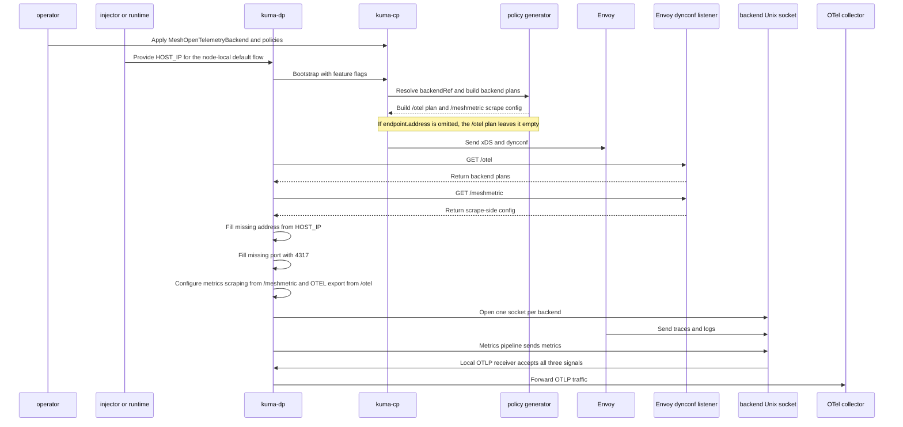

# Shared telemetry backend resource for observability policies

- Status: accepted

## Context and problem statement

Kuma has three observability policies that can export telemetry to an OpenTelemetry collector: MeshMetric, MeshTrace, and MeshAccessLog. Each policy defines the OTel collector endpoint independently in its own spec.

In practice, most deployments point all three policies at the same collector. The endpoint string (`otel-collector.observability:4317`) is duplicated across three policy instances per mesh. When the collector address changes (new namespace, different port), the operator updates three places. In multi-mesh setups, multiply by the number of meshes.

Each policy also has a slightly different OTel backend struct:

| Policy | OTel backend fields |
| --- | --- |
| MeshMetric | `endpoint`, `refreshInterval` |
| MeshTrace | `endpoint` |
| MeshAccessLog | `endpoint`, `attributes`, `body` |

The endpoint is the common denominator. Signal-specific fields (`refreshInterval`, `attributes`, `body`) are unique to each policy and don't belong in a shared resource.

Beyond endpoint duplication, there's a missing abstraction for collector connection settings. Today none of the policies support configuring:

- TLS settings for the collector connection (custom CA, client certs)
- Authentication headers (bearer tokens for managed OTel backends)
- Protocol preference (gRPC vs HTTP) - policies are gRPC-only today

These would need to be added to all three policies individually, tripling the work and the surface area.

### User stories

1. As a mesh operator, I want to deploy one OTel collector and point MeshMetric, MeshTrace, and MeshAccessLog at it without duplicating the endpoint in three places. I want to roll out signals incrementally - start with metrics, verify it works, then add tracing and access logging against the same backend.
2. As a mesh operator, I want to update my collector address in one place when the observability team moves it to a different namespace or changes the port.
3. As a mesh operator using a managed OTel backend (Grafana Cloud, Datadog, etc.), I want to configure connection settings (TLS, auth, protocol) for my collector in one place rather than across three policies.
4. As a mesh operator running multi-zone, I want each zone to have its own collector config without duplicating endpoints across zone-scoped policies.
5. As a mesh operator, I want to know when a policy references a backend that no longer exists so I don't silently lose telemetry.

## Design

### Option A: New shared telemetry backend resource (recommended)

Introduce a new mesh-scoped resource `MeshOpenTelemetryBackend` that defines an OTel collector endpoint with connection settings. Observability policies reference it via a `backendRef` field. Below, `MOTB` abbreviates `MeshOpenTelemetryBackend`.

#### Resource definition

```yaml
apiVersion: kuma.io/v1alpha1
kind: MeshOpenTelemetryBackend
metadata:
  name: main-collector
  namespace: kuma-system
  labels:
    kuma.io/mesh: default
spec:
  endpoint: # +optional, defaults to the node-local collector flow when omitted
    address: otel-collector.observability # +optional, defaults to HOST_IP
    port: 4317 # +optional, defaults to 4317
    path: "" # +optional, base path prefix for HTTP; non-empty value is rejected by validation when protocol: grpc
  protocol: grpc # +optional, grpc (default) or http
```

`endpoint` is optional. If it is omitted, the backend uses the node-local collector flow: `kuma-dp` uses `HOST_IP` as the address, port `4317`, and an empty path. On Universal or VMs, where `HOST_IP` is not injected, `kuma-dp` falls back to `127.0.0.1`.

No `type` discriminator - the resource name itself is the type. If other telemetry backend types are needed later (Zipkin, Datadog), they become separate resources (`MeshZipkinBackend`, etc.). In this design, `backendRef.kind` is required and must be `MeshOpenTelemetryBackend`, `backendRef.name` is required, and this MADR does not define defaulting for `kind`. The admission webhook enforces that contract and rejects any `backendRef` where `kind` does not match the enclosing OTel backend block.

If `endpoint` is present, each field is still optional. `address` defaults to `HOST_IP`, `port` defaults to `4317`, and `path` defaults to empty. This covers DaemonSet plus `hostPort` deployments, empty backends, and partially specified backends without adding a second field with different rules.

The `endpoint` field stays structured instead of becoming a raw string so Kuma can validate and default each component separately. Today MeshMetric and MeshAccessLog split the endpoint string on `:`, and MeshTrace has an unreleased URL parser for HTTP endpoints that is being removed. A structured format avoids those inconsistencies.

The `protocol` field selects gRPC or HTTP transport. Envoy's OTel extensions use separate `grpc_service` and `http_service` fields in their protobuf config - the CP needs to know which one to generate. Port-based inference (4317 = gRPC, 4318 = HTTP) would break for non-standard setups, so an explicit field is safer. Default is `grpc` for backward compatibility with existing Kuma behavior.

The OTLP/HTTP spec defines two content encodings: binary protobuf (`application/x-protobuf`) and JSON (`application/json`). Envoy's built-in OTel extensions (stats sink, access logger, tracer) only support protobuf encoding over HTTP. JSON encoding is not available in Envoy without a custom filter. So `protocol: http` means OTLP/HTTP with protobuf encoding. If JSON encoding support is needed later, a separate `encoding` field can be added to the spec.

When `protocol: http`, the `path` field is a base path prefix. The CP appends the signal-specific suffix (`/v1/traces`, `/v1/metrics`, `/v1/logs`) during xDS generation, matching how the OTel SDK handles `OTEL_EXPORTER_OTLP_ENDPOINT`. An empty path means the standard paths are used directly. For gRPC, paths are irrelevant - gRPC routes by protobuf service name.

#### Policy reference

Each policy's OTel backend gets an optional `backendRef` field. When set, the endpoint comes from the referenced MeshOpenTelemetryBackend. Signal-specific fields remain inline. In 3.0, `backendRef` becomes required and the inline `endpoint` is removed.

##### MeshMetric

```yaml
apiVersion: kuma.io/v1alpha1
kind: MeshMetric
metadata:
  name: all-metrics
  namespace: kuma-system
  labels:
    kuma.io/mesh: default
spec:
  targetRef:
    kind: Mesh
  default:
    backends:
      - type: OpenTelemetry
        openTelemetry:
          backendRef:
            kind: MeshOpenTelemetryBackend
            name: main-collector
          refreshInterval: 30s # signal-specific, stays inline
```

##### MeshTrace

```yaml
apiVersion: kuma.io/v1alpha1
kind: MeshTrace
metadata:
  name: all-traces
  namespace: kuma-system
  labels:
    kuma.io/mesh: default
spec:
  targetRef:
    kind: Mesh
  default:
    backends:
      - type: OpenTelemetry
        openTelemetry:
          backendRef:
            kind: MeshOpenTelemetryBackend
            name: main-collector
    sampling:
      overall: 80 # signal-specific, stays inline
```

##### MeshAccessLog

```yaml
apiVersion: kuma.io/v1alpha1
kind: MeshAccessLog
metadata:
  name: all-access-logs
  namespace: kuma-system
  labels:
    kuma.io/mesh: default
spec:
  targetRef:
    kind: Mesh
  default:
    backends:
      - type: OpenTelemetry
        openTelemetry:
          backendRef:
            kind: MeshOpenTelemetryBackend
            name: main-collector
          attributes: # signal-specific, stays inline
            - key: mesh
              value: "%KUMA_MESH%"
```

#### Required policy changes

None of the current policy OTel backend structs have a `backendRef` field. Today they only have an inline `endpoint` string:

- MeshMetric `OpenTelemetryBackend`: `endpoint` + `refreshInterval`
- MeshTrace `OpenTelemetryBackend`: `endpoint`
- MeshAccessLog `OtelBackend`: `endpoint` + `attributes` + `body`

Each struct needs a new optional `backendRef` field. The inline `endpoint` remains supported but is deprecated starting in 2.14 and will be removed in 3.0. Validation enforces mutual exclusivity: either `endpoint` or `backendRef`, not both.

Use `common_api.BackendResourceRef`, not `TargetRef`. This is a typed resource reference (`kind` + `name`), not policy matching.

```go
// In each policy's OTel backend struct
type OpenTelemetryBackend struct {
    // Inline endpoint (existing, deprecated in 2.14, removed in 3.0)
    Endpoint string `json:"endpoint,omitempty"`
    // Reference to shared backend (kind + name). Weight/port don't apply here.
    BackendRef *common_api.BackendResourceRef `json:"backendRef,omitempty"`
    // ... signal-specific fields unchanged
}
```

#### Resolution during xDS generation

1. CP loads all MeshOpenTelemetryBackend resources into MeshContext (same as MeshService, MeshExternalService).
2. During policy plugin's `Apply()`:
   - If `backendRef` is set: look up the resource by name from `ctx.Mesh.Resources.MeshLocalResources`.
   - If `spec.endpoint.address` is set: use it.
   - If `spec.endpoint.address` is omitted: leave the address empty in the `/otel` plan and let `kuma-dp` resolve the node-local default from `HOST_IP`.
   - If `spec.endpoint.port` is omitted: default it to `4317`.
   - If `spec.endpoint.path` is omitted: use an empty path.
3. Inline `endpoint` path: inline endpoints still bypass the pipe. The CP generates direct Envoy OTel resources for them, same as today.
4. `backendRef` path - unified kuma-dp pipe mode: when `backendRef` is set and the proxy advertises `FeatureOtelViaKumaDp`, the policy plugins add the resolved backend to a shared `OtelPipeBackends` accumulator. During xDS generation for that proxy, the policy generator writes a single `/otel` dynconf route from the deduplicated backend list. kuma-dp watches `/otel` and starts one receiver per backend socket. Socket identity is per backend, not global: if a proxy resolves two different backends, kuma-dp opens two local Unix sockets. Each receiver forwards traces, logs, and metrics to the collector using either the explicit endpoint from the backend or the local default that `kuma-dp` resolves. Trace and access log still point Envoy at the local Unix socket for that backend through normal xDS resources.
5. MeshMetric path: MeshMetric still keeps its `/meshmetric` dynconf route, but only for scrape-side config such as applications, sidecar stats settings, extra labels, and Prometheus state. OTEL backend runtime for metrics, including socket selection and OTEL export `refreshInterval`, comes from `/otel` together with traces and logs. Inline `endpoint` backends stay on the direct Envoy path and do not use `/otel`.

#### Runtime flow for `backendRef`



#### Resource characteristics

| Property | Value | Details |
| --- | --- | --- |
| `IsPolicy` | false | it's a resource, not a policy |
| `Scope` | Mesh |  |
| `HasStatus` | true | the status updater sets `Referenced` or `NotReferenced` on the backend while it exists; unresolved refs surface on the referencing policies |
| `KDSFlags` | <code>GlobalToZonesFlag &#124; ZoneToGlobalFlag</code> | same as MeshExternalService |
| `ShortName` | `motb` |  |
| `IsDestination` | false |  |

#### Advantages

- Purpose-built API for the use case
- Single place for endpoint + connection settings
- Extensible: TLS, auth, protocol preferences added once, used by all policies
- Follows established resource patterns (tooling, KDS, REST API, kumactl come for free)
- Multi-zone: syncs via KDS, can be zone-scoped
- Backward compatible with inline endpoints
- Separates infrastructure config (where the collector is) from policy config (what to send)

#### Disadvantages

- New resource type: CRD, REST API, kumactl support, documentation
- Three policy plugins need modification (add backendRef + resolution logic)
- Users learn a new concept
- More indirection (policy -> resource -> endpoint)

#### Configuration walkthroughs

##### Story 1: Single collector, incremental rollout

Deploy the `main-collector` backend from the resource definition above, then add policies one signal at a time. Full policy YAML is in the policy reference section above. The rollout sequence:

1. Apply MeshOpenTelemetryBackend `main-collector`
2. Apply MeshMetric with `backendRef: main-collector` - verify metrics flow
3. Apply MeshTrace with `backendRef: main-collector` - verify traces
4. Apply MeshAccessLog with `backendRef: main-collector` - verify access logs

Each step is independently reversible. Removing a policy stops that signal without affecting the others.

##### Story 2: Update collector address in one place

The observability team moves the collector to a new namespace. Update only the backend resource - all three policies pick up the change automatically.

```yaml
apiVersion: kuma.io/v1alpha1
kind: MeshOpenTelemetryBackend
metadata:
  name: main-collector
  namespace: kuma-system
  labels:
    kuma.io/mesh: default
spec:
  endpoint:
    address: otel-collector.new-observability # changed from otel-collector.observability
    port: 4317
  protocol: grpc
# MeshMetric, MeshTrace, and MeshAccessLog are unchanged.
```

##### Story 3: Managed backend with connection settings

Point at Grafana Cloud's OTLP gateway over HTTP. Initial scope covers endpoint and protocol. TLS and auth fields are follow-up work.

```yaml
apiVersion: kuma.io/v1alpha1
kind: MeshOpenTelemetryBackend
metadata:
  name: grafana-cloud
  namespace: kuma-system
  labels:
    kuma.io/mesh: default
spec:
  endpoint:
    address: otlp-gateway-prod-us-east-0.grafana.net
    port: 443
    path: /otlp # CP appends /v1/metrics, /v1/traces, /v1/logs per signal
  protocol: http
  # Follow-up work:
  # tls:
  #   mode: STRICT
  # auth:
  #   type: Bearer
  #   secretRef:
  #     name: grafana-cloud-token
```

Policies reference `grafana-cloud` the same way as story 1.

##### Story 4: per-zone collectors in multi-zone

When all zones run the same collector service name, create one backend on the Global CP. DNS resolves to the local collector in each zone.

```yaml
# Global CP - syncs to all zones via KDS
apiVersion: kuma.io/v1alpha1
kind: MeshOpenTelemetryBackend
metadata:
  name: zone-collector
  namespace: kuma-system
  labels:
    kuma.io/mesh: default
spec:
  endpoint:
    address: otel-collector.observability.svc.cluster.local
    port: 4317
  protocol: grpc
# Policies also created on Global CP, synced to all zones.
# Each zone's DNS resolves the address to its local collector.
```

When the collector runs as a DaemonSet with `hostPort` and no Service, the default backend shape is enough. An empty backend means "use the node-local collector on the default OTLP gRPC port."

```yaml
apiVersion: kuma.io/v1alpha1
kind: MeshOpenTelemetryBackend
metadata:
  name: node-collector
  namespace: kuma-system
  labels:
    kuma.io/mesh: default
spec: {}
# Effective defaults: HOST_IP:4317, protocol grpc, empty path.
```

If the DaemonSet uses a different port or an HTTP path, set only the fields that change:

```yaml
apiVersion: kuma.io/v1alpha1
kind: MeshOpenTelemetryBackend
metadata:
  name: node-collector-http
  namespace: kuma-system
  labels:
    kuma.io/mesh: default
spec:
  endpoint:
    port: 4318
    path: /otlp
  protocol: http
# Address still defaults to HOST_IP.
```

Backends can also be created directly on a zone CP instead of the Global CP. KDS syncs them (`ZoneToGlobalFlag`), so the zone operator manages their own collector config without Global CP involvement.

This MADR does not introduce a new zone-local resource model. It relies on the existing KDS visibility rules for mesh-scoped resources. When zones need different collectors, use distinct backend names plus zone-targeted policies rather than relying on implicit zone-local lookup or same-name overrides.

When zones need different collector addresses (separate cloud regions, different infrastructure), use zone-specific backend names:

```yaml
# Created on each zone's CP, or on Global CP - either works
apiVersion: kuma.io/v1alpha1
kind: MeshOpenTelemetryBackend
metadata:
  name: collector-us-east
  namespace: kuma-system
  labels:
    kuma.io/mesh: default
spec:
  endpoint:
    address: collector.us-east.internal
    port: 4317
  protocol: grpc
# collector-eu-west follows the same pattern with its own address.
---
# Zone-targeted policy
apiVersion: kuma.io/v1alpha1
kind: MeshMetric
metadata:
  name: metrics-us-east
  namespace: kuma-system
  labels:
    kuma.io/mesh: default
spec:
  targetRef:
    kind: MeshSubset
    tags:
      kuma.io/zone: us-east
  default:
    backends:
      - type: OpenTelemetry
        openTelemetry:
          backendRef:
            kind: MeshOpenTelemetryBackend
            name: collector-us-east
          refreshInterval: 30s
# Without MOTB, each zone's three policies would hardcode the endpoint.
# With MOTB, changing a zone's collector means updating one resource
# instead of three.
```

##### Story 5: Dangling reference detection

An operator deletes a backend that policies still reference. xDS generation skips the missing backend, and the status updater reports the broken reference on the policy.

```yaml
# The backend was deleted. The policy still references it:
apiVersion: kuma.io/v1alpha1
kind: MeshMetric
metadata:
  name: all-metrics
  namespace: kuma-system
  labels:
    kuma.io/mesh: default
spec:
  targetRef:
    kind: Mesh
  default:
    backends:
      - type: OpenTelemetry
        openTelemetry:
          backendRef:
            kind: MeshOpenTelemetryBackend
            name: main-collector # no longer exists
          refreshInterval: 30s
```

CP behavior when the referenced backend is missing:

- Logs at Info level: `MeshOpenTelemetryBackend "main-collector" not found, referenced by MeshMetric "all-metrics"`
- Skips OTel backend config in xDS for that signal (no telemetry export)
- The status updater sets an unresolved `backendRef` condition on the referencing policy (MeshMetric, MeshTrace, or MeshAccessLog), so the operator can detect it via `kubectl` or the REST API

Unlike routing, where a dropped backend is one of many weighted destinations, a dropped telemetry backend means the signal is entirely lost. The MeshOpenTelemetryBackend's `HasStatus: true` lets the status updater track which policies reference it while it exists. When it's deleted, the referencing policies' own status conditions report the broken reference.

#### Naming

`MeshOpenTelemetryBackend` names the resource after its backend type. Since the resource can only be referenced from the OTel backend section of policies, a generic name adds no value. Type matching is enforced by the admission webhook - the validator rejects `backendRef.kind` values that don't match the enclosing backend type. If Zipkin or Datadog backend types are needed later, they become separate resources (`MeshZipkinBackend`, etc.) with their own `backendRef.kind`.

Rejected alternatives:

- `MeshTelemetryBackend` (with `type` discriminator) - a generic name + type discriminator can't enforce type matching via the API structure. A policy's OTel backend could reference a Zipkin-typed backend, and this mismatch would only be caught by runtime validation.
- `MeshOTelBackend` - abbreviation is less readable than the full name
- `MeshOTelCollector` - "collector" is one deployment model, the resource is for any telemetry-receiving endpoint
- `MeshObservabilityBackend` - too abstract, doesn't add clarity over the specific protocol name
- `MeshCollectorBackend` - not all backends are "collectors" (e.g., managed SaaS endpoints)

#### Signal-specific fields stay in policies

MeshAccessLog's `body` field is logs-only (OTel LogRecord body). It holds Envoy access log command operators (`%START_TIME%`, `%UPSTREAM_HOST%`) that control what each log record says. This is per-record content formatting, not connection config - it stays in MeshAccessLog.

MeshAccessLog's `attributes` are also logs-only (mapped to OTel `KeyValueList` with command operator substitution). MeshTrace has `Tags` (mapped to Envoy `CustomTag` on the HCM tracing config). MeshMetric has no OTel attributes (uses kuma-dp `ExtraLabels`). Each signal uses a completely different Envoy mechanism for attributes, so there's no shared abstraction that works across all three.

#### OTel env var auto-detection (considered and dropped)

We considered having kuma-dp read `OTEL_EXPORTER_OTLP_*` env vars and forward them to the CP via the existing DynamicMetadata bootstrap transport, so policies without an explicit endpoint or backendRef could use them as fallback. After investigation, this creates more problems than it solves:

- `OTEL_EXPORTER_OTLP_*` env vars are designed for application OTel SDKs, not infrastructure proxies. The OTel spec places them under "Language APIs & SDKs." The OTel Collector itself doesn't read them for its own export config.
- No service mesh reads these env vars for proxy telemetry. Istio uses `MeshConfig.extensionProviders` + the `Telemetry` CRD. Linkerd uses Helm values. Both treat app SDK telemetry and proxy telemetry as separate concerns.
- The OpenTelemetry Operator injects into `Containers[0]` by default ([README](https://github.com/open-telemetry/opentelemetry-operator/blob/main/README.md): "instrumentation is performed on the first container available in the pod spec"). Kuma's webhook appends the sidecar, so kuma-sidecar won't receive the env vars. The `container-names` annotation accepts a comma-separated list and could include kuma-sidecar, but setting it automatically during injection requires Kuma's webhook to run after OTel's (webhook ordering is not guaranteed) and to know the app container name (which varies per workload). Either way, it requires explicit configuration - the same effort as creating a MeshOpenTelemetryBackend resource.
- For inline endpoints, MeshTrace and MeshAccessLog still use Envoy's built-in exporters (`envoy.tracers.opentelemetry`, `envoy.access_loggers.open_telemetry`) configured through xDS. Even with DynamicMetadata transport, the CP would still need to generate xDS config for those signals. MeshMetric and `backendRef`-based MeshTrace/MeshAccessLog route through kuma-dp (see pipe mode in scope), but getting env vars there still requires explicit sidecar configuration.
- Getting the env vars onto the sidecar container requires explicit steps (pod annotation, ContainerPatch, or Helm). If an operator is already doing explicit configuration, creating a MeshOpenTelemetryBackend resource is simpler and works the same way across all three signals.
- `OTEL_EXPORTER_OTLP_HEADERS` may contain bearer tokens. Forwarding them through DynamicMetadata puts them in Envoy's `node.metadata`, which shows up in config dumps and CP debug logs.

MeshOpenTelemetryBackend gives us a single place to configure the collector endpoint. Env var auto-detection would add implementation complexity (DynamicMetadata wiring, priority ordering, security redaction) for a convenience feature that conflicts with how the OTel ecosystem actually works.

Scope item 8 introduces a unified pipe mode for `backendRef` backends. For each proxy, the control plane writes a single `/otel` dynconf route, kuma-dp starts one receiver per backend socket, and the design reuses the OTLP gRPC server interfaces from `go.opentelemetry.io/proto/otlp`.

### Option B: Named backends on the Mesh resource (rejected)

Add OTel collector configurations to the Mesh spec. Policies reference by name.

This goes against the current direction. We're actively moving config OUT of Mesh (MeshMetric replaced `Mesh.spec.metrics`, MeshTrace replaced `Mesh.spec.tracing`, MeshAccessLog replaced `Mesh.spec.logging`). Adding `metrics.backends` to Mesh was a mistake - the whole point of MeshMetric was to move this OUT of Mesh. We should not repeat it.

The Mesh resource is already large (networking, mtls, metrics, tracing, logging, routing, meshServices). Adding collector config there means no separate RBAC, no per-team ownership, and proto changes for every new field. Faster to implement but wrong direction.

### Option C: Reference MeshExternalService (rejected)

Model the OTel collector as a MeshExternalService. Policies reference it as a destination.

Semantically wrong - an OTel collector is infrastructure config, not an external service in the traffic routing sense. MeshExternalService is built for traffic routing (VIP allocation, passthrough) and doesn't capture OTel-specific semantics (protocol preference, path for HTTP endpoints, signal-specific routing). An OTel collector has multiple ports (4317 gRPC, 4318 HTTP) but MeshExternalService.match.port is singular. If the collector isn't meshed (recommended), the MeshExternalService creates routing expectations that conflict with direct connectivity.

### Option D: Keep inline configuration (status quo)

Accept the endpoint duplication. Each policy manages its own OTel backend config.

#### Advantages

- Zero effort
- No new concepts
- Each policy is independently deployable

#### Disadvantages

- Endpoint duplication (3 policies per mesh, more in multi-mesh)
- Coordinated updates when collector changes
- No shared place for TLS/auth (when we add these, we add them 3x)
- Error-prone at scale

## Security implications and review

### Option A (MeshOpenTelemetryBackend)

- When auth support is added (bearer tokens, client certs), the resource would reference Kubernetes Secrets or Kuma secrets. Standard secret handling patterns from MeshGateway TLS apply.
- Separate resource means separate RBAC rules. An operator can grant "create MeshOpenTelemetryBackend" without granting "modify Mesh". This is better than Option B where Mesh modification is required.
- Mesh-scoped resource ensures one mesh's collector config can't affect another mesh.

### Option B (Mesh-level)

- Modifying collector config requires Mesh write access, which is typically restricted to cluster admins. This may be too restrictive for teams that should manage their own observability.

### Options C & D

- No new security concerns.

## Reliability implications

### Option A

- Dangling references: If a MeshOpenTelemetryBackend is deleted while policies reference it, policies lose their backend config. Unlike routing where a dropped backend is one of many weighted destinations, a dropped telemetry backend means the signal is entirely lost. The CP logs at Info level when a referenced backend is not found during xDS generation. The referencing policies' status conditions surface the unresolved backendRef so operators can detect missing backends (user story 5) rather than silently losing telemetry. The MeshOpenTelemetryBackend's `HasStatus: true` lets the CP track references while the resource exists. An empty backend is still a valid resolved backend because the defaults are intentional. No cross-reference validation webhooks - Kuma's existing pattern is to not block deletion of referenced resources.
- Resource sync: MeshOpenTelemetryBackend syncs via KDS. If sync is delayed, newly created policies in a zone may not find their backend. Same behavior as MeshExternalService references today.

### Option B

- Mesh is a critical resource. Adding more config increases blast radius of Mesh modifications.

### Options C & D

- No new reliability concerns.

## Implications for Kong Mesh

- Option A: Kong Mesh would need to include MeshOpenTelemetryBackend in its resource list.
- Options B/C/D: No Kong Mesh-specific implications.

## Decision

Option A: New MeshOpenTelemetryBackend resource.

It's more work upfront but it's the right abstraction. The endpoint config is shared infrastructure that doesn't belong in any single policy or in the already-bloated Mesh resource. A dedicated resource gives operators one place to manage collector connectivity, keeps policy specs focused on signal-specific behavior, and preserves clear ownership and RBAC boundaries.

The resource is named after its backend type (`MeshOpenTelemetryBackend`) rather than using a generic name with a type discriminator. If other backend types are needed later, they become separate resources - and `backendRef.kind` enforces type matching via webhook validation.

Start with a minimal spec: optional `endpoint`, no TLS/auth. If `endpoint` is omitted, the backend means "use the node-local default collector". Add TLS and auth fields as follow-up work. HTTP endpoint support will only exist in MeshOpenTelemetryBackend - the unreleased HTTP support in MeshTrace will be removed, and it won't be added to MeshMetric or MeshAccessLog.

Signal-specific config (refreshInterval, attributes, body, sampling) stays in each policy. The shared resource only handles "where is the backend and how do I connect to it."

### Scope

The initial implementation should cover:

1. MeshOpenTelemetryBackend resource with optional `endpoint` (`address`, `port`, `path`), `protocol` (`grpc`/`http`), and `HasStatus: true`
2. `backendRef` field added to all three policy OTel backends
3. Validation: exactly one of `endpoint` or `backendRef` on each policy backend (mutual exclusivity enforced at admission); non-empty `path` rejected when `protocol: grpc`; `endpoint.port` must be in range when set; omitted endpoint fields use defaults
4. Resolution in each policy's `Apply()`: use `endpoint.address` when it is set. If `endpoint.address` is omitted, leave the address empty in the `/otel` plan and let `kuma-dp` resolve `HOST_IP` locally. If `endpoint.port` is omitted, default to `4317`. On Universal, fall back to `127.0.0.1`.
5. The sidecar injector always injects `HOST_IP` into every `kuma-dp` container, unconditionally, using the Downward API `status.hostIP`. This matches `INSTANCE_IP`. `kuma-dp` uses it locally for default node-local backend resolution. There is no need to send `HOST_IP` through bootstrap metadata, and no need for the injector to watch MOTB resources.
6. A status updater component sets `Referenced` or `NotReferenced` on MeshOpenTelemetryBackend resources and sets resolved or unresolved `backendRef` conditions on MeshMetric, MeshTrace, and MeshAccessLog (user story 5). An empty MeshOpenTelemetryBackend is still a valid resolved backend because the defaults are intentional.
7. Inline `endpoint` on policies remains supported but deprecated (removed in 3.0)
8. Unified kuma-dp pipe mode for `backendRef` backends: when the proxy has `FeatureOtelViaKumaDp`, the policy plugins accumulate deduplicated MOTB backends and the generator writes one `/otel` dynconf route. This is the only OTEL backend runtime contract for traces, logs, and metrics. The metrics signal plan in `/otel` also carries OTEL export `refreshInterval`. kuma-dp runs one local Unix socket and one receiver per backend, then forwards traces, logs, and metrics to the collector. Inline `endpoint` backends stay on the direct Envoy path.
9. `/meshmetric` stays as a scrape-side contract only. It should carry applications, sidecar settings, extra labels, and Prometheus-related state, but not OTEL backend endpoint details or OTEL export `refreshInterval`.
10. kuma-dp should treat `/otel` as one shared source of truth for OTEL backend runtime. One fetch and decode step should feed both the OTEL receiver side and the metrics pipeline so the three signals cannot drift apart.

#### kuma-dp pipe mode versioning

In 2.14.0, pipe mode should be on by default. The CP should use it whenever `backendRef` is set and the data plane proxy advertises `FeatureOtelViaKumaDp`.

Compatibility note: the unified `/otel` route is only used when the CP selects pipe mode and the data plane proxy advertises `FeatureOtelViaKumaDp`. Older data planes without that feature should keep using direct clusters. Older control planes that do not write `/otel` should keep using the existing direct-cluster path.

To opt out, set `dataPlane.features.otelPipe: false` in the Helm chart. This maps to `DataplaneRuntime.OtelPipeEnabled` in kuma-dp config. When disabled, kuma-dp omits `FeatureOtelViaKumaDp` from its bootstrap feature list; the CP then generates direct static Envoy clusters for all backends, including `backendRef` ones. The behavior is identical to 2.13 and earlier.

In 3.0.0, the plan is to remove the opt-out flag. Pipe mode becomes the only supported path for `backendRef` backends, and inline `endpoint` is removed along with the direct cluster path.

TLS and auth fields are follow-up work.

## Notes

The control plane's own OTel metric export (via `KUMA_TRACING_OPENTELEMETRY_ENABLED` and standard `OTEL_EXPORTER_OTLP_*` env vars) is separate. MeshOpenTelemetryBackend is for data plane telemetry policies only. CP observability config is environment-level, not mesh-scoped.
