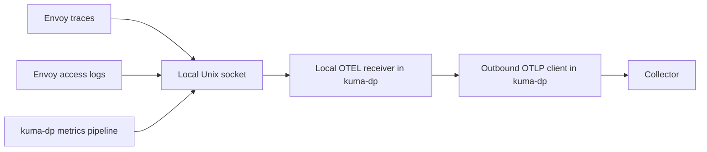
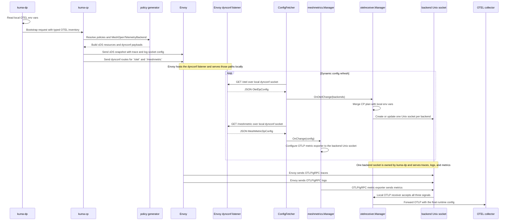
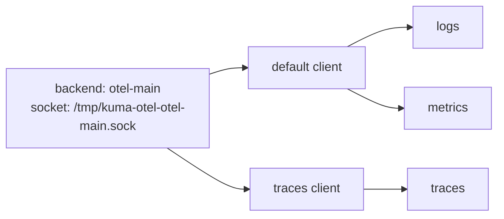

# OTEL env-var bootstrap and runtime resolution

- Status: proposed

Technical Story: TBD

## Context and problem statement

MADR 095 proposes `MeshOpenTelemetryBackend` as the shared backend for `MeshTrace`, `MeshAccessLog`, and `MeshMetric`. It also proposes the `backendRef` path and the `/otel` route through `kuma-dp`.

This MADR does not repeat that design. Read it as an enhancement to MADR 095, not as a statement that the MADR 095 model is already merged or implemented. It answers the next question: if MADR 095 is accepted, how should Kuma reuse standard `OTEL_EXPORTER_OTLP_*` env vars on top of that backend model? In many deployments that config already exists as env vars. On Kubernetes this may come from the OpenTelemetry Operator or sidecar env injection. On Universal it may come from a systemd unit, container runtime, or wrapper script.

We want Kuma to reuse those env vars without giving up the `MeshOpenTelemetryBackend` model and without sending secrets through the control plane. We also want the control plane to understand enough to make the right config decisions and show useful status.

The design has to answer these questions:

1. How does `kuma-dp` tell the control plane what OTEL env vars it already has?
2. How does the control plane fill the gaps from `MeshOpenTelemetryBackend`?
3. How do we support shared OTEL env vars and per-signal OTEL env vars in one model?
4. How do we keep headers, client keys, and similar values local to `kuma-dp`?
5. How do we make this work the same way on Kubernetes and Universal?
6. How do we let policy say whether env vars are allowed or ignored?
7. How do we show enough of the final result in status without making users inspect raw xDS?

### User stories

1. As a mesh operator, I want Kuma to reuse OTEL env vars that are already injected into `kuma-sidecar`, so I do not have to repeat the same collector settings in another place.
2. As a mesh operator, I want to keep using `MeshOpenTelemetryBackend` as the shared backend contract, so the three observability policies still point at one mesh-scoped object.
3. As a mesh operator, I want traces, logs, and metrics to use different OTLP settings when I set per-signal env vars, without changing the local Unix socket model.
4. As a mesh operator, I want the control plane and status to show whether env-var use is allowed, whether env input is present, and whether a signal is ready, blocked, or still missing required fields.
5. As a mesh operator, I want to block env-var reuse on some backends and allow it on others, so this stays a policy choice instead of hidden runtime behavior.
6. As a mesh operator, I want this to work on Kubernetes and Universal with the same rules, so I do not have to learn two different designs.

## Design

### Option 1: Let the control plane own the final exporter config

In this option, `kuma-dp` reads OTEL env vars and sends the real values to the control plane. The control plane merges them with `MeshOpenTelemetryBackend` and sends the final exporter config back to `kuma-dp` and Envoy.

Pros:

- The control plane has the full picture.
- Status is easy because the control plane already has the resolved values.

Cons:

- Bad, because secrets like OTEL headers or client keys would cross the control plane boundary.
- Bad, because those values could end up in CP-visible metadata, logs, config dumps, or debug endpoints.
- Bad, because it makes the control plane responsible for input that belongs to the local process.

We reject this option.

### Option 2: Let `kuma-dp` own everything

In this option, the control plane only sends the socket path and backend identity. `kuma-dp` reads env vars, reads backend config, resolves everything locally, and the control plane does not try to understand the final shape.

Pros:

- Good, because secrets stay local.
- Good, because the runtime owner is the process that actually uses the exporter settings.

Cons:

- Bad, because the control plane cannot explain what is missing or blocked.
- Bad, because policy cannot cleanly enforce whether env vars are allowed.
- Bad, because status becomes weak and hard to trust.
- Bad, because the control plane cannot tell when signal-level differences should change local wiring.

We reject this option.

### Option 3: Typed bootstrap inventory, control-plane runtime plan, and dataplane final merge

This option splits the job in a way that matches the runtime model proposed in MADR 095:

- `kuma-dp` reads OTEL env vars locally at startup.
- `kuma-dp` sends a typed non-secret OTEL inventory during bootstrap.
- The control plane resolves policies and `MeshOpenTelemetryBackend`, fills the missing pieces, and sends back a typed `/otel` runtime plan.
- `kuma-dp` builds the final exporter clients from that plan and its local env vars.

This keeps secrets local, gives the control plane enough information to plan the runtime shape, and keeps the final result easy to inspect.

This is the selected option.

### Ownership split

`kuma-dp` reads OTEL env vars, keeps raw values local, and builds the final outbound exporter clients. It owns all OTLP exporter fields in both shared and per-signal forms. The recognized env vars follow the [OpenTelemetry SDK specification](https://opentelemetry.io/docs/specs/otel/protocol/exporter/):

- `OTEL_EXPORTER_OTLP_ENDPOINT` / `OTEL_EXPORTER_OTLP_{SIGNAL}_ENDPOINT`
- `OTEL_EXPORTER_OTLP_PROTOCOL` / `OTEL_EXPORTER_OTLP_{SIGNAL}_PROTOCOL`
- `OTEL_EXPORTER_OTLP_HEADERS` / `OTEL_EXPORTER_OTLP_{SIGNAL}_HEADERS`
- `OTEL_EXPORTER_OTLP_TIMEOUT` / `OTEL_EXPORTER_OTLP_{SIGNAL}_TIMEOUT`
- `OTEL_EXPORTER_OTLP_COMPRESSION` / `OTEL_EXPORTER_OTLP_{SIGNAL}_COMPRESSION`
- `OTEL_EXPORTER_OTLP_CERTIFICATE` / `OTEL_EXPORTER_OTLP_{SIGNAL}_CERTIFICATE`
- `OTEL_EXPORTER_OTLP_CLIENT_KEY` / `OTEL_EXPORTER_OTLP_{SIGNAL}_CLIENT_KEY`
- `OTEL_EXPORTER_OTLP_CLIENT_CERTIFICATE` / `OTEL_EXPORTER_OTLP_{SIGNAL}_CLIENT_CERTIFICATE`

Where `{SIGNAL}` is `TRACES`, `LOGS`, or `METRICS`. Inside the env layer, standard OTEL precedence applies: signal-specific env vars override shared ones.

The control plane resolves policies, reads the dataplane's OTEL inventory from bootstrap, applies env-var policy, detects blocked/missing/ambiguous cases, sends the `/otel` runtime plan, and writes status.

Envoy only owns the local OTLP/gRPC hop to `kuma-dp`. It should not know the real collector endpoint, headers, TLS settings, or compression. Those belong to the `kuma-dp -> collector` hop.

### Data flow



The collector only sees normal OTLP traffic from `kuma-dp`. It never sees the Unix socket.

### Full control and data flow

This is the full flow from bootstrap to runtime. The important detail is that `/otel` is only a config path for the OTEL receiver side in `kuma-dp`. Traces and logs reach the backend socket through normal xDS config in Envoy, and metrics reach that same socket through the separate `/meshmetric` config path. The diagram shows the main unified flow and intentionally omits the older `/meshtrace` and `/meshaccesslog` fallback handlers that exist only for backward compatibility.



### Bootstrap contract

The bootstrap contract should be typed. OTEL capability data should use that typed section, not a separate metadata channel.

Bootstrap happens before the control plane resolves policies. Because of that, `kuma-dp` cannot report per-backend OTEL state at bootstrap time. It can only report process-level OTEL inventory.

The contract is:

- dataplane reports what OTEL env input it has
- control plane computes what each backend and signal still needs after policy resolution

The bootstrap payload should include a typed OTEL section with:

- whether the pipe is enabled
- which shared OTEL fields are present
- which traces, logs, and metrics override fields are present
- local validation errors

This payload must never contain raw endpoints, headers, tokens, certificate contents, key contents, or local file paths. Those values are secrets or sensitive deployment details. Once they reach the control plane, they are harder to contain and easier to leak through status, logs, debug output, or config inspection.

Example bootstrap inventory:

```json
{
  "otel": {
    "pipeEnabled": true,
    "shared": {
      "endpointPresent": true,
      "protocolPresent": true,
      "headersPresent": true
    },
    "traces": {
      "overrideKinds": ["endpoint"]
    },
    "logs": {
      "overrideKinds": []
    },
    "metrics": {
      "overrideKinds": []
    },
    "validationErrors": []
  }
}
```

This means `kuma-dp` has shared OTEL config in env vars (endpoint, protocol, and headers are all present) and only traces have a signal-specific override. The control plane can derive the protocol and auth mode from these flags. The real values stay local to `kuma-dp`.

When `pipeEnabled` is `false`, the control plane skips OTEL resolution for this dataplane entirely. No `/otel` runtime plan is generated and no OTEL-related status is written.

### Runtime plan on `/otel`

MADR 095 defines `OtelPipeBackend` as a fully resolved exporter config, but this design needs the control plane to leave gaps for `kuma-dp` to fill from env vars. The control plane should send a backend runtime plan instead.

Each backend plan should include:

- backend identity
- socket path
- env-var policy
- explicit shared backend settings from `MeshOpenTelemetryBackend`
- optional explicit per-signal settings when needed
- per-signal missing fields
- per-signal blocked reasons

This plan tells `kuma-dp` what the backend should look like without sending secrets through the control plane.

Example runtime plan:

```yaml
backends:
  - name: otel-main
    socketPath: /tmp/kuma-otel-otel-main.sock
    envPolicy:
      mode: Optional
    shared:
      endpoint: otel-collector.observability:4317
      protocol: grpc
    traces:
      missingFields: []
      blockedReasons: []
    logs:
      missingFields: []
      blockedReasons: []
    metrics:
      missingFields: []
      blockedReasons: []
      refreshInterval: 10s
```

All three signals use the same backend and the same socket. The plan includes the explicit backend settings from `MeshOpenTelemetryBackend`. `kuma-dp` fills any remaining gaps from env vars and may build signal-specific outbound clients if the final config differs per signal.

### Env policy and merge rules

Env-var policy belongs on `MeshOpenTelemetryBackend`, not on the three signal policies. Signal policies say which backend to use. The backend says whether env vars are allowed.

`MeshOpenTelemetryBackend` should grow:

```yaml
spec:
  endpoint:
    address: otel-collector.observability
    port: 4317
  protocol: grpc
  env:
    mode: Optional
```

The `env` block is optional. When omitted, Kuma defaults to `mode: Optional`. The default is `Optional` because the main use case for this MADR is reusing env vars that are already present - if the default were `Disabled`, every operator who wants env-var support would have to set it explicitly, which defeats the purpose. Operators who do not want env-var behavior can set `Disabled` per backend.

Values: `Disabled` (ignore env vars for this backend) or `Optional` (use env vars to fill gaps in explicit config).

When `mode` is `Optional`, `kuma-dp` resolves each field by picking the first available value:

1. signal-specific explicit config from the backend
2. shared explicit config from the backend
3. signal-specific OTEL env var
4. shared OTEL env var
5. built-in default

Explicit config always wins. Within each layer, signal-specific wins over shared. When `mode` is `Disabled`, steps 3 and 4 are skipped.

For one field such as the traces endpoint:

```text
final traces endpoint =
  pick(
    traces explicit endpoint,
    shared explicit endpoint,
    OTEL_EXPORTER_OTLP_TRACES_ENDPOINT,
    OTEL_EXPORTER_OTLP_ENDPOINT,
    built-in default,
  )
```

Example where env vars fill gaps (backend has no explicit endpoint or protocol):

```text
OTEL_EXPORTER_OTLP_ENDPOINT=https://otel-gateway.observability:4318
OTEL_EXPORTER_OTLP_PROTOCOL=http/protobuf
OTEL_EXPORTER_OTLP_TRACES_ENDPOINT=https://tempo.observability:4318
```

Result:

- traces use `tempo.observability:4318` (signal-specific env) with `http/protobuf` (shared env)
- logs and metrics use `otel-gateway.observability:4318` (shared env) with `http/protobuf` (shared env)

Traces go to a different collector because the signal-specific env var fills the gap. If the backend had an explicit endpoint, that would win and the env vars would be ignored for that field.

Future extensions if proven need exists: `Required` mode (backend not ready without env input), `precedence` field (let env win over explicit), `allowSignalOverrides: false` (block signal-specific env vars). Not part of the initial design.

### Runtime shape in `kuma-dp`

The runtime shape should stay simple:

- one Unix socket per backend
- one local OTLP gRPC server per backend socket
- one default outbound exporter client per backend
- optional dedicated traces client
- optional dedicated logs client
- optional dedicated metrics client

Examples:

- if traces, logs, and metrics resolve to the same final config, all three reuse the default client
- if only traces differ, traces get their own client and logs and metrics reuse the default client
- if all three differ, each signal gets its own client behind the same socket

Per-signal OTEL env vars should change outbound clients, not local sockets.

Example runtime shape:



That is the common per-signal override case. The local socket stays the same. Only the outbound traces client changes.

### Divergence rules

Three rules govern divergence:

- If signals point to different `MeshOpenTelemetryBackend` resources, the control plane generates different backend plans and may change local Envoy wiring (different sockets).
- If signals diverge inside one backend (per-signal env vars or explicit config), the control plane keeps one socket and `kuma-dp` builds separate outbound clients.
- The control plane only changes Envoy when the backend or socket mapping changes. Remote collector differences inside one backend are a `kuma-dp` concern.

### Ambiguity rules

OTEL env vars are process-global, not backend-specific. That means the design must explicitly handle ambiguous cases.

This case is ambiguous:

- one dataplane needs more than one effective OTLP backend for the same signal
- env vars are allowed for that signal
- there is no backend-local way to tell which process-global env values belong to which backend

In that case the control plane must not guess. It should:

- mark the signal as ambiguous
- refuse to use OTEL env vars for that signal and backend combination
- fall back to explicit config if explicit config is complete
- otherwise mark the signal as not ready

This behavior is part of the design, not a follow-up.

### Status

Status should be built in. Users should not need to read xDS dumps to understand what happened.

A signal is ready when it has at least an `endpoint` after merge. Other fields have defaults:

- `protocol` defaults to `grpc`
- `headers` defaults to none
- `timeout` defaults to SDK default
- `compression` defaults to none

If a signal has no `endpoint` from either explicit config or env vars, it is `missing`.

The control plane writes status to `DataplaneInsight` when it computes the `/otel` runtime plan. This happens:

- after bootstrap, when the CP first resolves policies for the dataplane
- when policies or `MeshOpenTelemetryBackend` resources change

Status is not updated on env-var changes because the CP does not see those until the dataplane restarts and re-bootstraps.

`DataplaneInsight` should show, per backend and per signal:

- whether the signal is enabled
- which backend it resolved to
- whether env-var use is allowed
- whether env-var input was present
- whether the signal is `ready`, `blocked`, `missing`, or `ambiguous`
- blocked reasons such as `EnvDisabledByPolicy` or `MultipleBackendsForSignal`
- missing fields such as `endpoint`, `protocol`, `headers`, or `client_key`

Example status - env vars fill the gaps for traces and logs, but metrics has no endpoint:

```yaml
backend: otel-main
signals:
  traces:
    envAllowed: true
    envInputPresent: true
    state: ready
  logs:
    envAllowed: true
    envInputPresent: true
    state: ready
  metrics:
    envAllowed: true
    envInputPresent: false
    state: missing
    missingFields:
      - endpoint
```

Example status - env vars are disabled by policy but the backend has no explicit endpoint:

```yaml
backend: otel-locked
signals:
  traces:
    envAllowed: false
    envInputPresent: true
    state: blocked
    blockedReasons:
      - EnvDisabledByPolicy
    missingFields:
      - endpoint
```

The operator set `env.mode: Disabled` on this backend. The dataplane has OTEL env vars, but policy blocks their use. Because the backend has no explicit endpoint either, the signal is blocked.

Example status - two backends compete for traces:

```yaml
backend: otel-primary
signals:
  traces:
    envAllowed: true
    envInputPresent: true
    state: ambiguous
    blockedReasons:
      - MultipleBackendsForSignal
```

Two `MeshOpenTelemetryBackend` resources both claim traces for this dataplane and both allow env vars. The control plane cannot tell which backend the process-global env vars belong to, so it marks the signal as ambiguous and refuses to use them.

### Kubernetes and Universal

The runtime model should be the same on both platforms.

On Kubernetes, OTEL env vars may come from:

- env vars already present on the `kuma-sidecar` container from the workload spec
- `kuma.io/sidecar-env-vars`
- other injector-controlled sidecar env
- OpenTelemetry Operator targeting `kuma-sidecar`

Only env vars that actually end up on the `kuma-sidecar` container are visible to `kuma-dp`. Env vars that exist only on the application container do not automatically carry over to the sidecar.

On Universal, OTEL env vars may come from:

- the process environment
- a systemd unit
- a container runtime
- a wrapper script

The source changes, but the model does not. `kuma-dp` still reads env vars at startup, sends OTEL inventory during bootstrap, receives the same `/otel` runtime plan, and uses the same merge rules.

## Security and reliability

Raw OTEL env-var values stay local to `kuma-dp`. Headers, client keys, certificate contents, and local file paths must never cross the control plane boundary. The control plane only receives typed inventory and computed status. The bootstrap OTEL inventory is informational - it must not become a way to send secrets.

`kuma-dp` reads OTEL env vars once at startup. If they change, the dataplane needs a restart. Resolution must be predictable: the same config and env input must always produce the same runtime plan. Invalid env-var input should not silently change behavior. If explicit config is complete, invalid env vars should be reported but should not break the signal.

The local transport model stays stable on top of MADR 095: one backend means one Unix socket, divergence only changes outbound clients, and most backends will use one default client.

## Implications for Kong Mesh

Kong Mesh would need to expose the same `MeshOpenTelemetryBackend` env fields, the same `/otel` runtime model, and the same status behavior.

Kong Mesh docs would also need to cover:

- how to inject OTEL env vars into `kuma-sidecar` on Kubernetes
- how to provide OTEL env vars on Universal
- how `Optional` and `Disabled` behave in mixed deployments

There is no separate enterprise-only runtime model here. Kong Mesh should follow the same backend contract so users do not have to learn a different observability path.

## Decision

If MADR 095 is accepted, extend the Unix socket model with env-var awareness using Option 3. `kuma-dp` reports a non-secret OTEL inventory at bootstrap, the control plane sends a runtime plan with env policy, and `kuma-dp` merges explicit config (wins) with local env vars (fills gaps). Secrets stay local, status is explicit, and the model works the same on Kubernetes and Universal.

## Phasing

Initial scope:

- `env.mode` with `Disabled` and `Optional`
- single merge rule: explicit config wins, env fills gaps, signal-specific wins over shared within each layer
- bootstrap OTEL inventory with presence flags (no derived fields)
- `/otel` runtime plan with env mode per backend
- status on `DataplaneInsight` with readiness, blocked reasons, and missing fields

Follow-up (when proven need exists):

- `Required` mode for backends that depend on env input
- `precedence` field to let env vars win over explicit config
- `allowSignalOverrides: false` to block signal-specific env vars

## Notes

- This MADR only applies if the MADR 095 backend model is accepted.
- Deprecated inline `endpoint` config stays outside this env-var contract. The env-var-aware path is the `backendRef` path.
