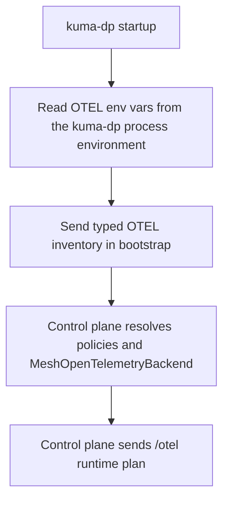
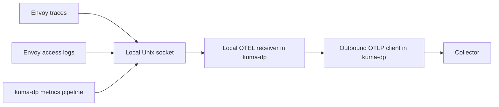
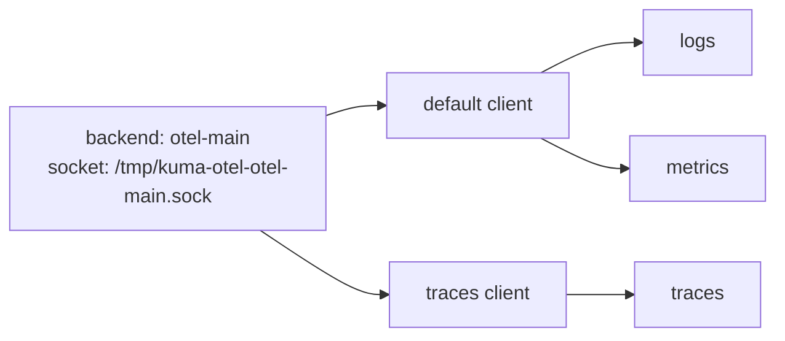

# OTEL env-var bootstrap and runtime resolution

- Status: proposed

Technical Story: TBD

## Context and Problem Statement

MADR 095 proposes `MeshOpenTelemetryBackend` as the shared backend for `MeshTrace`, `MeshAccessLog`, and `MeshMetric`. It also proposes the `backendRef` path and the unified `/otel` dynconf route through `kuma-dp`.

This MADR does not repeat that design. It should be read as an enhancement to MADR 095, not as a statement that the MADR 095 model is already merged or implemented. It answers the next question: if MADR 095 is accepted, how should Kuma reuse standard `OTEL_EXPORTER_OTLP_*` env vars on top of that backend model? In many real deployments that config already exists as env vars. On Kubernetes this may come from the OpenTelemetry Operator or sidecar env injection. On Universal it may come from a systemd unit, container runtime, or wrapper script.

We want Kuma to reuse those env vars without giving up the `MeshOpenTelemetryBackend` model and without sending secrets through the control plane. We also want the control plane to understand enough to make the right config decisions and show clear status.

The design has to answer these questions:

1. How does `kuma-dp` tell the control plane what OTEL env vars it already has?
2. How does the control plane fill the gaps from `MeshOpenTelemetryBackend`?
3. How do we support shared OTEL env vars and per-signal OTEL env vars in one model?
4. How do we keep headers, client keys, and similar values local to `kuma-dp`?
5. How do we make this work the same way on Kubernetes and Universal?
6. How do we let policy say whether env vars are allowed, required, or ignored?
7. How do we show the final result in status without making users inspect raw xDS?

### User stories

1. As a mesh operator, I want Kuma to reuse OTEL env vars that are already injected into `kuma-sidecar`, so I do not have to repeat the same collector settings in another place.
2. As a mesh operator, I want to keep using `MeshOpenTelemetryBackend` as the shared backend contract, so the three observability policies still point at one mesh-scoped object.
3. As a mesh operator, I want traces, logs, and metrics to use different OTLP settings when I set per-signal env vars, without changing the local Unix socket model.
4. As a mesh operator, I want the control plane and status to show whether a signal is using explicit config, env config, a mix of both, or is still missing required fields.
5. As a mesh operator, I want to block env-var reuse on some backends and require it on others, so this stays a policy choice instead of hidden runtime behavior.
6. As a mesh operator, I want this to work on Kubernetes and Universal with the same rules, so I do not have to learn two different designs.

## Design

### Option 1: Let the control plane own the final exporter config

In this option, `kuma-dp` reads OTEL env vars and sends the real values to the control plane. The control plane merges them with `MeshOpenTelemetryBackend` and sends the final exporter config back to `kuma-dp` and Envoy.

Pros:

- The control plane has the full picture.
- Status is easy because the control plane already has the resolved values.

Cons:

- Bad, because secret-bearing values like OTEL headers or client keys would cross the control plane boundary.
- Bad, because those values could end up in CP-visible metadata, logs, config dumps, or debug endpoints.
- Bad, because it makes the control plane responsible for process-local runtime input.

We reject this option.

### Option 2: Let `kuma-dp` own everything

In this option, the control plane only sends the socket path and backend identity. `kuma-dp` reads env vars, reads backend config, resolves everything locally, and the control plane does not try to understand the final shape.

Pros:

- Good, because secrets stay local.
- Good, because the runtime owner is the process that actually uses the exporter settings.

Cons:

- Bad, because the control plane cannot explain what is missing or blocked.
- Bad, because policy cannot cleanly enforce whether env vars are allowed.
- Bad, because status becomes weak and hard to trust.
- Bad, because the control plane cannot tell when signal-level differences should change local wiring.

We reject this option.

### Option 3: Typed bootstrap inventory, control-plane runtime plan, and dataplane final merge

This option splits the job in a way that matches the runtime model proposed in MADR 095:

- `kuma-dp` reads OTEL env vars locally at startup.
- `kuma-dp` sends a typed non-secret OTEL inventory during bootstrap.
- The control plane resolves policies and `MeshOpenTelemetryBackend`, fills the missing pieces, and sends back a typed `/otel` runtime plan.
- `kuma-dp` builds the final exporter clients from that plan and its local env vars.

This keeps secrets local, gives the control plane enough information to plan the runtime shape, and makes status explicit.

This is the selected option.

### What `kuma-dp` owns

`kuma-dp` owns:

- reading OTEL env vars from its own process environment
- parsing and validating those env vars
- keeping raw values local
- building the final outbound exporter clients
- choosing whether a signal uses the default client or a signal-specific client

This design should let `kuma-dp` own the OTLP exporter fields that this env-var path supports, in shared and per-signal forms. MADR 095 may defer some backend fields, so this MADR does not require every OTLP field to ship at once. The important part is that the runtime model can grow without changing the contract.

The model should be able to cover fields such as:

- endpoint
- protocol
- headers
- timeout
- compression
- insecure
- certificate
- client certificate
- client key

Inside the env layer itself, standard OTEL precedence applies:

- signal-specific env vars override shared env vars
- shared env vars apply when a signal-specific value is missing

### What the control plane owns

The control plane owns:

- resolving which observability policies apply to a dataplane
- resolving which `MeshOpenTelemetryBackend` resources those policies reference
- reading the dataplane's OTEL inventory from bootstrap
- applying backend policy rules for env-var usage
- deciding whether the backend runtime shape is shared or per-signal
- detecting blocked, missing, and ambiguous cases
- sending the `/otel` runtime plan back to `kuma-dp`
- storing and exposing status

### What Envoy owns

Envoy should only own the local OTLP/gRPC hop to `kuma-dp`:

- traces go to the local Unix socket
- access logs go to the local Unix socket
- metrics stay on the `kuma-dp` metrics pipeline and still end up on the same local OTEL receiver path

Envoy should not know the real collector endpoint, headers, TLS mode, HTTP path, timeout, or compression. Those belong to the `kuma-dp -> collector` hop.

### End-to-end flow

The control flow looks like this:



The data flow then looks like this:



The collector only sees normal OTLP traffic from `kuma-dp`. It never sees the Unix socket.

### Bootstrap contract

The main bootstrap contract should be typed. The existing `dynamicMetadata` path can still carry a small summary for status and inspection, but it should not be the main transport for OTEL capability data.

Bootstrap happens before the control plane resolves policies. Because of that, `kuma-dp` cannot report per-backend OTEL state at bootstrap time. It can only report process-level OTEL inventory.

The contract is:

- dataplane reports what OTEL env input it has
- control plane computes what each backend and signal still needs after policy resolution

The bootstrap payload should include a typed OTEL section with:

- whether the pipe is enabled
- which shared OTEL fields are present
- which traces, logs, and metrics override fields are present
- derived protocol and auth mode
- local validation errors

This payload must never contain raw endpoints, headers, tokens, certificate contents, key contents, or local file paths. Those values are either secrets or sensitive deployment details. Once they cross into the control plane, they are much harder to reason about and much easier to leak through status, logs, debug output, or config inspection.

Example bootstrap inventory:

```json
{
  "otel": {
    "pipeEnabled": true,
    "shared": {
      "endpointPresent": true,
      "protocolPresent": true,
      "headersPresent": true,
      "effectiveProtocol": "http/protobuf",
      "effectiveAuthMode": "headers"
    },
    "traces": {
      "overrideKinds": ["endpoint"]
    },
    "logs": {
      "overrideKinds": []
    },
    "metrics": {
      "overrideKinds": []
    }
  }
}
```

This means `kuma-dp` has shared OTEL config in env vars, the shared effective shape is OTLP HTTP with headers-based auth, and only traces have a signal-specific override. The real values still stay local to `kuma-dp`.

### Runtime plan on `/otel`

The `OtelPipeBackend` shape proposed for the MADR 095 flow is too resolved for this design. The control plane should send a backend runtime plan instead of a fully resolved exporter config.

Each backend plan should include:

- backend identity
- socket path
- env-var policy
- explicit shared backend settings from `MeshOpenTelemetryBackend`
- optional explicit per-signal settings when needed
- per-signal missing fields
- per-signal blocked reasons
- whether the backend uses one shared client or per-signal clients

This plan tells `kuma-dp` what the backend should look like without sending secret-bearing values through the control plane.

Example runtime plan:

```yaml
backends:
  - name: otel-main
    socketPath: /tmp/kuma-otel-otel-main.sock
    envPolicy:
      mode: Optional
      precedence: EnvFirst
      allowSignalOverrides: true
    shared:
      endpoint: otel-collector.observability:4317
      protocol: grpc
    traces:
      missingFields: []
      blockedReasons: []
    logs:
      missingFields: []
      blockedReasons: []
    metrics:
      missingFields: []
      blockedReasons: []
      refreshInterval: 10s
    clientLayout: per-signal
```

This means all three signals use the same backend and the same socket. The plan still carries the explicit backend settings from `MeshOpenTelemetryBackend` as fallback input, but in this running example `EnvFirst` means the final source may still be `env`. `kuma-dp` may also build a dedicated client for one signal if the final merged OTEL config differs after local env vars are applied.

### Policy-level control

The cleanest place to control env-var reuse is `MeshOpenTelemetryBackend`, not the three signal policies. The signal policies should keep saying which backend they use. The backend should say whether env vars are allowed and how they participate.

These three terms are used in the merge rules below:

- `mode` says whether env vars are ignored, allowed, or required
- `precedence` says whether explicit backend fields win or env vars win
- `allowSignalOverrides` says whether `OTEL_EXPORTER_OTLP_TRACES_*`, `..._LOGS_*`, and `..._METRICS_*` may change one signal without changing the others

`MeshOpenTelemetryBackend` should grow:

```yaml
spec:
  endpoint:
    address: otel-collector.observability
    port: 4317
  protocol: grpc
  env:
    mode: Optional
    precedence: EnvFirst
    allowSignalOverrides: true
```

The whole `env` block should stay optional. If it is omitted, Kuma should still apply a clear default behavior.

Default behavior:

- `mode: Optional`
- `precedence: EnvFirst`
- `allowSignalOverrides: true`

`env.mode` values:

- `Disabled` - ignore OTEL env vars for this backend
- `Optional` - use OTEL env vars when present
- `Required` - the backend is not ready unless the dataplane has the required OTEL env input

`env.precedence` values:

- `ExplicitFirst` - explicit backend config wins and env fills the gaps
- `EnvFirst` - env wins and explicit backend config fills the gaps

`allowSignalOverrides` controls whether `OTEL_EXPORTER_OTLP_TRACES_*`, `..._LOGS_*`, and `..._METRICS_*` are allowed to change the signal-specific runtime shape. When it is `false`, those vars are detected and reported but not used.

There should also be a global platform guard above backend policy.

The control plane should own the authoritative platform guard because it is the part that resolves policy, builds the `/otel` runtime plan, and writes status. A backend should not be able to turn OTEL env reuse on if the platform owner disabled it for the whole mesh.

On Kubernetes, this should follow the same pattern that Kuma already uses for `dataPlane.features.unifiedResourceNaming`:

- Helm exposes a first-class value such as `dataPlane.features.otelEnv`.
- That value makes the chart set a control-plane env var such as `KUMA_RUNTIME_KUBERNETES_INJECTOR_OTEL_ENV_ENABLED=true`.
- The injector uses that flag to add a dataplane env var such as `KUMA_DATAPLANE_RUNTIME_OTEL_ENV_ENABLED=true` to each injected `kuma-sidecar`.
- The same dataplane env var should also be added to ZoneIngress and ZoneEgress pods, so Kubernetes dataplanes behave the same way.

On Universal, there is no injector, so `kuma-dp` also needs a local runtime guard such as `KUMA_DATAPLANE_RUNTIME_OTEL_ENV_ENABLED=true`. That flag should control whether `kuma-dp` even reads `OTEL_EXPORTER_OTLP_*` env vars on startup.

The effective rule should be simple:

- if the global platform guard is off, backend `env` policy is ignored and status shows that env support was blocked globally
- if the global platform guard is on, backend `env` policy decides whether env vars are disabled, optional, or required for that backend

### Merge rules

Once `mode`, `precedence`, and `allowSignalOverrides` are known for a backend, `kuma-dp` can resolve the final exporter settings for each signal.

In the default `EnvFirst` mode, the order is:

1. signal-specific OTEL env var, if policy allows it
2. shared OTEL env var, if policy allows it
3. signal-specific explicit backend setting from the control plane
4. shared explicit backend setting from the control plane
5. built-in default

If the backend uses `ExplicitFirst`, the explicit and env layers swap order, but signal-specific still wins over shared inside each layer.

Field-level resolution is simple. For one field such as the traces endpoint, `kuma-dp` can think about it like this:

```text
final traces endpoint =
  pick(
    OTEL_EXPORTER_OTLP_TRACES_ENDPOINT,
    OTEL_EXPORTER_OTLP_ENDPOINT,
    traces explicit endpoint,
    shared explicit endpoint,
    built-in default,
  )
```

Example with actual env vars:

```yaml
backend:
  endpoint: otel-collector.observability:4317
  protocol: grpc
  env:
    mode: Optional
    precedence: EnvFirst
    allowSignalOverrides: true
```

```text
OTEL_EXPORTER_OTLP_ENDPOINT=https://otel-gateway.observability:4318
OTEL_EXPORTER_OTLP_PROTOCOL=http/protobuf
OTEL_EXPORTER_OTLP_TRACES_ENDPOINT=https://tempo.observability:4318
```

Result:

- traces use a dedicated HTTP client to `tempo.observability`
- logs use the default HTTP client to `otel-gateway.observability`
- metrics use the default HTTP client to `otel-gateway.observability`

### Runtime shape in `kuma-dp`

The runtime shape should stay simple:

- one Unix socket per backend
- one local OTLP gRPC server per backend socket
- one default outbound exporter client per backend
- optional dedicated traces client
- optional dedicated logs client
- optional dedicated metrics client

Examples:

- if traces, logs, and metrics resolve to the same final config, all three reuse the default client
- if only traces differ, traces get their own client and logs and metrics reuse the default client
- if all three differ, each signal gets its own client behind the same socket

Per-signal OTEL env vars should change outbound clients, not local sockets.

Example runtime shape:



That is the common per-signal override case. The local socket stays the same. Only the outbound traces client changes.

### Divergence rules

The control plane must model two different kinds of divergence.

#### 1. Signal-to-backend divergence

If traces, logs, and metrics point to different `MeshOpenTelemetryBackend` resources, the control plane must generate different backend plans. This may change local Envoy wiring because the local socket or local cluster is different.

#### 2. Signal-to-exporter divergence inside one backend

If one backend uses per-signal OTEL env vars or explicit per-signal config, the control plane should keep one backend and one socket but mark the backend as `per-signal` so `kuma-dp` builds separate outbound clients.

This is the central rule: the control plane should only change Envoy when the local backend or socket mapping changes. Remote collector differences inside one backend are a `kuma-dp` runtime concern.

### Ambiguity rules

OTEL env vars are process-global, not backend-specific. That means the design must explicitly handle ambiguous cases.

This case is ambiguous:

- one dataplane needs more than one effective OTLP backend for the same signal
- env vars are allowed for that signal
- there is no backend-local way to tell which process-global env values belong to which backend

In that case the control plane must not guess. It should:

- mark the signal as ambiguous
- refuse to use OTEL env vars for that signal and backend combination
- fall back to explicit config if explicit config is complete
- otherwise mark the signal as not ready

This behavior is part of the design, not a follow-up.

### Status

Status should be first-class. Users should not need to infer the final state from xDS dumps.

`DataplaneInsight` should show, per backend and per signal:

- whether the signal is enabled
- which backend it resolved to
- whether env-var use is allowed
- whether env-var input was present
- whether the final source is `explicit`, `env`, or `mixed`
- whether `kuma-dp` created a dedicated signal client
- whether the signal is `ready`, `blocked`, `missing`, or `ambiguous`
- blocked reasons such as `EnvDisabledByPolicy`, `SignalOverridesDisallowed`, or `MultipleBackendsForSignal`
- missing fields such as `endpoint`, `protocol`, `headers`, or `client_key`

The bootstrap `dynamicMetadata` path should still carry a compact allowlisted summary for quick inspection, but only derived non-secret fields should go there.

`MeshOpenTelemetryBackend` status should also grow aggregate conditions that answer:

- is the backend referenced
- are referenced dataplanes ready
- are some dataplanes blocked by env policy
- are some dataplanes missing required OTEL env input
- are some dataplanes ambiguous

In the running example below, `source: env` means env vars win after merge. `source: mixed` would mean explicit backend fields still filled at least one missing field.

Example status:

```yaml
backend: otel-main
signals:
  traces:
    source: env
    ready: true
    dedicatedClient: true
  logs:
    source: env
    ready: true
    dedicatedClient: false
  metrics:
    source: env
    ready: true
    dedicatedClient: false
conditions:
  - type: Ready
    status: "True"
```

This tells the operator that shared env vars drive the default client, while traces use a signal-specific env override and therefore get a dedicated client.

### Kubernetes and Universal

The runtime model should be the same on both platforms.

On Kubernetes, OTEL env vars may come from:

- env vars already present on the `kuma-sidecar` container from the workload spec
- `kuma.io/sidecar-env-vars`
- other injector-controlled sidecar env
- OpenTelemetry Operator targeting `kuma-sidecar`

Only env vars that actually end up on the `kuma-sidecar` container are visible to `kuma-dp`. Env vars that exist only on the application container do not automatically carry over to the sidecar.

On Universal, OTEL env vars may come from:

- the process environment
- a systemd unit
- a container runtime
- a wrapper script

The source changes, but the model does not. `kuma-dp` still reads env vars at startup, sends OTEL inventory during bootstrap, receives the same `/otel` runtime plan, and uses the same merge rules.

## Security implications and review

The main security rule is simple: raw OTEL env-var values stay local to `kuma-dp`.

That means:

- raw OTEL headers must never cross the control plane boundary
- client keys and certificate contents must never cross the control plane boundary
- local file paths for certificates and keys should also stay local because they still reveal deployment details
- the control plane should only receive typed inventory and derived status

The bootstrap OTEL inventory and `dynamicMetadata` OTEL summary are informational. They help the control plane plan runtime behavior and expose status. They must not become a new transport for secrets.

## Reliability implications

The design should use startup-time env discovery. If OTEL env vars change, the dataplane should re-read them on restart or re-bootstrap. We should not try to hot-reload process env.

Resolution must stay deterministic:

- the same explicit config and the same env input must always produce the same final runtime plan
- invalid env-var input should not silently fall through to a different meaning
- if explicit config is complete, invalid env vars should be reported but should not break the signal
- if the backend requires env input and the env input is invalid or missing, the signal should stay not ready

If we add this on top of MADR 095, the local transport model stays stable:

- one backend still means one local Unix socket
- divergence only changes outbound clients inside `kuma-dp`
- the common case stays cheap because most backends will still use one default client

## Implications for Kong Mesh

Kong Mesh would need to expose the same `MeshOpenTelemetryBackend` env fields, the same `/otel` runtime model, and the same status behavior.

Kong Mesh docs would also need to cover:

- how to inject OTEL env vars into `kuma-sidecar` on Kubernetes
- how to provide OTEL env vars on Universal
- how `Required`, `Optional`, and `Disabled` behave in mixed deployments

There is no separate enterprise-only runtime model here. Kong Mesh should follow the same backend contract so users do not have to learn a different observability path.

## Decision

If MADR 095 is accepted, we should keep that Unix socket model and extend it into an OTEL env-var aware runtime.

On top of the backend model proposed in MADR 095, `kuma-dp` reads OTEL env vars at startup and reports a typed non-secret OTEL inventory during bootstrap. The control plane resolves the applied observability policies, applies the global platform guard and backend env policy, fills missing pieces from `MeshOpenTelemetryBackend`, and sends a typed `/otel` runtime plan back to `kuma-dp`. `kuma-dp` then builds one default exporter client plus optional per-signal clients behind the same Unix socket.

This keeps secrets local, keeps the backend model explicit, works on Kubernetes and Universal, and gives the control plane enough information to configure the dataplane and expose the final source, readiness, blocked reasons, and ambiguity for every backend and signal if the MADR 095 backend model lands.

## Notes

- This MADR builds on the shared backend and unified `/otel` design proposed in MADR 095.
- This MADR is an enhancement to MADR 095 and only applies if that backend model is accepted.
- Deprecated inline `endpoint` config stays outside this env-var contract. The env-var-aware path is the `backendRef` path.
