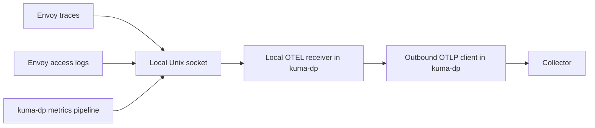
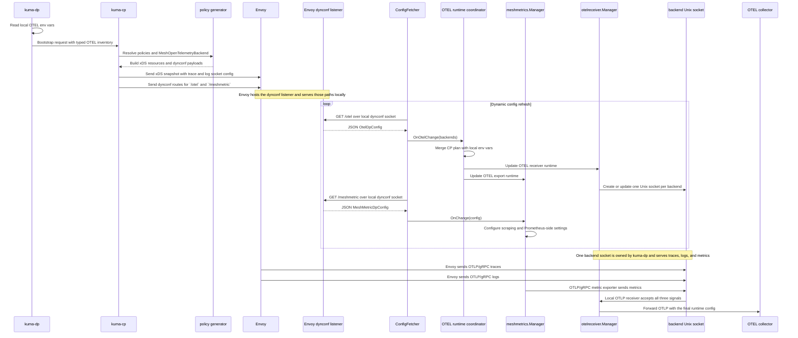
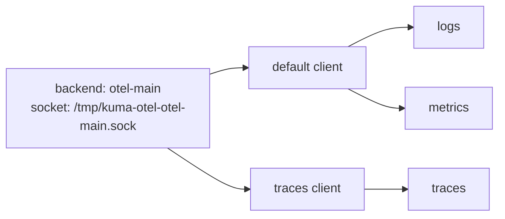

# OTEL env-var bootstrap and runtime resolution

* Status: accepted

Technical Story: none

## Context and problem statement

The `MeshOpenTelemetryBackend` MADR proposes `MeshOpenTelemetryBackend` as the shared backend for `MeshTrace`, `MeshAccessLog`, and `MeshMetric`. It also proposes the `backendRef` path, the `/otel` route through `kuma-dp`, and an optional `spec.endpoint` where omitting the address means the node-local default collector flow.

This builds on that `MeshOpenTelemetryBackend` design. It does not assume that the earlier MADR is already merged or implemented. The next question is practical: if that design is accepted, how should Kuma reuse standard `OTEL_EXPORTER_OTLP_*` env vars on top of it? In many deployments those settings already exist as env vars. On Kubernetes they may come from the OpenTelemetry Operator or sidecar env injection. On Universal they may come from a systemd unit, container runtime, or wrapper script.

We want Kuma to reuse those env vars without giving up the `MeshOpenTelemetryBackend` model and without sending secrets through the control plane. We also want the control plane to understand enough to make the right config decisions and show useful status.

This design has to answer these questions:

1. How does `kuma-dp` tell the control plane what OTEL env vars it already has?
2. How does the control plane fill the gaps from `MeshOpenTelemetryBackend`?
3. How do we support shared OTEL env vars and per-signal OTEL env vars in one model?
4. How do we keep headers, client keys, and similar values local to `kuma-dp`?
5. How do we make this work the same way on Kubernetes and Universal?
6. How do we let policy say whether env vars are allowed or ignored?
7. How do we show enough of the final result in status without making users inspect raw xDS?

### User stories

1. As a mesh operator, I want Kuma to reuse OTEL env vars that are already injected into `kuma-sidecar`, so I do not have to repeat the same collector settings in another place.
2. As a mesh operator, I want to keep using `MeshOpenTelemetryBackend` as the shared backend contract, so the three observability policies still point at one mesh-scoped object.
3. As a mesh operator, I want traces, logs, and metrics to use different OTLP settings when I set per-signal env vars, without changing the local Unix socket model.
4. As a mesh operator, I want the control plane and status to show whether env-var use is allowed, whether env input is present, and whether a signal is ready, blocked, or still missing required fields.
5. As a mesh operator, I want to block env-var reuse on some backends and allow it on others, so this stays a policy choice instead of hidden runtime behavior.
6. As a mesh operator, I want this to work on Kubernetes and Universal with the same rules, so I do not have to learn two different designs.

## Design

### Option 1: Let the control plane own the final exporter config

Here `kuma-dp` reads OTEL env vars and sends the real values to the control plane. The control plane merges them with `MeshOpenTelemetryBackend` and sends the final exporter config back to `kuma-dp` and Envoy.

Pros:

- The control plane has the full picture.
- Status is easy because the control plane already has the resolved values.

Cons:

- Secrets like OTEL headers or client keys would cross the control plane boundary.
- Those values could leak into CP-visible metadata, logs, config dumps, or debug endpoints.
- The control plane would end up owning input that belongs to the local process.

We reject this option.

### Option 2: Let `kuma-dp` own everything

Here the control plane only sends the socket path and backend identity. `kuma-dp` reads env vars, reads backend config, resolves everything locally, and the control plane does not try to understand the final shape.

Pros:

- Secrets stay local.
- The runtime owner is the process that actually uses the exporter settings.

Cons:

- The control plane cannot explain what is missing or blocked.
- Policy cannot cleanly enforce whether env vars are allowed.
- Status becomes weak and hard to trust.
- The control plane cannot tell when signal-level differences should change local wiring.

We reject this option.

### Option 3: Typed bootstrap inventory, control-plane runtime plan, and dataplane final merge

This split matches the runtime model proposed in MADR 095:

- `kuma-dp` reads OTEL env vars locally at startup.
- `kuma-dp` sends a typed non-secret OTEL inventory during bootstrap.
- The control plane resolves policies and `MeshOpenTelemetryBackend`, fills the missing pieces, and sends back a typed `/otel` runtime plan.
- `kuma-dp` builds the final exporter clients from that plan and its local env vars.

It keeps secrets local, gives the control plane enough information to plan the runtime shape, and keeps the final result easy to inspect.

We choose this option.

### Ownership split

`kuma-dp` reads OTEL env vars, keeps raw values local, and builds the final outbound exporter clients. It owns the standard OTLP exporter env vars from the [OpenTelemetry exporter specification](https://opentelemetry.io/docs/specs/otel/protocol/exporter/), including shared and per-signal forms such as `OTEL_EXPORTER_OTLP_ENDPOINT`, `OTEL_EXPORTER_OTLP_PROTOCOL`, `OTEL_EXPORTER_OTLP_HEADERS`, `OTEL_EXPORTER_OTLP_INSECURE`, `OTEL_EXPORTER_OTLP_TIMEOUT`, `OTEL_EXPORTER_OTLP_COMPRESSION`, `OTEL_EXPORTER_OTLP_CERTIFICATE`, `OTEL_EXPORTER_OTLP_CLIENT_KEY`, and `OTEL_EXPORTER_OTLP_CLIENT_CERTIFICATE`. Where `{SIGNAL}` is `TRACES`, `LOGS`, or `METRICS`, the signal-specific env vars override the shared ones inside the env layer.

The control plane resolves policies, reads the dataplane's OTEL inventory from bootstrap, applies env-var policy, detects blocked/missing/ambiguous cases, sends the `/otel` runtime plan, and writes status.

Envoy only owns the local OTLP/gRPC hop to `kuma-dp`. It should not know the real collector endpoint, headers, TLS settings, or compression. Those belong to the `kuma-dp -> collector` hop.

### Data flow



The collector only sees normal OTLP traffic from `kuma-dp`. It never sees the Unix socket.

### Full control and data flow

This is the full flow from bootstrap to runtime. The important detail is that `/otel` is the OTEL backend runtime contract for all three signals. `/meshmetric` still exists, but only for scrape-side config such as applications, sidecar settings, extra labels, and Prometheus-related state. The diagram keeps those two roles separate.



### Bootstrap contract

The bootstrap contract should be typed. OTEL capability data should use that typed section, not a separate metadata channel.

Bootstrap happens before the control plane resolves policies. Because of that, `kuma-dp` cannot report per-backend OTEL state at bootstrap time. It can only report process-level OTEL inventory.

The contract is:

- dataplane reports what OTEL env input it has
- control plane computes what each backend and signal still needs after policy resolution

The bootstrap payload should include a typed OTEL section with:

- non-secret OTEL env key names that are present locally
- local validation errors

`presentKeys` is allowlisted to the standard OTLP exporter env family that Kuma recognizes, so bootstrap stays bounded and predictable. This payload must never contain raw endpoints, headers, tokens, certificate contents, key contents, or local file paths. Once secret values reach the control plane, they are harder to contain and easier to leak through status, logs, debug output, or config inspection.

Example bootstrap inventory:

```json
{
  "otel": {
    "presentKeys": [
      "OTEL_EXPORTER_OTLP_ENDPOINT",
      "OTEL_EXPORTER_OTLP_PROTOCOL",
      "OTEL_EXPORTER_OTLP_HEADERS",
      "OTEL_EXPORTER_OTLP_TRACES_ENDPOINT"
    ],
    "validationErrors": []
  }
}
```

This bootstrap says `kuma-dp` has shared OTEL endpoint, protocol, and headers in env vars, and only traces have a signal-specific endpoint override. The control plane derives shared versus signal-specific inputs from the actual key names. The real values stay local to `kuma-dp`.

The bootstrap inventory only matters when the dataplane already advertises `FeatureOtelViaKumaDp` from MADR 095. That feature remains the only pipe-mode gate. If it is absent, the control plane follows the earlier compatibility path, does not generate `/otel`, and does not write OTEL pipe status for that dataplane.

### Runtime plan on `/otel`

MADR 095 defines `OtelPipeBackend` as a fully resolved exporter config, but this design needs the control plane to leave gaps for `kuma-dp` to fill from env vars. The control plane should send a backend runtime plan instead.

Each backend plan should include:

- backend identity
- socket path
- env-var policy
- shared backend settings from `MeshOpenTelemetryBackend`
- per-signal missing fields
- per-signal blocked reasons

The `/otel` plan tells `kuma-dp` what the backend should look like without sending secrets through the control plane. It stays typed because it carries backend identity, `socketPath`, env policy, per-signal `missingFields` and `blockedReasons`, and metrics-only runtime data like `refreshInterval`. A plain env-var map would need null or sentinel values for those fields and blur the backend contract from MADR 095.

Example runtime plan:

```yaml
backends:
  - name: otel-main
    socketPath: /tmp/kuma-otel-otel-main.sock
    envPolicy:
      mode: Optional
      precedence: ExplicitFirst
      perSignalOverrides: Enabled
    shared:
      endpoint:
        address: ""
        port: 4317
        path: ""
      protocol: grpc
    traces:
      missingFields: []
      blockedReasons: []
    logs:
      missingFields: []
      blockedReasons: []
    metrics:
      missingFields: []
      blockedReasons: []
      refreshInterval: 10s
```

All three signals use the same backend and the same socket. In this example, the earlier MADR left `endpoint.address` empty, so the runtime plan carries only the defaulted `port` and `path`. `kuma-dp` first applies env-var policy, then falls back to the node-local default address if no explicit or env-provided endpoint wins. It may still build signal-specific outbound clients if the final config differs per signal.

### Env policy and merge rules

Env-var policy belongs on `MeshOpenTelemetryBackend`, not on the three signal policies. Signal policies say which backend to use. The backend says whether env vars are allowed.

`MeshOpenTelemetryBackend` should grow:

```yaml
spec:
  protocol: grpc
  env:
    mode: Optional
    precedence: ExplicitFirst
    perSignalOverrides: Enabled
```

In this example, `endpoint` is omitted on purpose. That means the backend still exists, but its address comes from the node-local default flow defined by the earlier MADR unless an OTEL env var provides a more specific endpoint.

The `env` block is optional. When it is omitted, Kuma defaults to `mode: Optional`, `precedence: EnvFirst`, and `perSignalOverrides: Enabled`. The default mode is `Optional` because the main use case for this MADR is reusing env vars that are already present. The default precedence is `EnvFirst` for the same reason - if the operator already has OTEL env vars in place and adds a `MeshOpenTelemetryBackend` without an explicit endpoint, the env vars should win by default so the existing setup keeps working. Operators who do not want env-var behavior can still set `Disabled` per backend.

`env.mode` values:

- `Disabled` - ignore OTEL env vars for this backend
- `Optional` - use OTEL env vars when present
- `Required` - the backend depends on OTEL env input; if that input is missing or invalid, the signal becomes `missing`, `blockedReasons` includes `RequiredEnvMissing`, and `missingFields` lists any fields that validation could identify

`env.precedence` values:

- `ExplicitFirst` - explicit backend config wins and env fills the gaps
- `EnvFirst` - env wins and explicit backend config fills the gaps

`perSignalOverrides` controls whether signal-specific OTEL env vars such as `OTEL_EXPORTER_OTLP_TRACES_*`, `OTEL_EXPORTER_OTLP_LOGS_*`, and `OTEL_EXPORTER_OTLP_METRICS_*` may change one signal without changing the others. An operator might disable this to keep all signals going to the same collector, even if someone injects a signal-specific env var into the sidecar. When it is `Disabled`, those vars are detected but not used, and status includes `SignalOverridesDisallowed`.

When `mode` is `Disabled`, the env layers are skipped.

When `mode` is `Optional` or `Required` and `precedence` is `EnvFirst`, `kuma-dp` resolves each field by picking the first available value:

1. signal-specific OTEL env var, if policy allows it
2. shared OTEL env var, if policy allows it
3. shared explicit config from the backend
4. built-in default

When `precedence` is `ExplicitFirst`, `kuma-dp` resolves each field by picking the first available value:

1. shared explicit config from the backend
2. signal-specific OTEL env var, if policy allows it
3. shared OTEL env var, if policy allows it
4. built-in default

For one field such as the traces endpoint, `ExplicitFirst` looks like this:

```text
final traces endpoint =
  pick(
    shared explicit endpoint,
    OTEL_EXPORTER_OTLP_TRACES_ENDPOINT,
    OTEL_EXPORTER_OTLP_ENDPOINT,
    built-in default,
  )
```

With `EnvFirst`, the env and explicit layers swap order.

`built-in default` means the node-local fallback from the earlier MADR: `HOST_IP:4317` on Kubernetes, `127.0.0.1:4317` elsewhere. The control plane already defaulted `port` to `4317` and `path` to empty in the `/otel` plan. This fallback is always last in the resolution order.

In `EnvFirst`, an env-provided endpoint wins before the node-local fallback. In `ExplicitFirst`, a shared explicit backend endpoint wins before both env vars and the node-local fallback.

Example where env vars fill gaps (backend has no explicit address and relies on the node-local default when env vars are absent):

```text
OTEL_EXPORTER_OTLP_ENDPOINT=https://otel-gateway.observability:4318
OTEL_EXPORTER_OTLP_PROTOCOL=http/protobuf
OTEL_EXPORTER_OTLP_TRACES_ENDPOINT=https://tempo.observability:4318
```

Result:

- traces use `tempo.observability:4318` (signal-specific env) with `http/protobuf` (shared env)
- logs and metrics use `otel-gateway.observability:4318` (shared env) with `http/protobuf` (shared env)
- the node-local `HOST_IP:4317` fallback is not used, because the env layer already provided a full endpoint

Traces go to a different collector because the signal-specific env var fills the gap. If the backend had a shared explicit endpoint and `precedence` was `ExplicitFirst`, that explicit endpoint would win. If neither explicit config nor env vars provided an endpoint, `kuma-dp` would fall back to `HOST_IP:4317` on Kubernetes or `127.0.0.1:4317` elsewhere.

### Runtime shape in `kuma-dp`

The runtime shape should stay simple:

- one Unix socket per backend
- one local OTLP gRPC server per backend socket
- one default outbound exporter client per backend
- optional dedicated traces client
- optional dedicated logs client
- optional dedicated metrics client

Examples:

- if traces, logs, and metrics resolve to the same final config, all three reuse the default client
- if only traces differ, traces get their own client and logs and metrics reuse the default client
- if all three differ, each signal gets its own client behind the same socket

Per-signal OTEL env vars should change outbound clients, not local sockets.

Example runtime shape:



That is the common per-signal override case. The local socket stays the same. Only the outbound traces client changes.

### Divergence rules

Three rules govern divergence:

- If signals point to different `MeshOpenTelemetryBackend` resources, the control plane generates different backend plans and may change local Envoy wiring (different sockets).
- If signals diverge inside one backend (per-signal env vars or explicit config), the control plane keeps one socket and `kuma-dp` builds separate outbound clients.
- The control plane only changes Envoy when the backend or socket mapping changes. Remote collector differences inside one backend are a `kuma-dp` concern.

### Ambiguity rules

OTEL env vars are process-global, not backend-specific. That means the design must explicitly handle ambiguous cases.

This case is ambiguous:

- one dataplane needs more than one effective OTLP backend for the same signal
- env vars are allowed for that signal
- there is no backend-local way to tell which process-global env values belong to which backend

This is not a separate routing model. It only applies after normal policy resolution, when one dataplane and one signal still end up with more than one backend entry. MADR 095 still decides the socket mapping. This rule only says that process-global OTEL env vars cannot be safely attributed across those competing backend entries.

In that case the control plane must not guess. It should:

- mark the signal as ambiguous
- refuse to use OTEL env vars for that signal and backend combination
- fall back to explicit config if explicit config is complete
- otherwise mark the signal as not ready

This is part of the design, not follow-up work.

### Status

Status should be built in. Users should not need to read xDS dumps to understand what happened.

The status surface should stay small. It is only there to explain whether a signal can export and why. It should not mirror the full merged config, raw env input, or the runtime topology behind `kuma-dp`.

A signal is ready when it has at least an `endpoint` after merge. Other fields have defaults:

- `protocol` defaults to `grpc`
- `headers` defaults to none
- `timeout` defaults to SDK default
- `compression` defaults to none

"After merge" includes the node-local fallback described in the merge rules section. A backend that omits `endpoint.address` is not missing by itself. It only becomes `missing` when explicit config, env vars, and the built-in default all fail to produce a usable endpoint.

`Required` mode adds one more rule: if required env input is missing or invalid, the signal stays `missing`, `blockedReasons` includes `RequiredEnvMissing`, and `missingFields` lists the fields that validation could name.

The control plane writes status to `DataplaneInsight` when it computes the `/otel` runtime plan. This happens:

- after bootstrap, when the CP first resolves policies for the dataplane
- when policies or `MeshOpenTelemetryBackend` resources change

Status is not updated on env-var changes because the CP does not see those until the dataplane restarts and re-bootstraps.

This is additive to the `MeshOpenTelemetryBackend` MADR, not a replacement for it. That earlier MADR keeps the backend-level `Referenced` or `NotReferenced` status on `MeshOpenTelemetryBackend` and the resolved or unresolved `backendRef` conditions on the observability policies. This MADR only adds per-dataplane runtime status.

`DataplaneInsight` should show, per backend and per signal:

- whether the signal is enabled
- which backend it resolved to
- whether env-var use is allowed
- whether env-var input was present
- whether the signal is `ready`, `blocked`, `missing`, or `ambiguous`
- blocked reasons such as `EnvDisabledByPolicy`, `RequiredEnvMissing`, `SignalOverridesDisallowed`, or `MultipleBackendsForSignal`
- missing fields such as `endpoint`, `protocol`, `headers`, or `client_key`

Example status - env vars fill the gaps for traces and logs, while metrics uses the MADR 095 node-local default path:

```yaml
backend: otel-main
signals:
  traces:
    envAllowed: true
    envInputPresent: true
    state: ready
  logs:
    envAllowed: true
    envInputPresent: true
    state: ready
  metrics:
    envAllowed: true
    envInputPresent: false
    state: ready
```

In this case, metrics is still ready even without env input because the backend omitted `endpoint.address` intentionally and the node-local default produced a usable endpoint.

Example status - the backend requires env input and validation found it incomplete:

```yaml
backend: otel-required
signals:
  traces:
    envAllowed: true
    envInputPresent: true
    state: missing
    blockedReasons:
      - RequiredEnvMissing
    missingFields:
      - client_key
```

The operator set `env.mode: Required` on this backend. The dataplane has OTEL env vars, but validation found incomplete mTLS input, so the signal stays missing until that field is fixed.

Example status - env vars are disabled by policy, but explicit backend config is still enough:

```yaml
backend: otel-locked
signals:
  traces:
    envAllowed: false
    envInputPresent: true
    state: ready
    blockedReasons:
      - EnvDisabledByPolicy
```

The operator set `env.mode: Disabled` on this backend. The dataplane has OTEL env vars, but policy blocks their use. Because the backend already has enough explicit config, the signal stays ready.

Example status - two backends compete for traces:

```yaml
backend: otel-primary
signals:
  traces:
    envAllowed: true
    envInputPresent: true
    state: ambiguous
    blockedReasons:
      - MultipleBackendsForSignal
```

Two `MeshOpenTelemetryBackend` resources both claim traces for this dataplane and both allow env vars. The control plane cannot tell which backend the process-global env vars belong to, so it marks the signal as ambiguous and refuses to use them.

### Kubernetes and Universal

The runtime model should be the same on both platforms.

On Kubernetes, OTEL env vars may come from:

- env vars already present on the `kuma-sidecar` container from the workload spec
- `kuma.io/sidecar-env-vars`
- other injector-controlled sidecar env
- OpenTelemetry Operator targeting `kuma-sidecar`

Only env vars that actually end up on the `kuma-sidecar` container are visible to `kuma-dp`. Env vars that exist only on the application container do not automatically carry over to the sidecar.

On Universal, OTEL env vars may come from:

- the process environment
- a systemd unit
- a container runtime
- a wrapper script

The source changes but the model does not. `kuma-dp` reads env vars at startup, sends OTEL inventory during bootstrap, receives the same `/otel` runtime plan, and uses the same merge rules.

## Security implications and review

Raw OTEL env-var values stay local to `kuma-dp`. Headers, client keys, certificate contents, and local file paths must never cross the control plane boundary. The control plane only receives typed inventory and computed status. The bootstrap inventory is informational, not a channel for secrets.

## Reliability implications

`kuma-dp` reads OTEL env vars once at startup. If they change, the dataplane needs a restart. Resolution is deterministic: the same config and env input always produce the same runtime plan. Invalid env-var input should not silently change behavior. If explicit config is complete, invalid env vars are reported but do not break the signal.

The local transport model stays stable on top of the `MeshOpenTelemetryBackend` MADR: one backend means one Unix socket, divergence only changes outbound clients, and most backends will use one default client.

## Implications for Kong Mesh

Kong Mesh would need to expose the same `MeshOpenTelemetryBackend` env fields, the same `/otel` runtime model, and the same status behavior.

Kong Mesh docs would also need to cover:

- how to inject OTEL env vars into `kuma-sidecar` on Kubernetes
- how to provide OTEL env vars on Universal
- how `Disabled`, `Optional`, and `Required` behave in mixed deployments

There is no separate enterprise-only runtime model here. Kong Mesh should follow the same backend contract so users do not have to learn a different observability path.

## Decision

If the `MeshOpenTelemetryBackend` MADR is accepted, extend that Unix socket model with env-var awareness using Option 3. `kuma-dp` reports a non-secret OTEL inventory at bootstrap, the control plane sends a typed runtime plan with env policy, and `kuma-dp` merges explicit config and local env vars according to `mode`, `precedence`, and `perSignalOverrides`. Secrets stay local, status is explicit, and the model works the same on Kubernetes and Universal.

## Phasing

Initial scope:

- `env.mode` with `Disabled`, `Optional`, and `Required`
- `env.precedence` with `ExplicitFirst` and `EnvFirst`
- `perSignalOverrides` with `Enabled` and `Disabled`
- merge rules for both precedence orders, with signal-specific env input winning over shared env input
- bootstrap OTEL inventory with present OTEL env key names (no values)
- `/otel` runtime plan with full env policy per backend
- status on `DataplaneInsight` with readiness, blocked reasons, and missing fields

## Notes

- Applies only if the `MeshOpenTelemetryBackend` backend model is accepted.
- Deprecated inline `endpoint` config stays outside this env-var contract. The env-var-aware path is the `backendRef` path.
