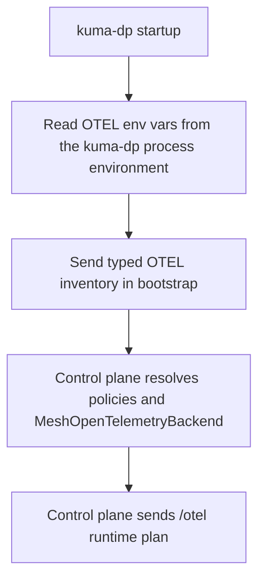
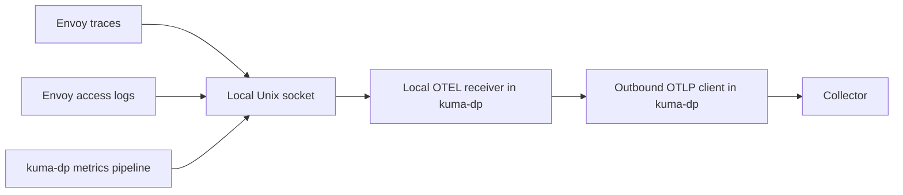
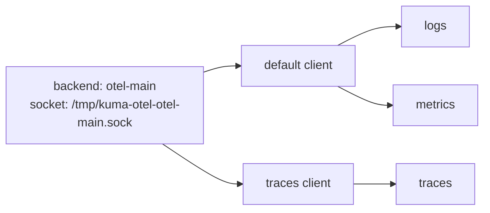

# OTEL env-var bootstrap and runtime resolution

- Status: proposed

Technical Story: TBD

## Context and problem statement

MADR 095 proposes `MeshOpenTelemetryBackend` as the shared backend for `MeshTrace`, `MeshAccessLog`, and `MeshMetric`. It also proposes the `backendRef` path and the `/otel` route through `kuma-dp`.

This MADR does not repeat that design. Read it as an enhancement to MADR 095, not as a statement that the MADR 095 model is already merged or implemented. It answers the next question: if MADR 095 is accepted, how should Kuma reuse standard `OTEL_EXPORTER_OTLP_*` env vars on top of that backend model? In many deployments that config already exists as env vars. On Kubernetes this may come from the OpenTelemetry Operator or sidecar env injection. On Universal it may come from a systemd unit, container runtime, or wrapper script.

We want Kuma to reuse those env vars without giving up the `MeshOpenTelemetryBackend` model and without sending secrets through the control plane. We also want the control plane to understand enough to make the right config decisions and show useful status.

The design has to answer these questions:

1. How does `kuma-dp` tell the control plane what OTEL env vars it already has?
2. How does the control plane fill the gaps from `MeshOpenTelemetryBackend`?
3. How do we support shared OTEL env vars and per-signal OTEL env vars in one model?
4. How do we keep headers, client keys, and similar values local to `kuma-dp`?
5. How do we make this work the same way on Kubernetes and Universal?
6. How do we let policy say whether env vars are allowed, required, or ignored?
7. How do we show enough of the final result in status without making users inspect raw xDS?

### User stories

1. As a mesh operator, I want Kuma to reuse OTEL env vars that are already injected into `kuma-sidecar`, so I do not have to repeat the same collector settings in another place.
2. As a mesh operator, I want to keep using `MeshOpenTelemetryBackend` as the shared backend contract, so the three observability policies still point at one mesh-scoped object.
3. As a mesh operator, I want traces, logs, and metrics to use different OTLP settings when I set per-signal env vars, without changing the local Unix socket model.
4. As a mesh operator, I want the control plane and status to show whether env-var use is allowed, whether env input is present, and whether a signal is ready, blocked, or still missing required fields.
5. As a mesh operator, I want to block env-var reuse on some backends and allow it on others, so this stays a policy choice instead of hidden runtime behavior.
6. As a mesh operator, I want this to work on Kubernetes and Universal with the same rules, so I do not have to learn two different designs.

## Design

### Option 1: Let the control plane own the final exporter config

In this option, `kuma-dp` reads OTEL env vars and sends the real values to the control plane. The control plane merges them with `MeshOpenTelemetryBackend` and sends the final exporter config back to `kuma-dp` and Envoy.

Pros:

- The control plane has the full picture.
- Status is easy because the control plane already has the resolved values.

Cons:

- Bad, because secrets like OTEL headers or client keys would cross the control plane boundary.
- Bad, because those values could end up in CP-visible metadata, logs, config dumps, or debug endpoints.
- Bad, because it makes the control plane responsible for input that belongs to the local process.

We reject this option.

### Option 2: Let `kuma-dp` own everything

In this option, the control plane only sends the socket path and backend identity. `kuma-dp` reads env vars, reads backend config, resolves everything locally, and the control plane does not try to understand the final shape.

Pros:

- Good, because secrets stay local.
- Good, because the runtime owner is the process that actually uses the exporter settings.

Cons:

- Bad, because the control plane cannot explain what is missing or blocked.
- Bad, because policy cannot cleanly enforce whether env vars are allowed.
- Bad, because status becomes weak and hard to trust.
- Bad, because the control plane cannot tell when signal-level differences should change local wiring.

We reject this option.

### Option 3: Typed bootstrap inventory, control-plane runtime plan, and dataplane final merge

This option splits the job in a way that matches the runtime model proposed in MADR 095:

- `kuma-dp` reads OTEL env vars locally at startup.
- `kuma-dp` sends a typed non-secret OTEL inventory during bootstrap.
- The control plane resolves policies and `MeshOpenTelemetryBackend`, fills the missing pieces, and sends back a typed `/otel` runtime plan.
- `kuma-dp` builds the final exporter clients from that plan and its local env vars.

This keeps secrets local, gives the control plane enough information to plan the runtime shape, and keeps the final result easy to inspect.

This is the selected option.

### What `kuma-dp` owns

`kuma-dp` owns:

- reading OTEL env vars from its own process environment
- parsing and validating those env vars
- keeping raw values local
- building the final outbound exporter clients
- choosing whether a signal uses the default client or a signal-specific client

`kuma-dp` should own the OTLP exporter fields that this env-var path supports, both shared and per-signal. MADR 095 may defer some backend fields, so this MADR does not require every OTLP field to ship at once. The runtime model can grow without changing the contract.

The model should be able to cover fields such as:

- endpoint
- protocol
- headers
- timeout
- compression
- insecure
- certificate
- client certificate
- client key

Inside the env layer itself, standard OTEL precedence applies:

- signal-specific env vars override shared env vars
- shared env vars apply when a signal-specific value is missing

### What the control plane owns

The control plane owns:

- resolving which observability policies apply to a dataplane
- resolving which `MeshOpenTelemetryBackend` resources those policies reference
- reading the dataplane's OTEL inventory from bootstrap
- applying backend policy rules for env-var usage
- deciding whether the backend runtime shape is shared or per-signal
- detecting blocked, missing, and ambiguous cases
- sending the `/otel` runtime plan back to `kuma-dp`
- storing and exposing status

### What Envoy owns

Envoy should only own the local OTLP/gRPC hop to `kuma-dp`:

- traces go to the local Unix socket
- access logs go to the local Unix socket
- metrics stay on the `kuma-dp` metrics pipeline and still end up on the same local OTEL receiver path

Envoy should not know the real collector endpoint, headers, TLS mode, HTTP path, timeout, or compression. Those belong to the `kuma-dp -> collector` hop.

### End-to-end flow

The control flow looks like this:



The data flow then looks like this:



The collector only sees normal OTLP traffic from `kuma-dp`. It never sees the Unix socket.

### Bootstrap contract

The bootstrap contract should be typed. OTEL capability data should use that typed section, not a separate metadata channel.

Bootstrap happens before the control plane resolves policies. Because of that, `kuma-dp` cannot report per-backend OTEL state at bootstrap time. It can only report process-level OTEL inventory.

The contract is:

- dataplane reports what OTEL env input it has
- control plane computes what each backend and signal still needs after policy resolution

The bootstrap payload should include a typed OTEL section with:

- whether the pipe is enabled
- which shared OTEL fields are present
- which traces, logs, and metrics override fields are present
- local validation errors

This payload must never contain raw endpoints, headers, tokens, certificate contents, key contents, or local file paths. Those values are secrets or sensitive deployment details. Once they reach the control plane, they are harder to contain and easier to leak through status, logs, debug output, or config inspection.

Example bootstrap inventory:

```json
{
  "otel": {
    "pipeEnabled": true,
    "shared": {
      "endpointPresent": true,
      "protocolPresent": true,
      "headersPresent": true
    },
    "traces": {
      "overrideKinds": ["endpoint"]
    },
    "logs": {
      "overrideKinds": []
    },
    "metrics": {
      "overrideKinds": []
    }
  }
}
```

This means `kuma-dp` has shared OTEL config in env vars (endpoint, protocol, and headers are all present) and only traces have a signal-specific override. The control plane can derive the protocol and auth mode from these flags. The real values stay local to `kuma-dp`.

### Runtime plan on `/otel`

MADR 095 defines `OtelPipeBackend` as a fully resolved exporter config, but this design needs the control plane to leave gaps for `kuma-dp` to fill from env vars. The control plane should send a backend runtime plan instead.

Each backend plan should include:

- backend identity
- socket path
- env-var policy
- explicit shared backend settings from `MeshOpenTelemetryBackend`
- optional explicit per-signal settings when needed
- per-signal missing fields
- per-signal blocked reasons

This plan tells `kuma-dp` what the backend should look like without sending secrets through the control plane.

Example runtime plan:

```yaml
backends:
  - name: otel-main
    socketPath: /tmp/kuma-otel-otel-main.sock
    envPolicy:
      mode: Optional
    shared:
      endpoint: otel-collector.observability:4317
      protocol: grpc
    traces:
      missingFields: []
      blockedReasons: []
    logs:
      missingFields: []
      blockedReasons: []
    metrics:
      missingFields: []
      blockedReasons: []
      refreshInterval: 10s
```

All three signals use the same backend and the same socket. The plan includes the explicit backend settings from `MeshOpenTelemetryBackend`. `kuma-dp` fills any remaining gaps from env vars and may build signal-specific outbound clients if the final config differs per signal.

### Policy-level control

Env-var policy belongs on `MeshOpenTelemetryBackend`, not on the three signal policies. Signal policies say which backend to use. The backend says whether env vars are allowed.

`MeshOpenTelemetryBackend` should grow:

```yaml
spec:
  endpoint:
    address: otel-collector.observability
    port: 4317
  protocol: grpc
  env:
    mode: Optional
```

The `env` block is optional. When omitted, Kuma defaults to `mode: Optional`.

`env.mode` values:

- `Disabled` - ignore OTEL env vars for this backend
- `Optional` - use OTEL env vars to fill gaps in explicit config

Explicit backend config always wins over env vars. Env vars only fill fields that explicit config leaves empty. See [merge rules](#merge-rules) for the full resolution order.

Backend policy is the only place that controls env-var use in this design.

Future extensions if proven need exists:

- `Required` mode: the backend is not ready unless the dataplane has env input
- `precedence` field: let env vars win over explicit config instead of filling gaps
- `allowSignalOverrides: false`: block signal-specific env vars like `OTEL_EXPORTER_OTLP_TRACES_ENDPOINT`

These are not part of the initial design because they add knobs without proven demand.

### Merge rules

When `mode` is `Optional`, `kuma-dp` resolves each field by picking the first available value:

1. signal-specific explicit config from the backend
2. shared explicit config from the backend
3. signal-specific OTEL env var
4. shared OTEL env var
5. built-in default

Explicit config always wins. Within each layer (explicit or env), signal-specific wins over shared. When `mode` is `Disabled`, steps 3 and 4 are skipped.

For one field such as the traces endpoint:

```text
final traces endpoint =
  pick(
    traces explicit endpoint,
    shared explicit endpoint,
    OTEL_EXPORTER_OTLP_TRACES_ENDPOINT,
    OTEL_EXPORTER_OTLP_ENDPOINT,
    built-in default,
  )
```

Example where env vars fill gaps:

```yaml
backend:
  # no endpoint configured
  # no protocol configured
  env:
    mode: Optional
```

```text
OTEL_EXPORTER_OTLP_ENDPOINT=https://otel-gateway.observability:4318
OTEL_EXPORTER_OTLP_PROTOCOL=http/protobuf
OTEL_EXPORTER_OTLP_TRACES_ENDPOINT=https://tempo.observability:4318
```

Result:

- traces use `tempo.observability:4318` (signal-specific env) with `http/protobuf` (shared env)
- logs use `otel-gateway.observability:4318` (shared env) with `http/protobuf` (shared env)
- metrics use `otel-gateway.observability:4318` (shared env) with `http/protobuf` (shared env)

Traces go to a different collector because the signal-specific env var fills the traces endpoint gap. If the backend had an explicit endpoint, that would win and the env vars would be ignored for that field.

### Runtime shape in `kuma-dp`

The runtime shape should stay simple:

- one Unix socket per backend
- one local OTLP gRPC server per backend socket
- one default outbound exporter client per backend
- optional dedicated traces client
- optional dedicated logs client
- optional dedicated metrics client

Examples:

- if traces, logs, and metrics resolve to the same final config, all three reuse the default client
- if only traces differ, traces get their own client and logs and metrics reuse the default client
- if all three differ, each signal gets its own client behind the same socket

Per-signal OTEL env vars should change outbound clients, not local sockets.

Example runtime shape:



That is the common per-signal override case. The local socket stays the same. Only the outbound traces client changes.

### Divergence rules

The control plane must model two different kinds of divergence.

#### 1. Signal-to-backend divergence

If traces, logs, and metrics point to different `MeshOpenTelemetryBackend` resources, the control plane must generate different backend plans. This may change local Envoy wiring because the local socket or local cluster is different.

#### 2. Signal-to-exporter divergence inside one backend

If one backend uses per-signal OTEL env vars or explicit per-signal config, the control plane should keep one backend and one socket but mark the backend as `per-signal` so `kuma-dp` builds separate outbound clients.

This is the central rule: the control plane should only change Envoy when the local backend or socket mapping changes. Remote collector differences inside one backend are a `kuma-dp` runtime concern.

### Ambiguity rules

OTEL env vars are process-global, not backend-specific. That means the design must explicitly handle ambiguous cases.

This case is ambiguous:

- one dataplane needs more than one effective OTLP backend for the same signal
- env vars are allowed for that signal
- there is no backend-local way to tell which process-global env values belong to which backend

In that case the control plane must not guess. It should:

- mark the signal as ambiguous
- refuse to use OTEL env vars for that signal and backend combination
- fall back to explicit config if explicit config is complete
- otherwise mark the signal as not ready

This behavior is part of the design, not a follow-up.

### Status

Status should be built in. Users should not need to read xDS dumps to understand what happened.

A signal is ready when it has at least an `endpoint` after merge. Other fields have defaults:

- `protocol` defaults to `grpc`
- `headers` defaults to none
- `timeout` defaults to SDK default
- `compression` defaults to none

If a signal has no `endpoint` from either explicit config or env vars, it is `missing`.

The control plane writes status to `DataplaneInsight` when it computes the `/otel` runtime plan. This happens:

- after bootstrap, when the CP first resolves policies for the dataplane
- when policies or `MeshOpenTelemetryBackend` resources change

Status is not updated on env-var changes because the CP does not see those until the dataplane restarts and re-bootstraps.

`DataplaneInsight` should show, per backend and per signal:

- whether the signal is enabled
- which backend it resolved to
- whether env-var use is allowed
- whether env-var input was present
- whether the signal is `ready`, `blocked`, `missing`, or `ambiguous`
- blocked reasons such as `EnvDisabledByPolicy` or `MultipleBackendsForSignal`
- missing fields such as `endpoint`, `protocol`, `headers`, or `client_key`

Example status:

```yaml
backend: otel-main
signals:
  traces:
    envAllowed: true
    envInputPresent: true
    state: ready
    blockedReasons: []
  logs:
    envAllowed: true
    envInputPresent: true
    state: ready
    blockedReasons: []
  metrics:
    envAllowed: true
    envInputPresent: false
    state: missing
    missingFields:
      - endpoint
```

This tells the operator that traces and logs have usable OTEL env input, while metrics are still missing the endpoint they need.

### Kubernetes and Universal

The runtime model should be the same on both platforms.

On Kubernetes, OTEL env vars may come from:

- env vars already present on the `kuma-sidecar` container from the workload spec
- `kuma.io/sidecar-env-vars`
- other injector-controlled sidecar env
- OpenTelemetry Operator targeting `kuma-sidecar`

Only env vars that actually end up on the `kuma-sidecar` container are visible to `kuma-dp`. Env vars that exist only on the application container do not automatically carry over to the sidecar.

On Universal, OTEL env vars may come from:

- the process environment
- a systemd unit
- a container runtime
- a wrapper script

The source changes, but the model does not. `kuma-dp` still reads env vars at startup, sends OTEL inventory during bootstrap, receives the same `/otel` runtime plan, and uses the same merge rules.

## Security implications and review

The main security rule is simple: raw OTEL env-var values stay local to `kuma-dp`.

That means:

- raw OTEL headers must never cross the control plane boundary
- client keys and certificate contents must never cross the control plane boundary
- local file paths for certificates and keys should also stay local because they still reveal deployment details
- the control plane should only receive typed inventory and computed status

The bootstrap OTEL inventory is informational. It helps the control plane decide what to do and show status. It must not become a way to send secrets.

## Reliability implications

`kuma-dp` reads OTEL env vars once at startup. If they change, the dataplane needs a restart or re-bootstrap. We should not try to hot-reload process env.

Resolution must be predictable:

- the same explicit config and the same env input must always produce the same runtime plan
- invalid env-var input should not silently change behavior
- if explicit config is complete, invalid env vars should be reported but should not break the signal

If we add this on top of MADR 095, the local transport model stays stable:

- one backend still means one local Unix socket
- divergence only changes outbound clients inside `kuma-dp`
- the common case stays cheap because most backends will still use one default client

## Implications for Kong Mesh

Kong Mesh would need to expose the same `MeshOpenTelemetryBackend` env fields, the same `/otel` runtime model, and the same status behavior.

Kong Mesh docs would also need to cover:

- how to inject OTEL env vars into `kuma-sidecar` on Kubernetes
- how to provide OTEL env vars on Universal
- how `Optional` and `Disabled` behave in mixed deployments

There is no separate enterprise-only runtime model here. Kong Mesh should follow the same backend contract so users do not have to learn a different observability path.

## Decision

If MADR 095 is accepted, we should keep that Unix socket model and extend it into an OTEL env-var aware runtime.

On top of the backend model proposed in MADR 095, `kuma-dp` reads OTEL env vars at startup and reports a typed non-secret OTEL inventory during bootstrap. The control plane resolves policies, applies the backend's `env.mode`, fills missing pieces from `MeshOpenTelemetryBackend`, and sends a typed `/otel` runtime plan back to `kuma-dp`. Explicit config always wins; env vars fill the gaps. `kuma-dp` then builds one default exporter client plus optional per-signal clients behind the same Unix socket.

This keeps secrets local, keeps the backend model explicit, works on Kubernetes and Universal, and gives the control plane enough information to show readiness, blocked reasons, and missing fields for every backend and signal.

## Phasing

Initial scope:

- `env.mode` with `Disabled` and `Optional`
- single merge rule: explicit config wins, env fills gaps, signal-specific wins over shared within each layer
- bootstrap OTEL inventory with presence flags (no derived fields)
- `/otel` runtime plan with env mode per backend
- status on `DataplaneInsight` with readiness, blocked reasons, and missing fields

Follow-up (when proven need exists):

- `Required` mode for backends that depend on env input
- `precedence` field to let env vars win over explicit config
- `allowSignalOverrides: false` to block signal-specific env vars

## Notes

- This MADR builds on the shared backend and unified `/otel` design proposed in MADR 095.
- This MADR is an enhancement to MADR 095 and only applies if that backend model is accepted.
- Deprecated inline `endpoint` config stays outside this env-var contract. The env-var-aware path is the `backendRef` path.
